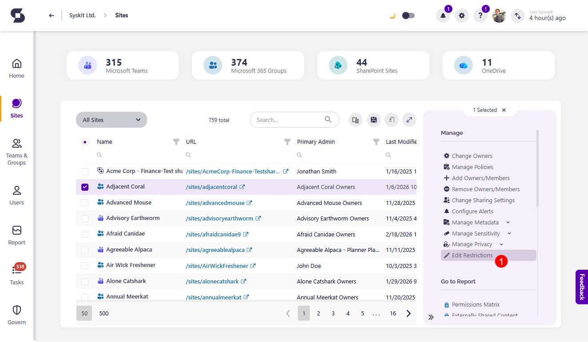
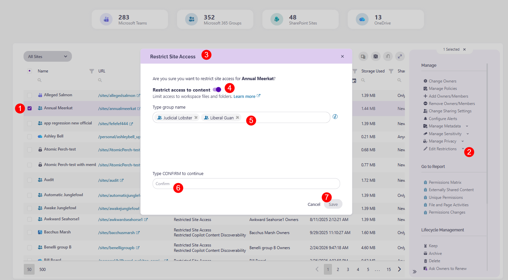
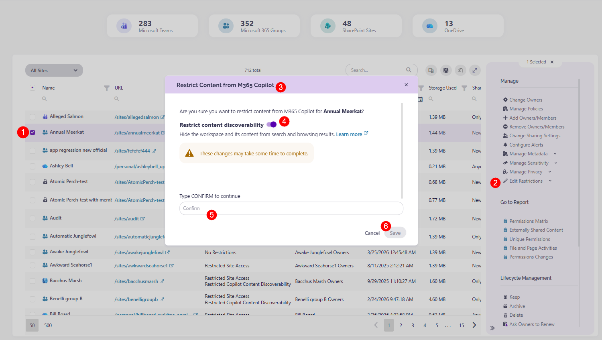

# Edit Restrictions

**Managing access and visibility of SharePoint sites is a vital part of governance**, helping keep sites secure and prevent oversharing. 

With **the new Restrictions column on the Site Overview screen**, you can now easily view whether a site has: 

* **Restricted SiteAccess**, if access to the site is restricted to members of whitelisted groups 
* **Restricted Copilot Content Discoverability**, if site content is exempt from Microsoft 365 Copilot
* **Restricted Site Access and Restricted Copilot Content Discoverability**, if both restrictions are applied to the site
* **No Restrictions**, if no access restrictions are applied to the site.

By using **the Edit Restrictions action**, located on the **Site Overview and Site Details screens**, you can update these settings for selected sites and choose whether to restrict access to content, restrict content discoverability, both, or leave a workspace without restrictions.

**Clicking the Edit Restrictions action (1)** opens the Edit Restrictions dialog, where you can make your selection. 

## Restrict Site Access to Content

Restricting access to content prevents oversharing by limiting access to a SharePoint site and its content to specific groups.

When this restriction is applied:  
 * **Syskit Point** manages Microsoft's SharePoint Restricted site access control capability, which **limits access to a SharePoint site and its content to members of specific Microsoft Entra security groups or Microsoft 365 groups** defined as Restricted Access Control groups.
 * For **SharePoint sites**, at least **one Microsoft Entra security group or Microsoft 365 group must be added** for the restriction to become active.
 * For **Microsoft 365 group-connected sites**, the **Microsoft 365 group connected** to the site is automatically added as the **default Restricted Access Control group**. 
   * You can optionally **add additional Microsoft 365 or Microsoft Entra security groups**.
 * **Shared and private channel sites** are separate from the parent Microsoft 365 group-connected site, so **the restriction applied to the main site does not affect them**. 
   * The **restriction has to be enabled separately** for each shared or private channel site.
   * For **shared channel sites**, only **internal users** in the resource tenant **are subject to the restriction policy**, while external participants are assessed based on existing site access. 
 * To access restricted content, **users must** have **permission to access the site or content** and be **members of the defined Restricted Access Control group**.
   * Users who are not members of the specified group cannot access the site or its content, even if they previously had access or received a sharing link.

For more details, take a look at this Microsoft article: [Restrict SharePoint site access with Microsoft 365 groups and Microsoft Entra security groups.](https://learn.microsoft.com/en-us/sharepoint/restricted-access-control)

In Syskit Point, you can restrict access to content by doing the following: 
* On the Sites Overview screen, **select a workspace (1)**
* **Click the Edit Restrictions button (2)** on the right side
   * **Select Restrict Site Access** from the dropdown
* The **Restrict Site Access dialog opens (3)**, where you can:
  * **Turn the toggle on to Restrict access to content (4)** - this limits access to workspace files and folders
  * **Enter the names of the groups (5)** you want to retain access when restrictions are enabled in the available space
    * Your site's connected Microsoft 365 Group is pre-filled as a starting point, however it can be removed, and/or additional groups can be added
    * Only the groups added to the list are able to access contect when restrictions are enabled
  * **Type Confirm (6)** to continue
  * **Click Save (7)** to finalize your selection

## Restrict Content from M365 Copilot

Restricting content discoverability limits how SharePoint site content appears in organization-wide search and Microsoft 365 Copilot. When enabled for a site, the site's content does not appear in a tenant-wide search, such as the SharePoint home page or Bing, unless a user has recently interacted with it.

This setting does not change existing permissions, so users who already have access can still open files directly. 

By controlling discoverability at the site level, you can protect sensitive content during governance review or Copilot onboarding while still allowing authorized users to continue working as normal. 

For more details, take a look at this Microsoft article: [Restrict discovery of SharePoint sites and content.](https://learn.microsoft.com/en-us/sharepoint/restricted-content-discovery)

In Syskit Point, you can restrict content discoverability: 
* On the Sites Overview screen, **select a workspace (1)**
* **Click the Edit Restrictions button (2)** on the right side
  * **Select Restrict Content from M365 Copilot** from the dropdown
* The **Restrict Content from M365 Copilot dialog opens (3)**, where you can:
  * **Turn the toggle on to Restrict content discoverability (4)** - this hides the workspace and its content from search and browsing results
  * **Type Confirm (5)** to continue
  * **Click Save (6)** to finalize your selection

