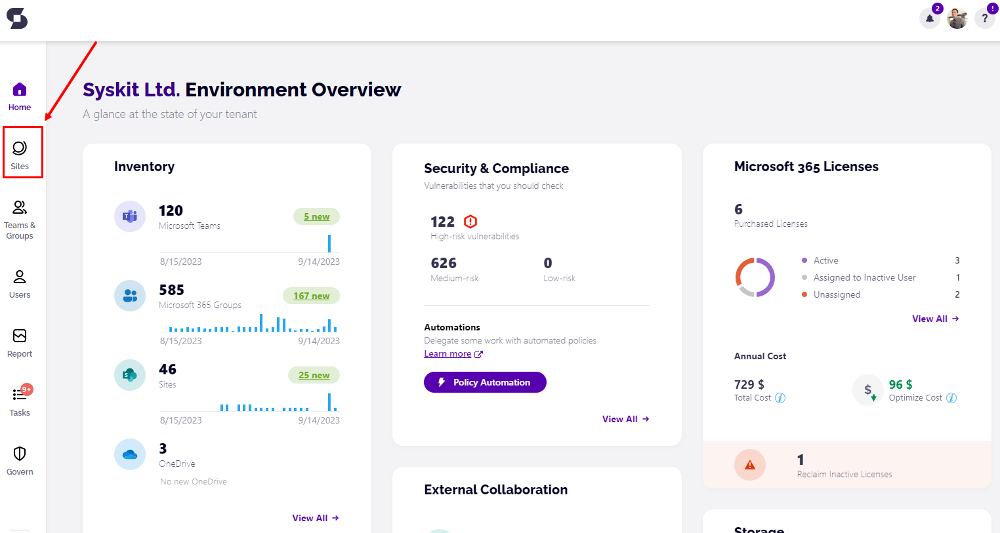
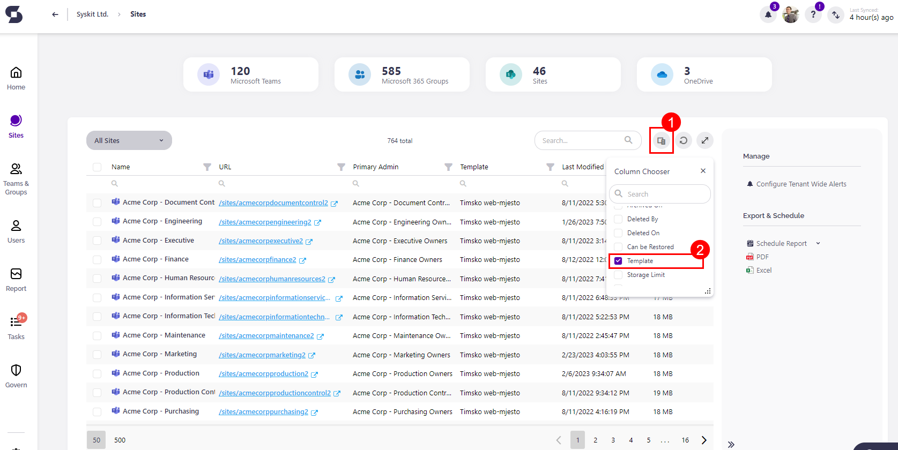
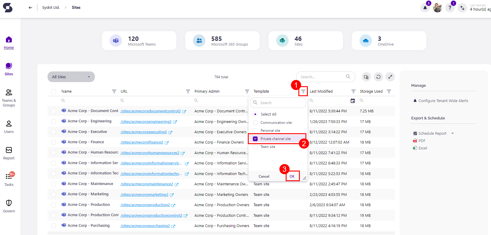
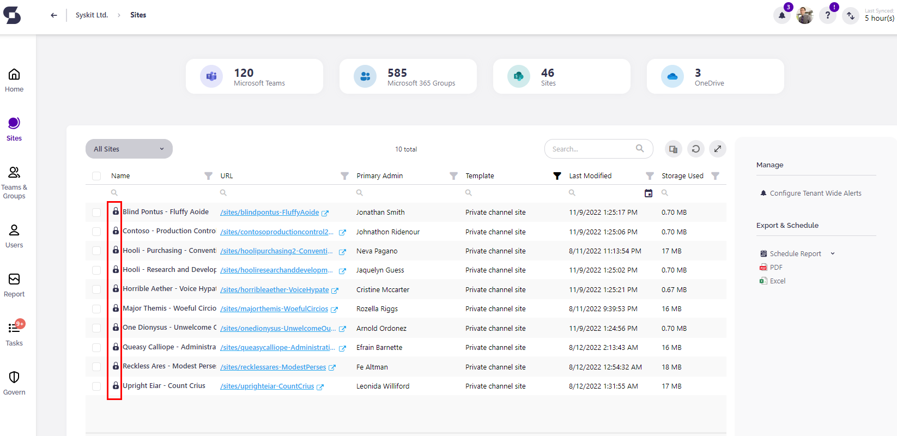
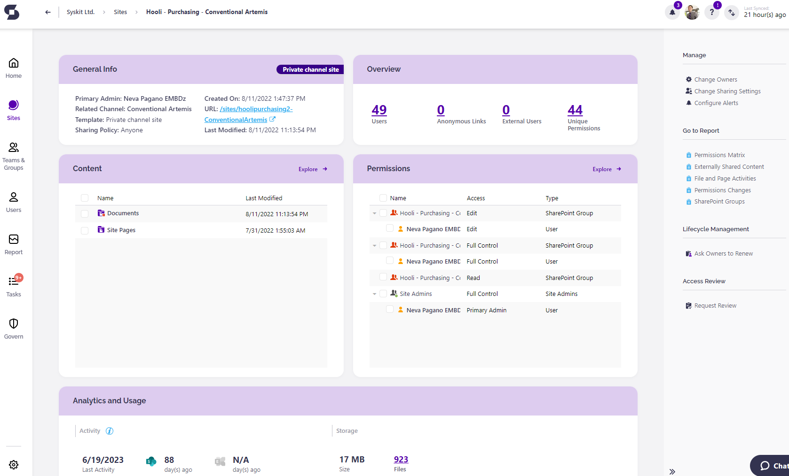
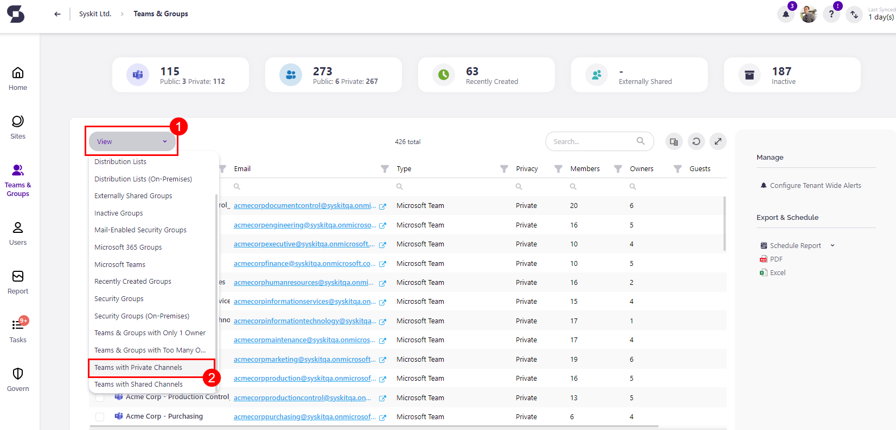
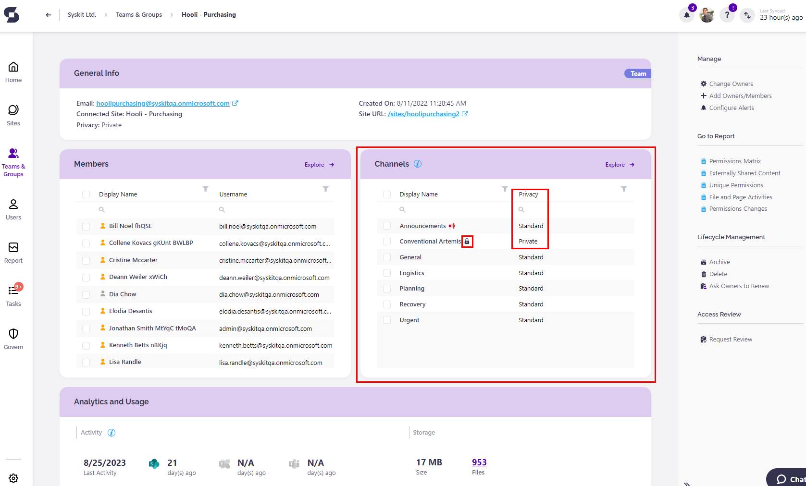
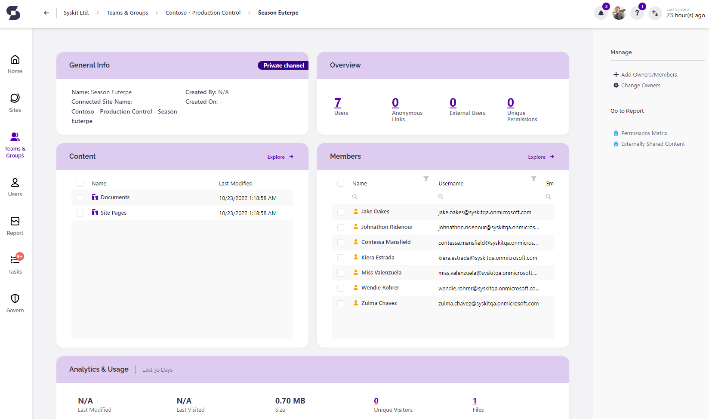
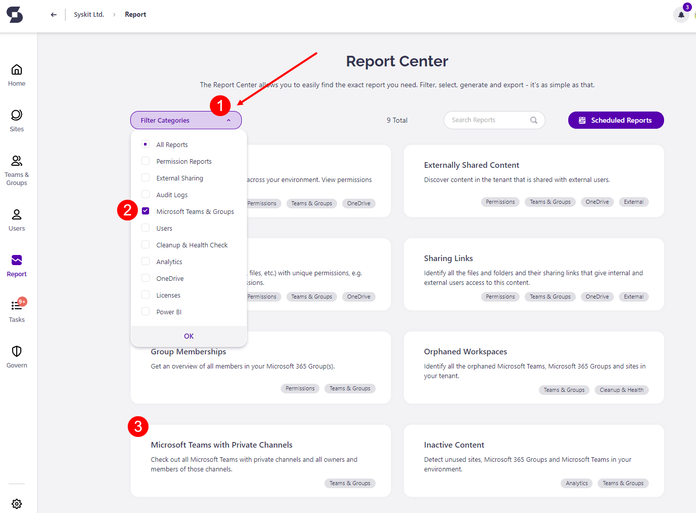
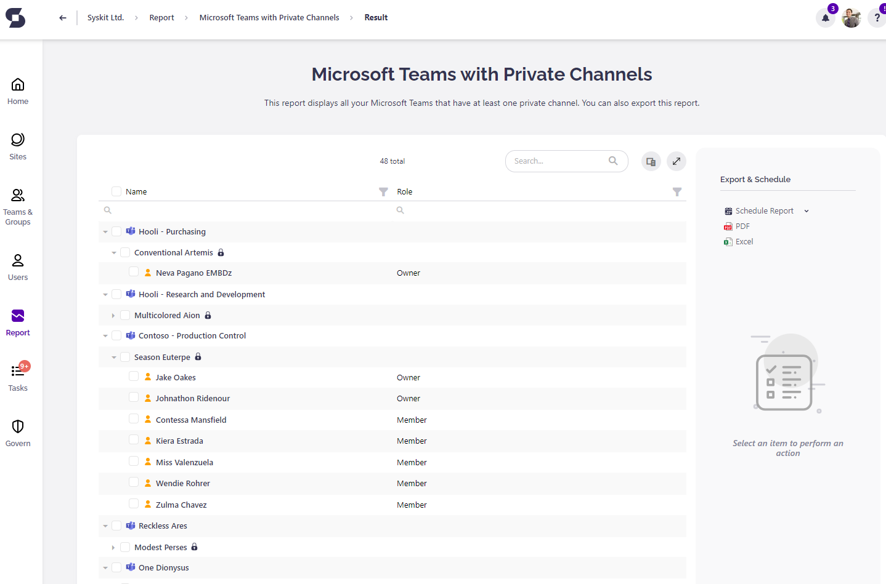

# Supervise Microsoft Teams Private Channels

## Microsoft Teams Private Channels

**Microsoft Teams Private Channels** are focused spaces for collaboration within Microsoft Teams, where only users who are **owners** or **members** of the private channel have access.

You might want to use a Private Channel in a situation where you have a group of people who need a focused space to collaborate without having to create a separate team, or they need to discuss sensitive information, such as budgets, resourcing, strategic positioning, and so on.

:::warning
**Please note!**\
Anyone, **including guest users**, can be a member of a Private Channel as long as they are a member of the Team within which the Private channel was created.
:::

### Who Can Create a Private channel

By default, any **Team Owner** or **Team Member can create a Private channel**. Only Guest users aren't allowed to create them. It is possible to limit the creation of Private channels by turning off the option, which allows Team members to create Private channels.

### What Can Team Owners and Members See in a Private Channel

In **Microsoft Admin Center**, **Team Owners can see the names of all Private Channels** in their team, and they **can delete them**. However, **they cannot see any conversations**, **shared files**, or a **member list** of a Private Channel **if they are not a member** of said Private Channel.

**Team Members** can only see the Private Channels they are members of. Unless they're added to them they are unable to see that said channels even exist.

### Background of Microsoft Teams Private Channels

When you create a **Microsoft Teams Private Channel**, you are creating that channel's **SharePoint Site collection** **optimized for file sharing and fast provisioning**. The separate site collection is there to ensure that the access to private channel files is restricted only to members of the Private Channel compared to the Team site where Team owners have access to all the assets within the site collection

## Using Syskit Point to Oversee Private Channels

**Syskit Point** enables you to oversee if there are any Private Channels, and which Teams have them. It is easy to see, and you can **manage your Teams more efficiently**.

### Find Private Channels in Syskit Point

Depending on your needs, there are several places in **Syskit Point** where you can find and manage Microsoft Teams Private Channels.

#### Sites Overview screen

From the **Home** screen of **Syskit Point**, click the **Sites** button on the left side of the screen.

It will redirect you to **Syskit Point Sites Overview screen**. As we know when a Private Channel is created, it also creates a SharePoint Site Collection. **Syskit Point gives you the ability to see that Site Collection within your Sites**, and also **gives Team owners the ability to see all members and shared files in a Private Channel**, even when the Team owner is not a member of a said Private Channel.

On the **Sites Overview** screen, any existing Microsoft Teams **Private Channel site will be located right under its parent Microsoft Teams site**, but to easily filter said Sites, click the **Column Chooser (1)** and **enable the column called Template (2)**.

The next thing you have to do is to **click the Filter icon (1)** of the Template column, **select the Private Channel site (2)** and **click OK (3)**.

Now, **only the sites of Private Channels will be visible** on the Site Overview screen. You can **recognize them by the lock icon** displayed next to the name of the site.

:::warning
**Please note!**\
The name of the Private Channel site consists of the **name of its Team** + the **name of said Private Channel**.
:::

**Click the site name to open the Private Channel site details page**. 

Here, **you can see which users have permissions** in the private channel, **view shared files**, and **find all analytics data**, as in other types of Sites. 

Additionally, you can **generate multiple reports** for the Private Channel site and **perform multiple actions** - Remove Access, Edit Permissions, Delete SharePoint Group, Remove Users from Group, etc.

#### Microsoft Teams & Groups Screen

**Syskit Point** also gives you the **ability** to see **Microsoft Teams Private Channels** via the **Group details page** of its **parent Team**. Here's how you can do it.

From the **Home Screen**, click the **Microsoft Teams & Groups** button on the left side of the screen. This redirects you to the Microsoft Teams & Group Overview screen. 

Here, click the **View chooser (1)** and select the **Teams with Private Channels** **option (2)**.

The report now shows only Microsoft Teams with Private Channels.

:::info
**Hint!**\
You can also see which Microsoft Teams have Private Channels by enabling the **Private Channels** column in the **Column Chooser**.
:::

When you click the name column of a Team you wish to inspect, the Group Details page opens. 

Here, you can find the **Channels tile**, which shows all the channels that are inside the Team, be it a **Standard** or a **Private** channel. 

You will notice that **Private Channels have a lock icon** next to the channel name, and under the column named **Privacy**, the value is set to **Private**.

Clicking a Private Channel inside the Channels tile opens the **Syskit Point Channel Details** page, where you can **see all members** of that **Private Channel**, **when it was created**, **by whom**, as well as **all shared** **files.**

#### Microsoft Teams with Private Channels Report

If you want to see all the information about **Private channels** in your **Microsoft 365 environment**, **Syskit Point** has a solution for you in the form of the **Microsoft Teams with Private Channels report**. Here's how you can generate it.

From the Home screen, click the **Reports tile**. Report Center opens. Here, **click the Filter in the left corner** **(1)**, **select the Microsoft Teams & Groups option (2)**, and find the **Microsoft Teams with Private Channels report (3)**.

When you click the report tile, the report is **automatically generated**, containing all the **Microsoft Teams that have Private Channels** and all the **members** and **owners** inside the channels. 

You can also export the generated report as a **PDF** or **XLSX** file.

If you wish to know even more about the Private Channels, you can find it in the [following Microsoft article](https://docs.microsoft.com/en-us/microsoftteams/private-channels).
