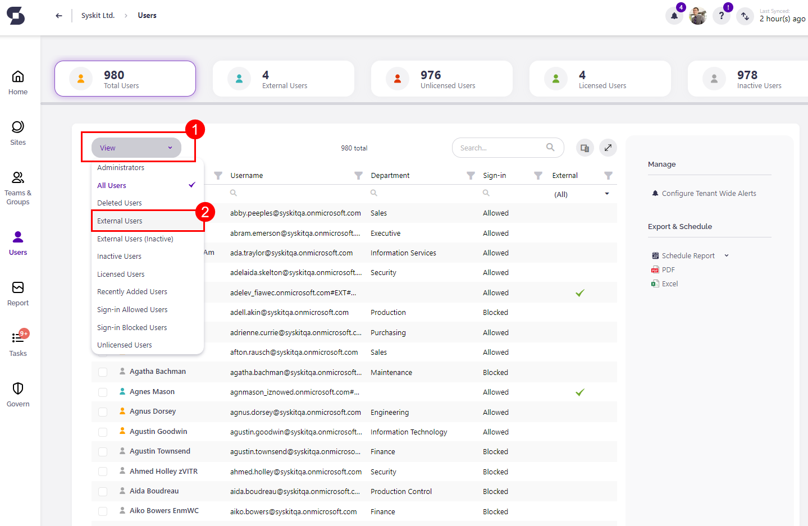
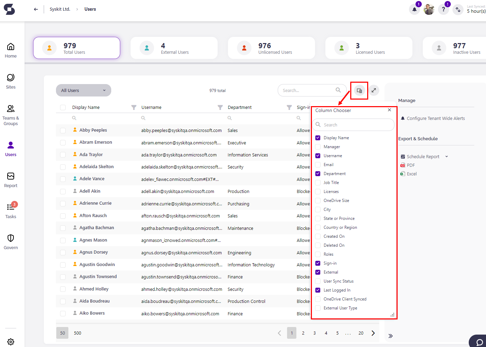
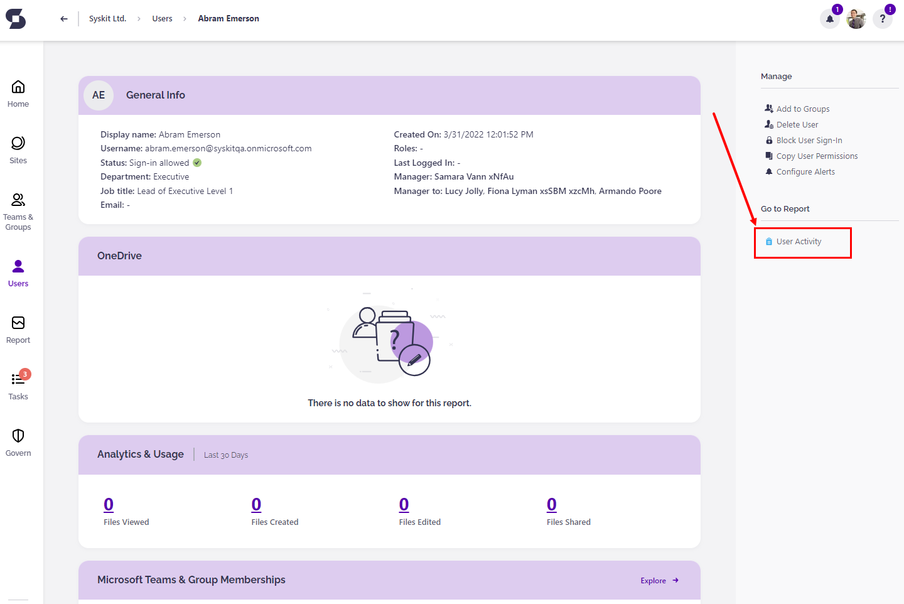
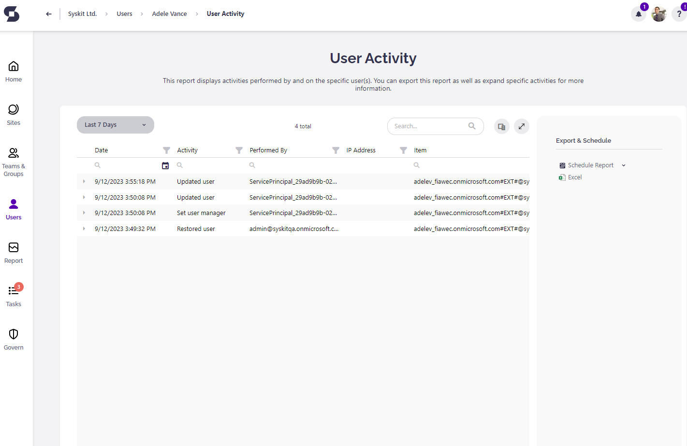
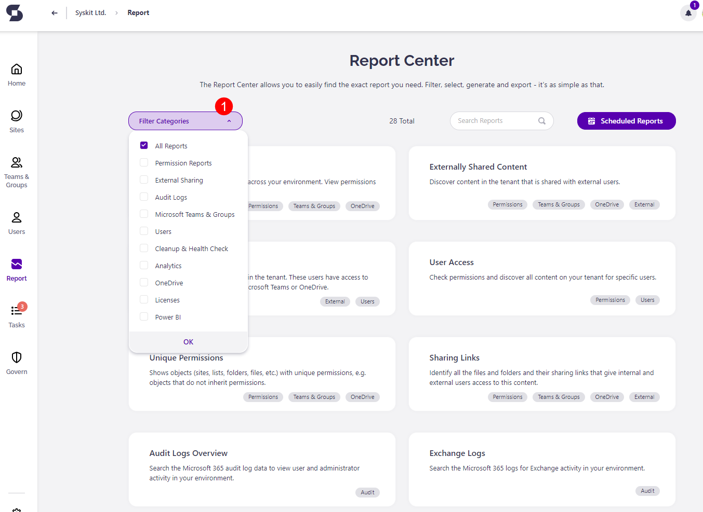
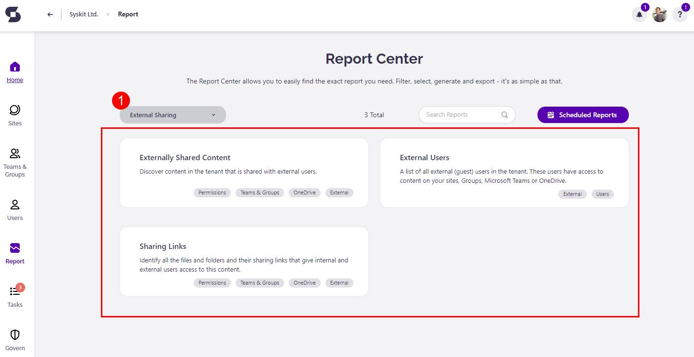

# Microsoft 365 External Users

**External Users refers to individuals who are not part of your organization but need access to your Microsoft 365 resources**, such as files, documents, etc. External users can collaborate with your organization's users, sharing and working on content. 

The two types of external users you can track in Syskit Point are **Ad Hoc External Users** and **Guest Users**.

**Ad Hoc External Users** 
* Users who don't have an identity in your Azure AD directory.
* Access is given via a sharing link to a specific resource.
* Access is often temporary and might just be needed for a particular project or task. 
    * For example, you've outsourced an agency to do your branding and they require access to certain documents and files in order to complete their job. This would make them an Ad Hoc external user as they do not belong to your organization but need temporary access to certain files.
* You can distinguish Ad Hoc Users by their username that starts with `urn:spo:guest#`, for example, `urn:spo:guest#johndoe@gmail.com`.
    * You can also use the External User Type column on the Users Overview screen to filter out Ad Hoc Users.

**Guest Users** 
* Users who have an identity/guest account in your Azure AD directory.
* Guest users typically have a broader scope of access and may have been given access to multiple resources or workspaces.
* They have a more structured and potentially even long-term relationship with your organization. 
    * Let's say you hired a freelance developer to help you maintain your website. While this person might not work for your organization directly, they are hired long-term and might require access to more workspaces than a short-term hire would. 
* Guest User's username contains `#EXT#` string in their username, for example, `johndoe_gmail.com#EXT#@contoso.onmicrosoft.com`.
    * You can also use the External User Type column on the Users Overview screen to filter out Guest Users.

Keeping track of your external users and their activity is vital in order to ensure a safe and secure collaborative environment. 

## Track External Users and Their Activities

If you want to find out everything about External users and their access to your environment, you can simply open the **Syskit Point** web application and within the **Users Overview** screen, from the **View drop-down menu** (1) located on the top left of the overview screen, choose **External Users (2)** view.

The picture below shows you how to switch between different views at the **Users Overview** screen.

You will find useful data while checking the External Users view in the grid, such as the sign-in status of the user.

You can open **Column Chooser** with the list of all available columns to display by clicking on the button located on the left side of the **Search** field.

Detailed information about each External user \(or any other user\) is visible on their **User Details** screen. 

There you can find information divided into a few tiles - General info, OneDrive, Analytics & Usage, Microsoft Teams & Groups Memberships, and Sites tile.

Notice the sidebar panel on the right end of the screen and section **Go to Report** &gt; **User Activity** report.

Clicking on that report button will redirect you to the **User Activity** report, where you can see all the actions performed by/on that external user.

By default, this report has the timeframe for the **Last 30 Days**. To switch this, choose a different timeframe from the dropdown menu.

Every report within the **Syskit Point** is exportable, all of them in the form of **Microsoft Excel Worksheet** file type and most of them in **PDF** file type. You will find this option in the sidebar panel under the section **Manage** &gt; **Export** button.

The icon will point out which export file type you are choosing. You can also access the **User Activity** report from the **Report Center** when you click the **Reports button** on the left of the screen. 

The reports screen will open where you can select the type of report you want to access from the **All reports drop-down bar (1)** on the top left of the report screen. 

For example, if you open the dropdown filter and select **External Sharing (1)** category - three reports will be selected \(**Externally Shared Content, External Users, Sharing Links**\), and all of them are regarding external users.

Every tile in the Report Center holds a description. This way, you won't have trouble choosing the right report.

