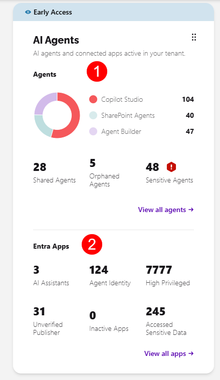

# AI Agents Dashboard

The **AI Agents** tile on the Syskit Point Dashboard shows the Microsoft agents and connected Entra apps that are active in your tenant, how they break down by type, and how many of them need your attention.

The tile gives you a single place to see how many agents and Entra apps exist in your tenant and lets you jump straight into the detailed inventory reports, without having to search through the Report Center.

:::info

**AI Agents in Syskit Point is currently in Early Access** and free to use while the feature is in active development. Feature behavior and scope may change as new capabilities are released.

:::

The AI Agents tile is split into two sections:

* **[Agents](#agents) (1)** - the Microsoft agents deployed across your tenant, grouped by type, with counts for the shared, orphaned, and sensitive agents that most often need attention.
* **[Entra Apps](#entra-apps) (2)** - the Entra ID apps that can access your Microsoft 365 data, with counts for the categories that carry the most risk.

Clicking **View all agents** or **View all apps** opens the relevant inventory report, where you can review the findings and take action.

## Agents

**As more people across your organization create or install agents, it becomes harder to keep track of who owns them and what data they can reach.** The Agents section breaks down the agents in your tenant by type and shows the ones that need a closer look.

The section shows the number of agents by type - **Copilot Studio**, **SharePoint Agents**, and **Agent Builder**, alongside the numbers for the following:

* **Shared Agents** - agents that have been shared with other users
* **Orphaned Agents** - agents whose owner is no longer an active user
* **Sensitive Agents** - agents that reference sensitive content through their knowledge sources

Clicking **View all agents** opens the [Agents Inventory](ai-agents-and-apps-agents-inventory.md) report, where you can review every agent in detail and take action. You can also click any of the counts to open the report filtered to that view.

## Entra Apps

**Alongside agents, Entra ID app registrations, enterprise applications, and service principals can also access your Microsoft 365 data.** The Entra Apps section gives you visibility into those apps and highlights the ones worth reviewing.

The section shows the counts you'll want to keep an eye on:

* **AI Assistants** - apps identified as AI assistants
* **Agent Identity** - apps that act as an agent identity
* **High Privileged** - apps that hold high-privilege permissions
* **Unverified Publisher** - apps from a publisher Microsoft hasn't verified
* **Inactive Apps** - apps with no recent activity
* **Accessed Sensitive Data** - apps that have accessed sensitive content

Clicking **View all apps** opens the [Apps Inventory](ai-agents-and-apps-apps-inventory.md) report, where you can review every app in detail and take action. You can also click any of the counts to open the report filtered to that view.

## Related Articles

* [AI Agents Overview](ai-agents-and-apps-overview.md)
* [Configure AI Agents](ai-agents-and-apps-settings.md)
* [Agents Inventory Report](ai-agents-and-apps-agents-inventory.md)
* [Apps Inventory Report](ai-agents-and-apps-apps-inventory.md)
* [AI Agents Reports](../reporting/ai-agents-reports.md)
