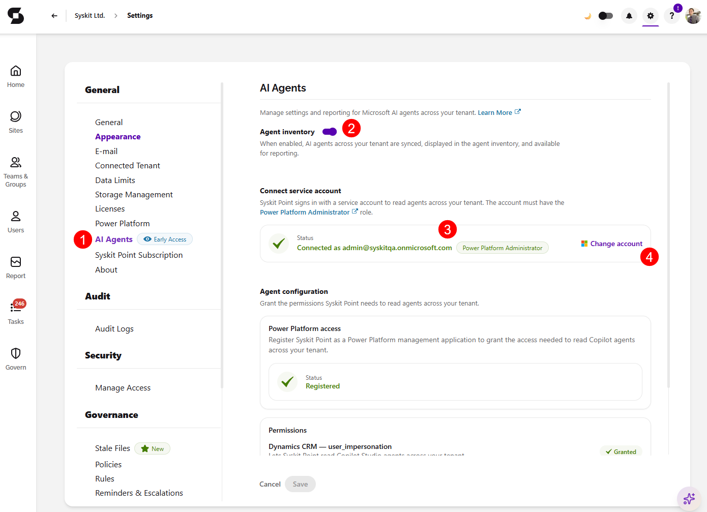

# Set Up AI Agents & Apps

In order to start discovering the **Microsoft agents and apps that can access your Microsoft 365 data**, you need to first set up **AI Agents & Apps** in Syskit Point. During the setup, you connect a service account and grant Syskit Point the permissions it needs to read the agents across your tenant. This helps you keep track of the agents and apps in one place through the [Agents Inventory](ai-agents-and-apps-agents-inventory.md) and [Apps Inventory](ai-agents-and-apps-apps-inventory.md) reports.

In this article, you can find details on:

* [Prerequisites](#prerequisites)
* [Setting Up AI Agents & Apps](#set-up-ai-agents--apps-in-settings)

:::info
**Please Note!** AI Agents & Apps is currently in **Early Access** and still in further development. Available features and their behavior may change as new capabilities are released.
:::

## Prerequisites

* To set up and configure AI Agents & Apps, you need the **Syskit Point Admin** role.
* To connect the service account, you need an account with the **Power Platform Administrator** role assigned in Entra ID. Syskit Point signs in with this account to read the agents across your tenant.

## Set Up AI Agents & Apps in Settings

To set up AI Agents & Apps, go to the **AI Agents section (1)** of Settings, under **General**. 

* **Turn on the toggle for Agent inventory (2)** 
  * When enabled, AI agents across your tenant are synced, displayed in the agent inventory, and available for reporting. 

The rest of the setup consists of two parts: **connecting a service account** and **granting the agent configuration permissions**.

### Connect the Service Account

Syskit Point uses your **service account** to sign in and read the agents across your tenant. The account **must have the Power Platform Administrator** role.

* Once connected, the **Status** shows the **connected account** with a **green** checkmark next to it and confirms the **Power Platform Administrator (3)** role.
  * **Clicking Change account (4)** takes you to the **Connected Tenant** section of Settings, where you can change your connected service account.

### Grant the Agent Configuration Permissions

Under **Agent configuration**, grant the permissions Syskit Point needs to read the agents across your tenant.

* Under **Power Platform access**, register Syskit Point as a Power Platform management application to grant the access needed to read Copilot agents across your tenant.
  * Once registered, the **Status** shows **Registered** with a **green** checkmark next to it.
* Under **Permissions**, grant the permissions listed below. Each permission shows as **Granted** with a green checkmark once approved:
  * **Dynamics CRM — user_impersonation** lets Syskit Point read Copilot Studio agents across your tenant.
  * **Power Platform — ResourceQuery.Resources.Read** lets Syskit Point query Agent Builder agents across your tenant.
  * **Power Platform — CopilotStudio.MinimalBot.ReadWrite** lets Syskit Point read and write minimal bot resources for Copilot Studio agents across your tenant.
* **Click Save** to store your preferences.

Once the service account is connected and the permissions are granted, the first **AI Agents & Apps data sync** starts. When completed, the summary data shows on the [AI Agents & Apps dashboard tile](ai-agents-and-apps-dashboard-tile.md). From there, you can drill to open the Agents Inventory and Apps Inventory reports for a detailed overview of the agents and apps in your tenant.

