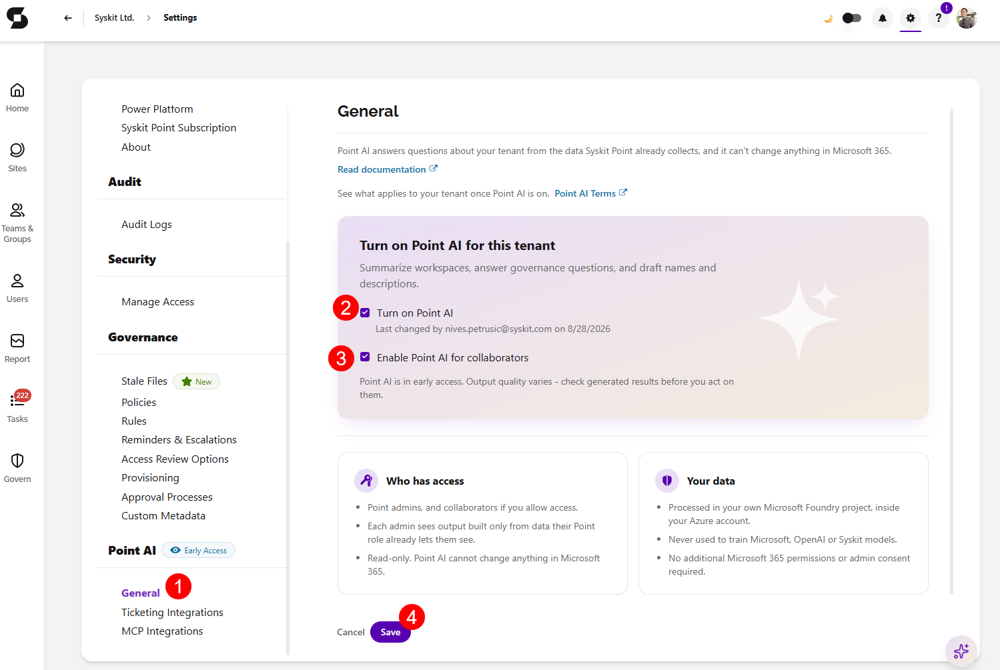

# Enable AI Features

**AI features that use LLM functionality are off by default.** This article shows how to enable them, who can do it, and what changes when you do.

Before enabling, we recommend reviewing [AI Data Privacy & Security](ai-data-privacy-and-security.md) article and the [Syskit AI Terms](https://www.syskit.com/legal/ai-terms). 

## Prerequisites

To enable AI features:

* You need the **Syskit Point Admin** role.
* Your organization uses Syskit Point Cloud. During the [Early Access Program](early-access-program.md), AI features are available to all Cloud customers.

## Enable Point AI

* In Syskit Point, go to **Settings** > **Point AI** > **General (1)**.
* Select the **Turn on Point AI** checkbox (2) to enable Point AI.
  * This is a single opt-in. 
  * Opting in makes all Point AI features available; there are no per-feature toggles.
* Optionally, select the **Enable Point AI for collaborators checkbox (3)** below it to make Point AI available to collaborators.
* **Click Save (4)** to finalize your decision.

:::info

**Please note:** changes take **effect immediately**. Users may need to refresh Syskit Point to see new AI entry points, such as the Syskit Point Assistant icon.

:::

## What to Expect when Enabling Point AI

**Enabling Point AI:**

* Makes LLM-based features available to your Syskit Point users, within their existing Point roles.
* Means you accept that usage falls under the Early Access fair-usage principles, see [Early Access Program](early-access-program.md).

**Enabling Point AI doesn't:**

* Change what data Syskit Point collects from your tenant.
* Give any user access to data beyond their Point role.
* Allow AI to make changes in your environment.
  * AI features only deliver findings and recommendations.

The [Sensitivity Label Recommendations](features/sensitivity-label-recommendations.md) report uses machine learning with no LLM involved. It is part of Syskit Point's standard functionality and are not controlled by the Point AI setting.

## Disable Point AI

To turn Point AI off, return to **Settings** > **Point AI** > **General** and clear the **Turn on Point AI** checkbox. 

This takes effect immediately:

* AI entry points disappear from the interface.
* No LLM processing of your data occurs while disabled.
* Connected AI tools using the [Syskit Point MCP Server](features/mcp-server.md) lose access.

You can re-enable the feature at any time.
