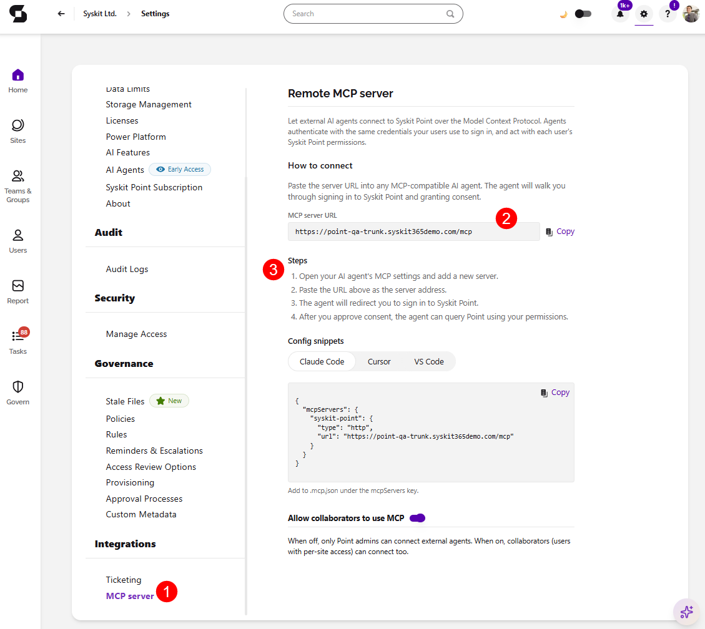
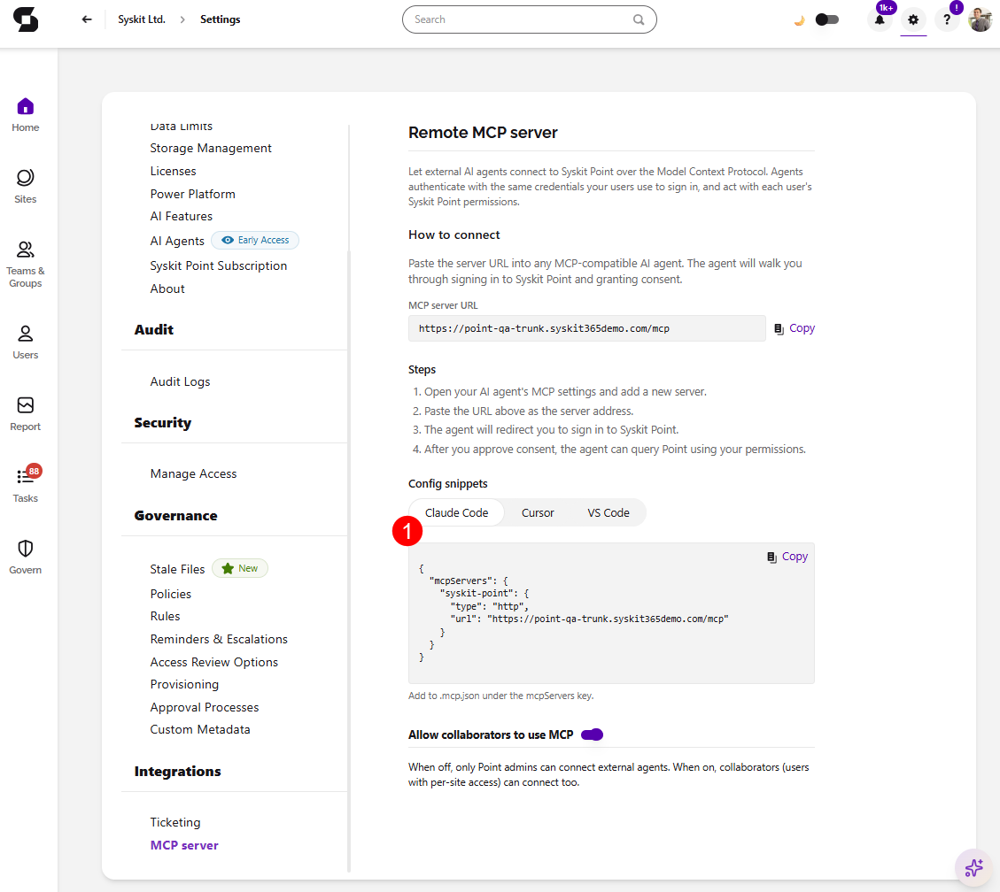

# Syskit Point MCP Server

:::info

**This feature uses LLM functionality which means admin opt-in required.** Take a look at the [AI Data Privacy & Security](../ai-data-privacy-and-security.md) and [Enable AI features](../enable-ai-features.md) articles for more details.

:::

**The Syskit Point MCP Server lets you query your Microsoft 365 governance data directly from any AI tool that supports the Model Context Protocol (MCP)**:
* Microsoft Copilot 
* Claude, or 
* Custom agents you build 

## Prerequisites

* AI features are [enabled](../enable-ai-features.md) in Syskit Point.
* Setting up the MCP Server requires the **Syskit Point Admin** role.
* An MCP-compatible AI tool.

## Capabilities 

With the Syskit Point MCP Server you can:

* **Explore users, groups, teams, and sites** - ownership, membership, and access investigations ("Which of our sites are externally shared and ownerless?").
* **Run and interpret Syskit Point reports** - external sharing, ownerless groups, excessive storage, "which resources can this user access."
* **Query audit history** - user and admin activity, file and sharing events, membership changes, within a date range.
* **Analyze storage** - quotas, growth trends, and version-cleanup opportunities across the tenant.
* **Inventory Power Platform resources** - apps, flows, connections, and their ownership risks.

The **MCP Server is read-and-report** only: it **delivers findings and report results**, and does not expose administrative write actions in your tenant. 
  * Queries return only data the connecting identity is allowed to view under Point's permission model, within Point's sync scope and your audit retention period.

## Set up the MCP Server

* In Syskit Point, go to **Settings** > **Integrations** > **MCP Server (1)** 
* As instructed on screen, paste the **provided server URL (2)** into any MCP-compatible AI agent. 
  * The agent will walk you through signing in to Syskit Point and granting consent.
  * **Follow the Steps (3)** listed on screen if you are unsure. 

:::warning

**Please note:** Treat MCP credentials like admin credentials. Whoever holds one can query your governance data at the scope it allows.

:::

## Connect your AI tool

To connect you AI tool, you'll need the endpoint URL and a credential from your Point admin. 

* **Claude** - add a custom connector: **Settings** > **Connectors** > **Add custom connector**, paste the endpoint URL, and authenticate. You can test it after with a prompt: *"Using Syskit Point, list ownerless groups."*
* **Microsoft Copilot Studio** - add a new tool of type **Model Context Protocol** pointing to the Syskit Point endpoint, configure authentication, and publish to the users or agents who need governance data.
* **Custom agents** - any MCP-compatible framework can connect using the endpoint and credential; list the available tools on connection to discover the capability surface programmatically.

The **configuration snippets (1)** are located in **Settings** > **Integrations** > **MCP Server** for Claude Code, Cursor, and VS Code.  

## Manage access

* **Rotate credentials:** create a new credential, update the client tool, revoke the old one.
* **Revoke a credential:** takes effect immediately; the tool's next request fails with an authentication error.
* **Disable the server:** turns off all MCP access at once without deleting registered credentials.

## Early Access status

The **MCP Server is in Early Access and under active development**. If a query fails or returns unexpected results, share it when the product team reaches out for feedback. **MCP feedback is a top priority** right now.
