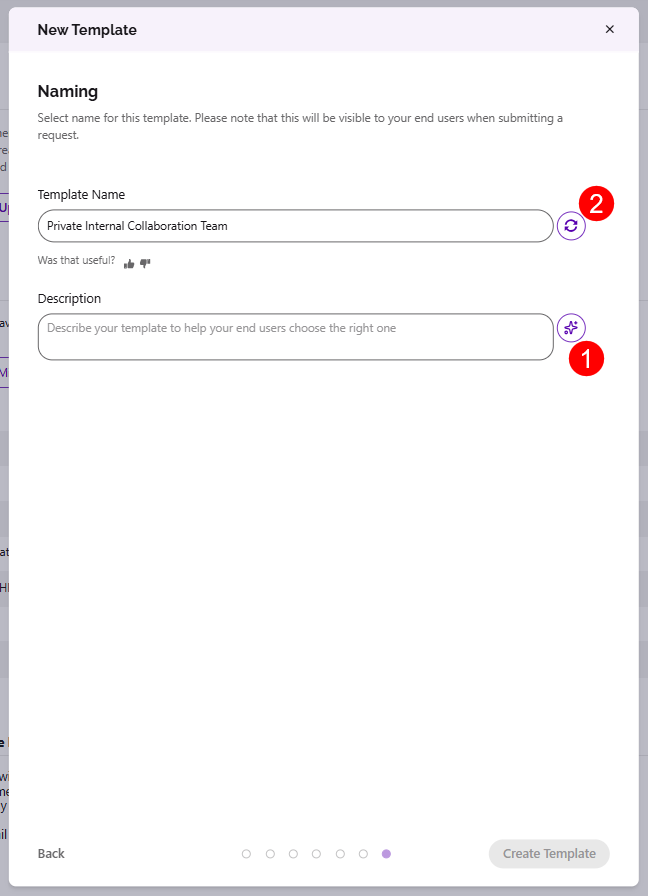

# Naming Recommendations

:::info

**Uses LLM functionality - admin opt-in required.** Off by default; processing runs through Microsoft Foundry (Azure-hosted models) in your selected Azure region, and your data is never used to train the foundation models. See [AI Data Privacy & Security](../ai-data-privacy-and-security.md).

:::

**Naming provisioning templates and governance policies is a small but constant friction point**. Every policy-creation workflow stalls for a moment at the "Name" field.

Naming Recommendations remove that moment. As you create a provisioning template or governance policy, Syskit Point suggests a clear, descriptive name based on what you've configured - one less thing to think about, and more consistent naming across your governance setup.

## How it works

* Create a provisioning template or policy as usual.
* As you configure it, on the Naming screen, you can **click the AI suggestion button (1)** and Point suggests a name reflecting the settings you've chosen.
  * If you are unhappy with the suggestion, **click the retry button (2)** and another suggestion is provided.
* Accept the suggestion, edit it, or ignore it and write your own. 
  * The suggestion never overrides what you type.

## Good to know

* Suggestions are based on the template or policy configuration — not on tenant content.
* This feature is intentionally small. It exists to speed up admin workflows, and that's it.
* Available for: **[to be confirmed — provisioning templates, governance policies, others?]**.
