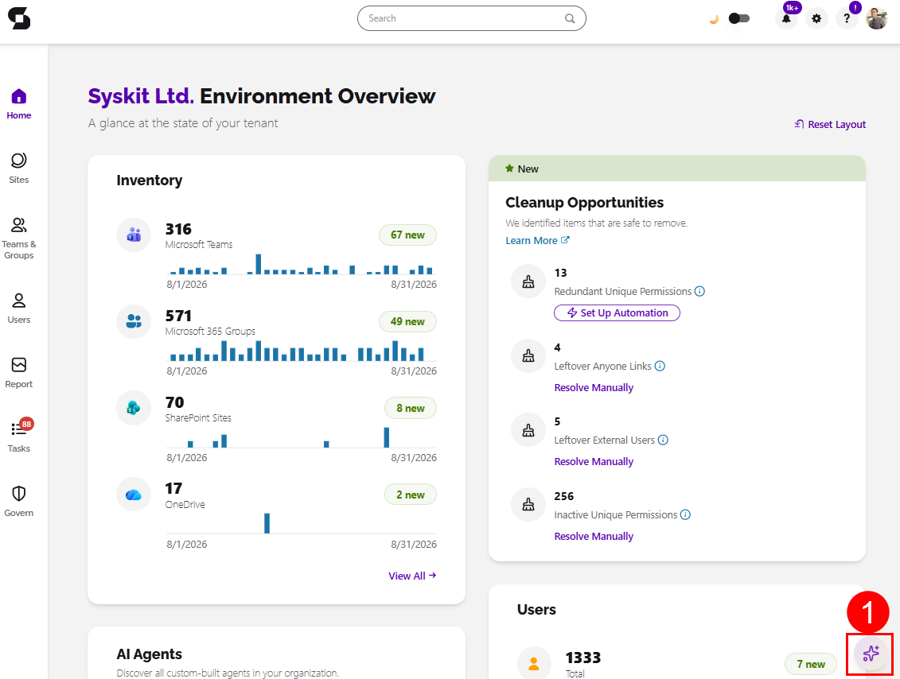
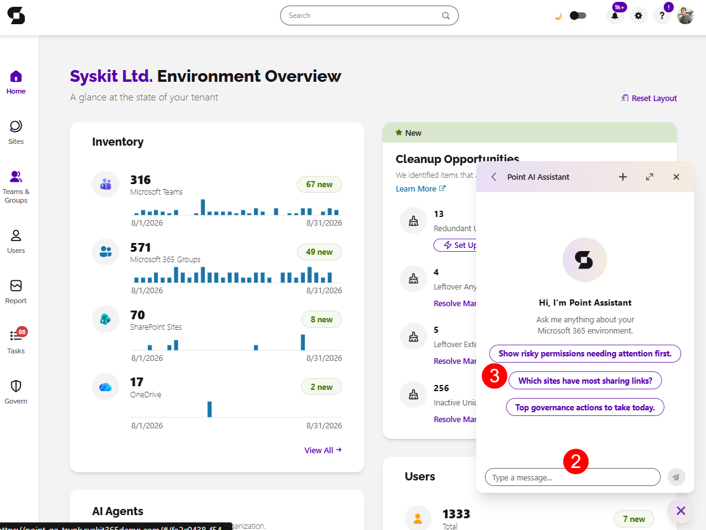

# Point Assistant

:::info

**Uses LLM functionality - admin opt-in required.** Off by default; processing runs through Microsoft Foundry (Azure-hosted models) in your selected Azure region, and your data is never used to train the foundation models. See [AI Data Privacy & Security](../ai-data-privacy-and-security.md).

:::

**Point Assistant lets you ask everyday governance questions in plain language** - who has access to what, why a user is risky, what an account has been doing — without knowing which of dozens of reports to run or where each setting lives.

The Assistant answers from Syskit Point's own data: audit logs, users, workspaces, permissions, and reports. It turns "go dig through dashboards" into a conversation.

## Requirements

* An admin must [enable AI features](../enable-ai-features.md) in Settings.
* You need a Syskit Point account. 
  * The Assistant answers within the limits of your Point role - it never shows you data your role can't access.

## Open the Assistant

* In Syskit Point, select the **Point AI Assistant icon (1)** in the bottom-right corner.
* **Type your question (2)**, no special syntax is needed, or select one of the **available prompts (3)**.

## Initial Questions

The Assistant covers users, groups and teams, SharePoint sites, storage, audit activity, Point reports, and Power Platform. 

Try these to get a feel for how it works:

* *"Which groups and sites can Eva Green access?"*
* *"Who owns the Marketing team?"*
* *"Show inactive SharePoint sites."*
* *"Who deleted (file name) last week?"*
* *"Find sites nearing their storage quota and tell me where version cleanup would save the most space."*
* *"(User Name) is leaving on Friday. Show their groups, sites, apps, flows, and ownership responsibilities."*

## Sugestions for Better Answers

* Name the user, site, or group as precisely as you can — name, email, or sign-in name all work.
* For activity questions, include a time range: *"in the last 30 days"*, *"between May 1 and May 25"*.
* Ask compound questions when you need a full picture — the Assistant can chain lookups across users, access, activity, and reports in one ask.

:::info

Please Note, the Point AI Assistant:

* Is **read-only.** 
  * The Assistant delivers findings and recommended steps; it does not make administrative changes. To act on a finding, follow the link into the relevant Point report.
* Shows **Point data only.** 
  * Answers come from data synced into Syskit Point — very recent tenant changes appear after the next sync, and activity answers are limited by your audit retention period. It doesn't answer general knowledge questions.
* Shows **no fabrications.** 
  * If the data isn't there, the Assistant says so rather than inventing records.

:::

