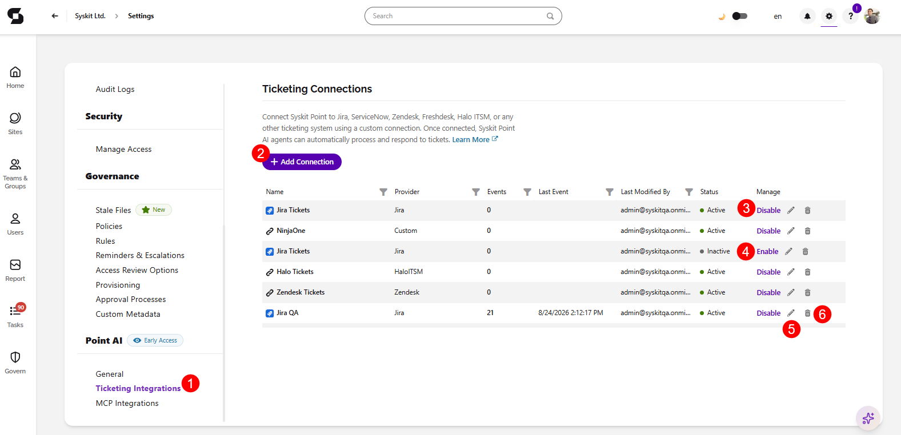
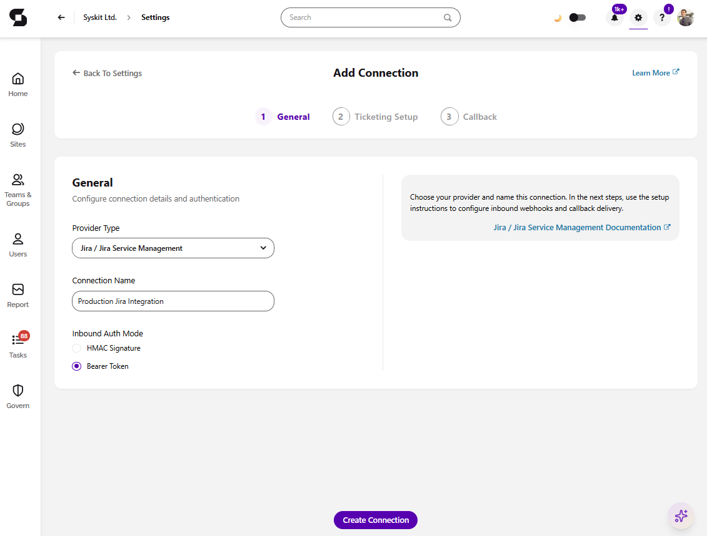
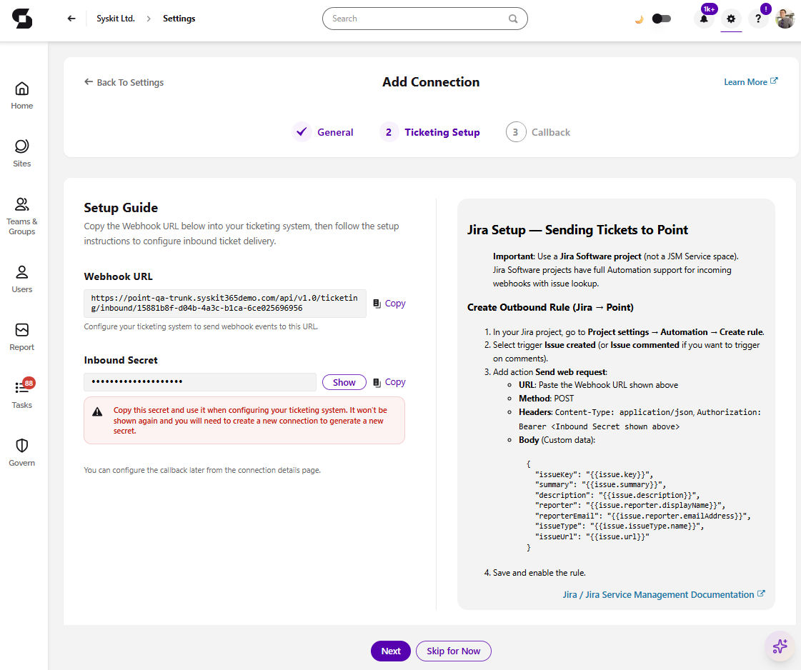
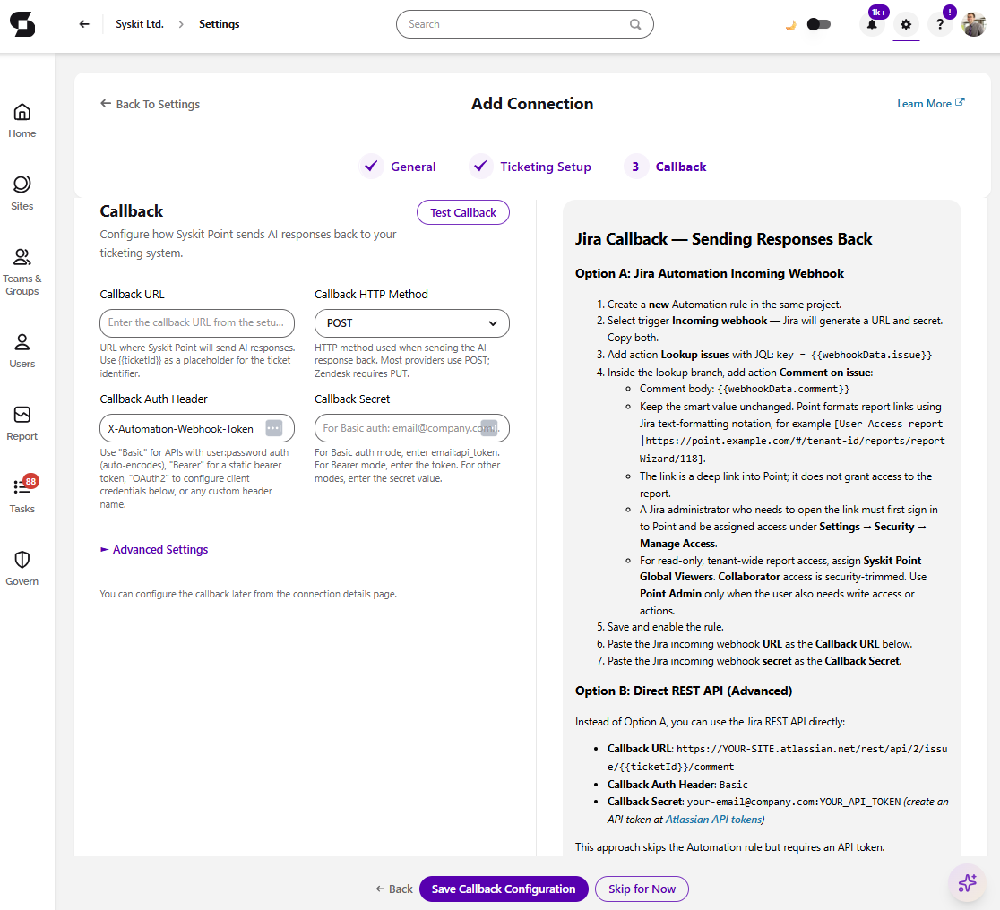

# Ticketing Integrations

:::info

**This feature uses LLM functionality which means admin opt-in required.** It is off by default; processing runs through Microsoft Foundry (Azure-hosted models) in your selected Azure region, and your data is never used to train the foundation models. Take a look at the [AI Data Privacy & Security](../ai-data-privacy-and-security.md) and [Enable AI features](../enable-ai-features.md) articles for more details.

:::

**Support teams waste time hunting for answers across disconnected systems.** A ticket like *"Eva lost access to the site"* normally means jumping between the ticketing system, admin centers, and audit logs before anyone can reply.

With Ticketing Integrations, your ticketing system forwards Microsoft 365-related tickets to Syskit Point, and Point AI sends the answer back — *"Eva lost access because Daniel removed it on 25 May"* — before an agent even opens the ticket. Faster resolutions, lower cost per ticket, better CSAT, and easier onboarding of new support staff.

## How it works

Syskit Point provides the answers; the integration itself is set up and controlled by you, within your ticketing tool. The flow:

* **A ticket arrives** in your ticketing system.
* **Your ticketing system forwards it to Syskit Point.** 
  * Based on your internal setup in the ticketing tool, you decide which tickets or notes are forwarded to Point.
* **Point AI provides the answer back** to the ticketing system, based on Point's own data - permissions, audit logs, group memberships, sharing events - with what happened, when, and who did it.
* **Your ticketing system posts the answer.** 
  * Based on your setup, it can be added as an **internal note (recommended)** or as a reply to the ticket.

Because steps 2 and 4 happen in your ticketing system, you stay in full control of which tickets Point sees and how its answers are used.

## Setting up a connection

In Syskit Point, go to **Settings** > **Integrations** > **Ticketing (1)**.

* **Click Add Connection (2)** and pick your ticketing system. 
* You can also complete the following actions:
  * **Click disable (3)** to disable a connection.
  * **Click enable (4)** to enable a connection that has been disabled. 
  * **Click the edit icon (5)** to change the details for this connection.
  * **Click the delete icon (6)** to erase the created connection from the list.

In this example, for the sake of the screenshots we are using Jira Service Management. 
  * The connection setup and requirements are explained in-app on the right side of the screen for every connection. 
    * **Follow the steps shown for your platform.**

There is also an **Custom / Other** option you can use to integrate ticketing platforms we currently don't have a native connection with.

:::info

**Please Note,** the Ticketing integration **does not**:

* Make changes in your Microsoft 365 tenant — restoring Eva's access is still an admin action, done through Point or your admin tools.
* Decide how tickets are handled — forwarding rules and how answers are posted are controlled by your setup in the ticketing tool.

:::

## Data Handling

Syskit Point processes the ticket content it receives (to understand the question) and returns an answer. Ticket content is processed under the same rules as all LLM features in Point - within your Azure boundary, never used to train the foundation models. You can find more details in the [AI Data Privacy & Security](../ai-data-privacy-and-security.md) article.
