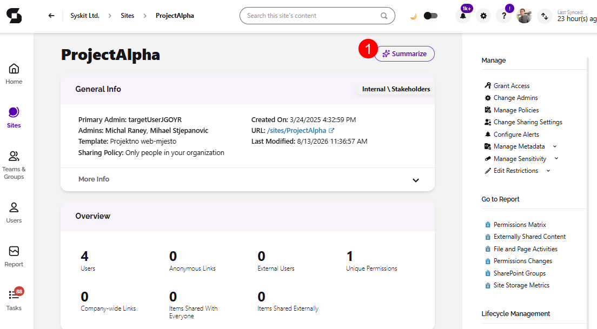
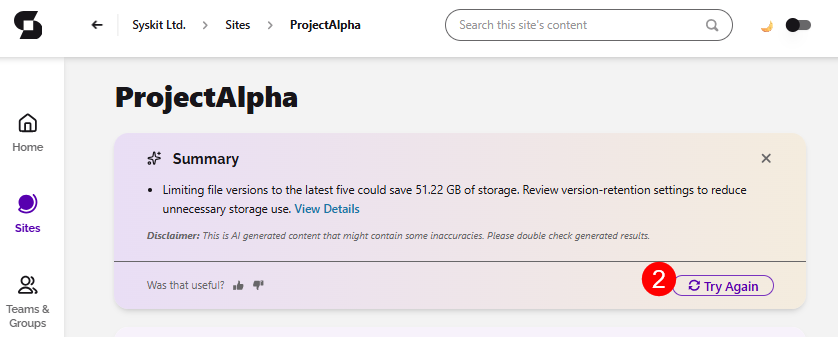

# Workspace Summaries

:::info

****This feature uses LLM functionality which means admin opt-in required.** It is off by default; processing runs through Microsoft Foundry (Azure-hosted models) in your selected Azure region, and your data is never used to train the foundation models. Take a look at the [AI Data Privacy & Security](../ai-data-privacy-and-security.md) and [Enable AI features](../enable-ai-features.md) articles for more details.

:::

**Knowing whether a single workspace is healthy normally means searching through dashboards** and cross-referencing sharing links, permissions, sensitivity labels, inactive access, and storage. In an environment with thousands of workspaces, it's difficult for admins to find enough time to go through all of that, so risks can sometimes remain unnoticed until they become problematic.

Workspace Summaries turn everything Syskit Point knows about a workspace into a plain-language overview, in one click. Just like that, workspace assessment goes from needing hours to finish to being available in seconds.

## Generate a Summary

To generate a AI Workspace Summary complete the following:

* Open any **workspace's details page** in Syskit Point.
  * For example, by going to Sites and clicking a workspace name opens that workspace's details screen. 
* Select the **Summarize button (1)**.
  * The summary appears within seconds.
* Click **Try Again (2)** if you want to try and generate a different summary.

## AI Summary Content

In the AI generated Workspace Summary, you can find the following information:

* **The top 3–5 issues** that need attention in this workspace.
  * They are prioritized.
* **Benchmarks** against your organizational averages, so you know whether "47 sharing links" is normal or an outlier in *your* environment.
* **Quantified impact** where acting has measurable value.
  * For example, *more than 100 GB reclaimable by deleting old file versions*.
* **Direct links** - each item links directly into the Syskit Point report where you can investigate and fix any issue it.

:::info

**Please note:** 

* Summaries reflect data currently synced into Syskit Point.
* A summary is an assessment aid, not an action. Fixing issues happens through the linked reports and standard Point workflows.
* Summaries are generated on demand and are not stored.

:::

