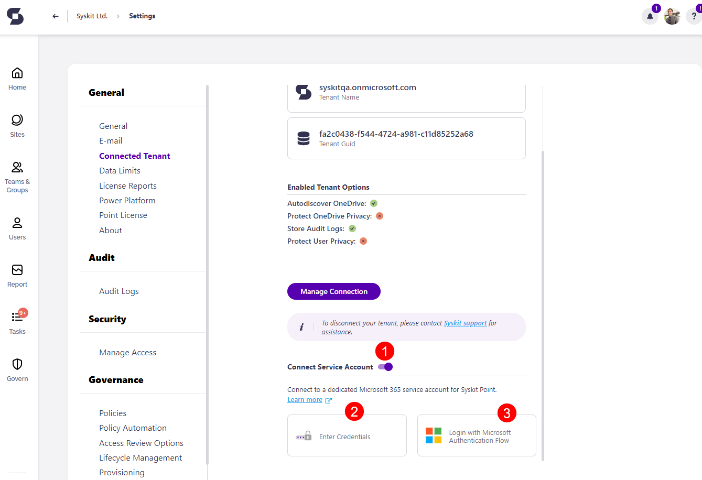
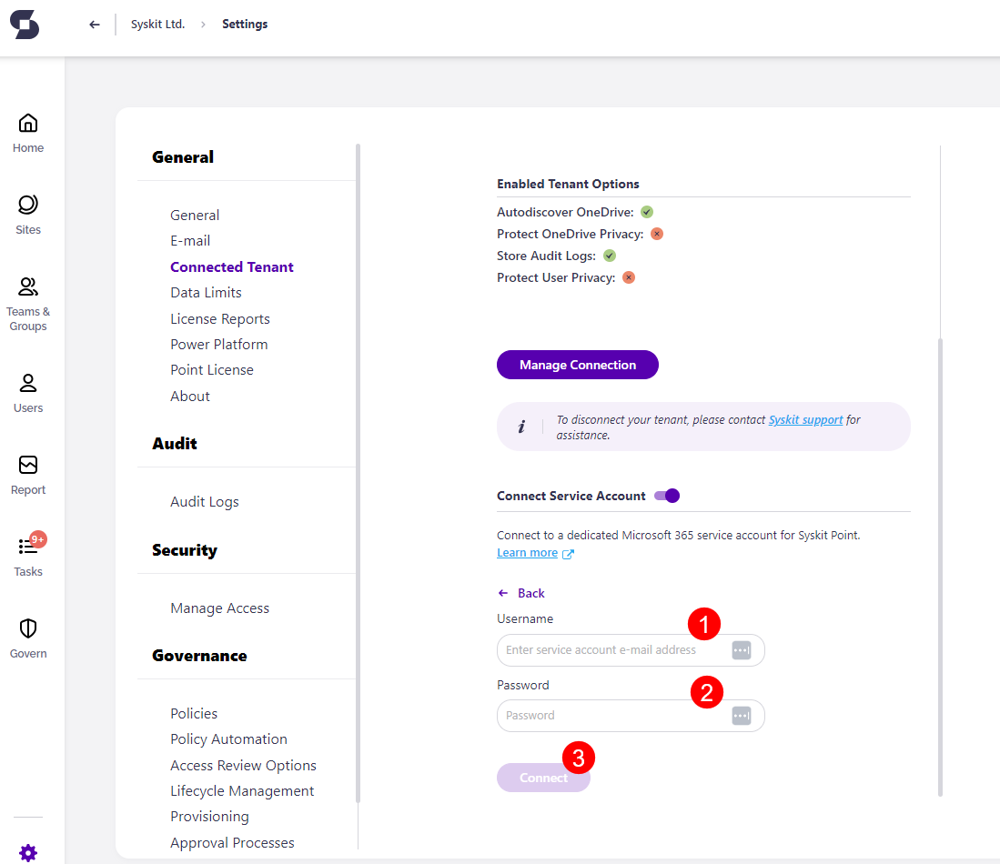
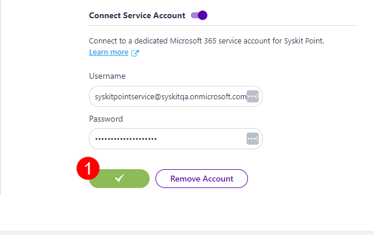
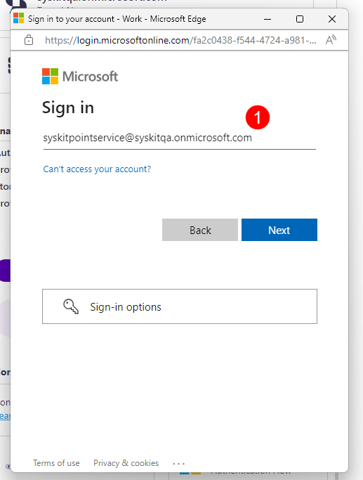
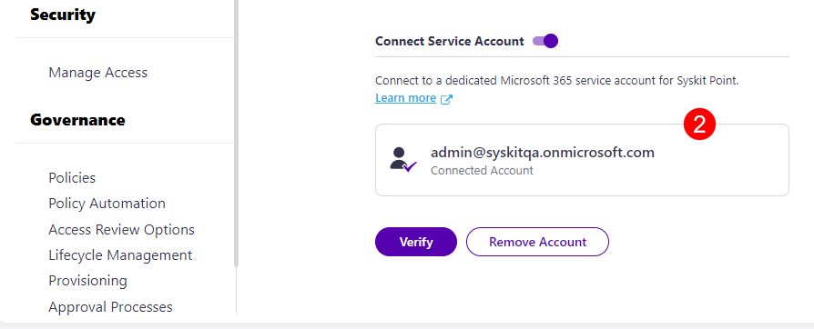
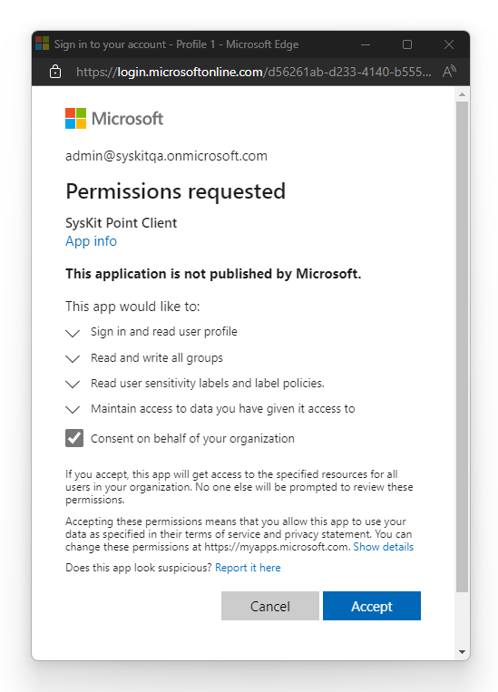

# Connect Service Account

**A service account** in Syskit Point is utilized for:
 * [Sensitivity labels in provisioning templates](../governance-and-automation/provisioning/enable-sensitivity-labels.md)
 * [Applying Versioning limits to workspaces via rules](../storage-management/versioning-limits.md)

To connect the service account in Syskit Point:
* **Navigate to Settings** > **General** > **Connected Tenant**
* **Switch the Connect Service Account (1) toggle on**

Once the Connect Service Account option is turned on, you can choose how to connect and authenticate your service account.

Two options are available:

* **Enter credentials (2)** option - service account should not have multi-factor authentication enabled
* **Login with Microsoft Authentication Flow (3)** - supports a service account with **Multi-factor authentication enabled** 

  * To enable multi-factor authentication, follow the instructions in [this article](https://support.microsoft.com/en-us/office/set-up-your-microsoft-365-sign-in-for-multi-factor-authentication-ace1d096-61e5-449b-a875-58eb3d74de14).

## Enter Credentials

If credentials are selected, additional fields are displayed where you can:
* **Enter service account email address (1)**
* **Enter service account password (2)**
* **Click the Connect button (3)** to finish

**After a successful connection, the connect button turns green and shows a checkmark (1).**

## Login with Microsoft Authentication Flow
If logging in with Microsoft Authentication Flow is selected, a pop-up will appear requesting the **sign-in information (1)** for the service account. 

Once the account is successfully connected, you will see the email listed stating it is a **Connected Account (2)**.


**Please note!**  
**Global Admin consent is required** when connecting the service account through Microsoft Authentication Flow for the first time. 


## Additional Information
When Microsoft Authentication Flow is used, Global Admin consent is required due to additional permissions required for the Syskit Point Client app registration. 
[Learn more about these permissions in the Permission Requirements article](../requirements/permission-requirements.md#syskit-point-client).