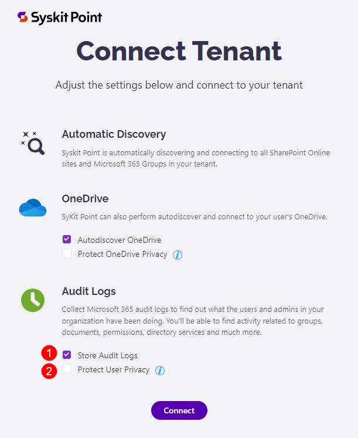
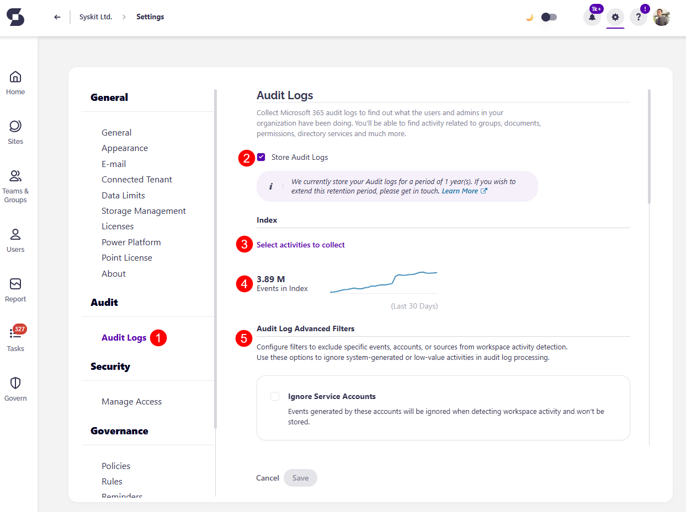
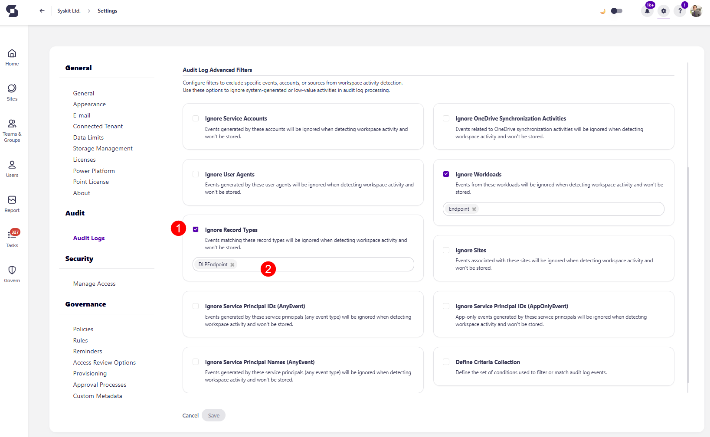
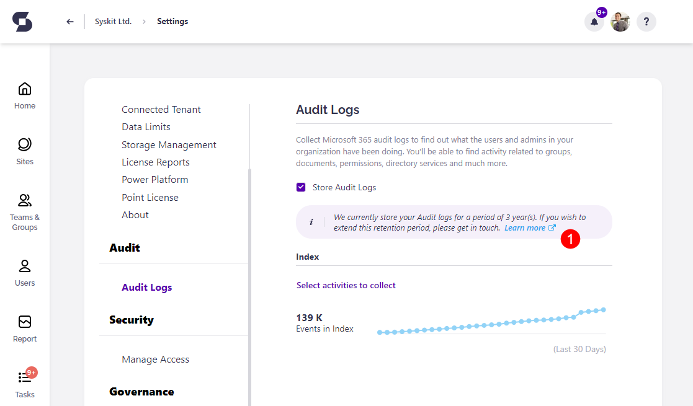
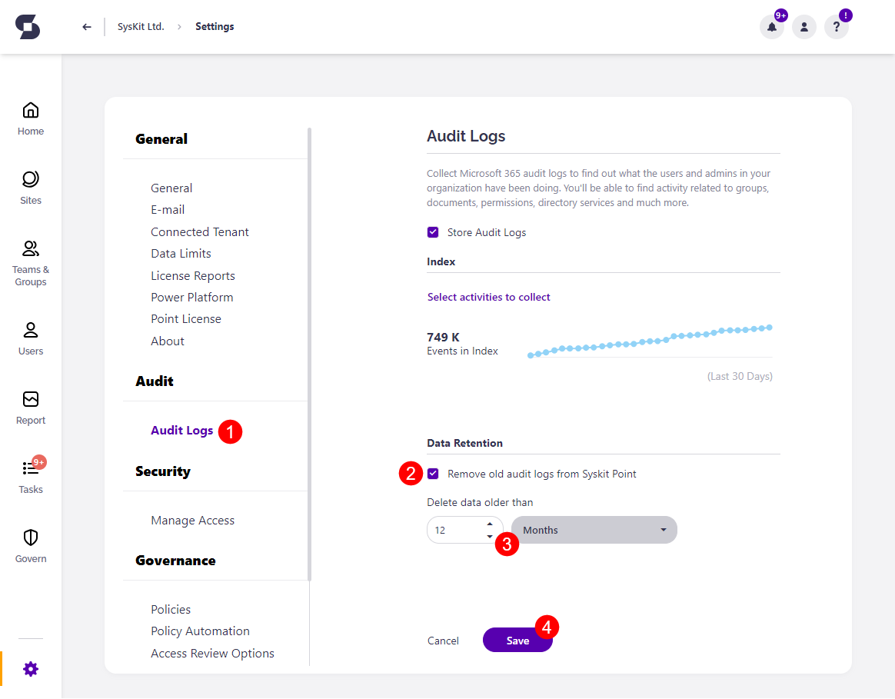
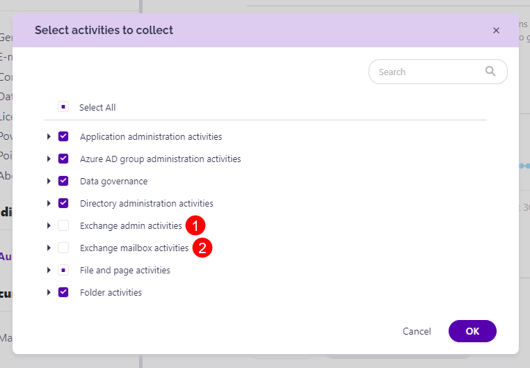

# Customize Audit Logs Collection

:::info
**Audit Logs** are available in the Security & Compliance plan and higher tiers. See the [pricing page](https://www.syskit.com/products/point/pricing/) for more details.
:::

Audit logs provide **insights into all activities** related to users and administrative activities in your Microsoft 365 environment. The Audit Logs contain information about activities within your organization, including **groups, documents, permissions, directory services, and much more**.

Users who are assigned the **Syskit Point Admin role** can configure which activities will be collected in the following locations:

* **Syskit Point Registration > Tenant settings**
* **Audit Logs section in Settings**

## Syskit Point Registration > Tenant settings

After registering **Syskit Point**, during the **Connect tenant** step, the following audit options are available:

* **Store audit logs \(1\)**
* **Protect user privacy \(2\)**

:::info
**Please note!**  
You can change these settings by managing your tenant connection in Settings > General > Connected Tenant. 
:::

### Store Audit Logs Option

By default, the **Store audit logs** option is enabled, which means Syskit Point will process and store audit logs in your **Azure Cosmos DB account**.

:::info
**Tip!**  
You can change the Audit Logs settings after the initial connection by managing your tenant connection in Settings > General > Connected Tenant. 
:::

### Protect User Privacy Option

Turning this option on results in the following:

* **User activity data**, such as file and permissions changes, **will be hidden and protected from Administrator supervision** 
  * **The User Activity report will be hidden from the Syskit Point user interface**
  * **Access to the File and Page Activities reports will be hidden**
  * **Summary data in the Analytics & Usage tile will remain visible, but you cannot drill down to view data for a specific user**
* **User activity** data will, however, still be collected and stored

:::warning
**Please note!**  
User activity data continues to be collected and stored to be readily available if needed in the event of a security incident.
:::

The following rules apply regarding the User Privacy option:

* **By default, this option is turned off**
* **The option can be set for each tenant connected with Syskit Point independently**
* **Changing the option is possible through the Manage Connection button in the Syskit Point Settings > General > Connected Tenant screen**

:::warning
**Please note!**  
The **Protect user privacy** option is disabled automatically if the **Store audit logs option** is turned off.
:::

## Audit Logs Settings

Audit log settings can also be configured after the initial configuration of **Syskit Point**. To do so:

* Open the **Settings** screen
* Navigate to the **Audit** > **Audit Logs (1)** page

Here, you can:

* **Turn the storage of Audit Logs on or off (2)**
* **Select activities to collect (3)**
* **View the number of events (4)** in the Audit Index
* **Configure Audit Log Advanced Filters (5)**

Audit logs activities that are being collected can be found by clicking the **Select activities to collect (3)** link.

A new dialog opens, showing all audit log categories and activities available in Syskit Point. Here you can:

* Use the **Select All** option to enable the collection of all available activities **(1)**
* **Adjust which audit log categories will be collected by clicking the checkbox (2)** next to a category
* **Expand categories (3)**
* **Mark only specific activities within a category to be collected (4)**
* **Confirm your changes** by clicking the **OK button (5)** and the **Save** button on the **Audit Logs** screen.

Available audit log categories:

* **Application administration activities**
* **Azure AD group administration activities**
* **Copilot activities**
* **Data governance**
* **Directory administration activities**
* **Exchange admin activities**
* **Exchange mailbox activities**
* **File and page activities**
* **Folder activities**
* **Information barriers activities**
* **Microsoft Forms**
* **Microsoft Power Automate**
* **Microsoft Stream**
* **Microsoft Teams activities**
* **Other SharePoint activities**
* **Power Apps activities**
* **Power BI activities**
* **Role administration activities**
* **Sensitivity label activities**
* **SharePoint list events**
* **Sharing and access request activities**
* **Site administration activities**
* **Site permissions activities**
* **Synchronization activities**
* **User activities**
* **User administration activities**
* **Viva Engage activities**

### Audit Log Advanced Filters

The Audit Log Advanced Filters allow you to **exclude specific events, accounts, or sources from workspace activity detection**. 

You can use these options to **ignore system-generated or low-value activities in audit log processing**.

The following options are available: 
* **Ignore Service Accounts** - events generated by these accounts will be ignored when detecting workspace activity and won't be stored
* **Ignore OneDrive Synchronization Activities** - events related to OneDrive synchronization activities will be ignored when detecting workspace activity, and won't be stored
* **Ignore User Agents** - events generated by these user agents will be ignored when detecting workspace activity and won't be stored
* **Ignore Workloads** - events from these workloads will be ignored when detecting workspace activity and won't be stored
* **Ignore Record Types** - events matching these record types will be ignored when detecting workspace activity and won't be stored
* **Ignore Sites** - events associated with these sites will be ignored when detecting workspace activity and won't be stored
* **Ignore Service Principal IDs (AnyEvent)** - events generated by these service principals (any event type) will be ignored when detecting workspace activity and won't be stored
* **Ignore Service Principal IDs (AppOnlyEvent)** - app-only events generated by these service principals will be ignored when detecting workspace activity and won't be stored
* **Ignore Service Principal Names (AnyEvent)** - events generated by these service principals (any event type) will be ignored when detecting workspace activity and won't be stored
* **Define Criteria Collection** - define the set of conditions used to filter or match audit log events

To exclude specific events, accounts, or sources:

* **Select the checkbox (1)** next to the option you want to ignore
  * Selecting the checkbox excludes this option from workspace activity detection
* Once selected, **you are asked to enter (2)** the following information:
  * For Ignore Service Accounts, **enter the service account names**
  * For Ignore OneDrive Synchronization Activities, **no additional information is needed**
  * For Ignore User Agents, **enter user agent names**
  * For Ignore Workloads, **by default Endpoint is added**
  * For Ignore Record Types, **by default DLPEndpoint is added**
  * For Ignore Sites, **enter the names of Microsoft Teams, SharePoint Sites, Viva Engage Communities, or Microsoft 365 Groups**
  * For Ignore Service Principal IDs (AnyEvent), **enter service principal IDs**
  * Ignore Service Principal IDs (AppOnlyEvent), **enter service principal IDs**
  * Ignore Service Principal Names (AnyEvent), **enter service principal names**
  * For Define Criteria Collection, **paste your JSON file**

## Data Retention

### Point Cloud

**By default, audit logs data retention is set to 1 year in Syskit Point Cloud**. 

You can purchase additional years of audit log storage by contacting our Sales team. [Contact us](https://www.syskit.com/contact-us/)

To find the information on how long the Audit logs are stored for you:
* Navigate to **Settings** > **Audit** > **Audit Logs**
* **Find the info section where the audit logs storage period is visible (1)**

:::info
**Purchased audit logs storage period will be added to the default period of 1-year audit log storage**. For example, if you purchased 2 years of additional storage, your audit logs will be stored for 3 years.
:::

### Point Enterprise

When audit log data retention is **enabled and set up, Syskit Point will delete audit logs** that are older than the specified timeframe. 

This option is **disabled by default**. 

Go to the **General Settings** screen in your Syskit Point to enable it. 
 * Navigate to the **Audit section** &gt; **Audit Logs (1)** page
 * Select the checkbox next to **Remove old audit Logs from Syskit (2)**
 * Choose **the amount of time (3)** that should pass for audit logs to be deleted
    * Once set up, audit logs that are older than the timeframe you select will be deleted 
 * Click **Save (4)** to finalize

## Exchange Logs

:::warning
**Please note!**  
By default, Exchange logs are **not collected**; at least one Exchange activity must be selected for Syskit Point to start collecting and storing Exchange log data.
:::

To select Exchange activities:

* **Open the Select activities to collect dialog in Audit settings**
* **Choose from two available categories:**
  * **Exchange admin activities \(1\)**
  * **Exchange mailbox activities \(2\)**
* **Click OK** to confirm

:::tip
**Please note!** It can take up to 30 minutes for Syskit Point to collect Exchange log data.
:::

To view collected Exchange logs, use the **Exchange Logs report** available in the Report Center.

## Additional information

### Type of Audit Logs Collected

Syskit Point collects audit logs, which are accessible in the unified audit log. Out of the box, you can review the audit logs from the [Microsoft Purview admin center](https://purview.microsoft.com/audit/auditsearch).
You can additionally [customize for which activities Syskit Point will collect audit logs](../configuration/customize-audit-logs-collection.md).

### Sign-in Logs from Microsoft Entra ID 

Microsoft Entra ID shows all sign-ins performed by users, service principals, apps, and Azure resources.
**Syskit Point does not collect Microsoft Entra ID sign-in logs.** 
Syskit Point collects unified audit logs, which contain a subset of said logs related to Microsoft 365 and are visible in the [Microsoft Purview admin center](https://purview.microsoft.com/audit/auditsearch).

### Frequency of Audit Log Collection

Syskit Point checks for and collects new audit logs every 15 minutes. 
Note that it can take up to 24 hours after an event occurs for the corresponding audit log record to appear in the results of an audit log search. 

### Unified Audit Logs

You can find additional information about unified audit logs in the [following Microsoft article](https://learn.microsoft.com/en-us/purview/audit-search?view=o365-worldwide).