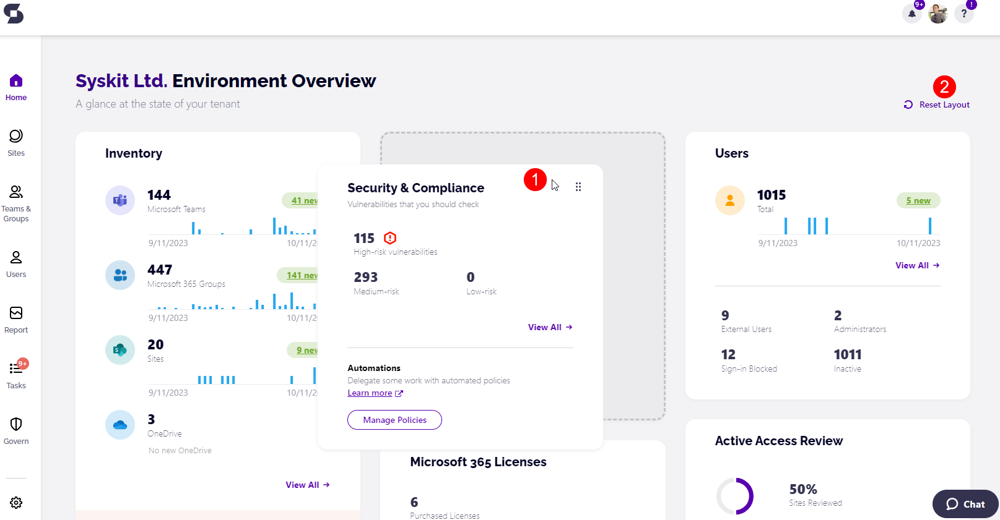

# Customize Dashboard

The **Syskit Point** Dashboard shows Syskit Point administrators the following information in the tiles:
 * Inventory
 * Users
 * Storage
 * Security & Compliance
 * External Collaboration
 * Active Access Review
 * Lifecycle Management
 * Microsoft 365 Licenses
 * Copilot Readiness

The **Syskit Point** Dashboard shows Syskit Point collaborators the following information in the tiles:
 * Inventory
 * Users
 * External Collaboration

You can customize the order in which these tiles are shown based on which of the features shown on the dashboard are most important to you. 

To customize the dashboard, complete these steps:
  * Hover over the feature you want to move, and 6 dots appear in the right corner of the tile
    * This signifies that the tile is moveable
  * **Click and hold anywhere on the tile (1)**
    * This makes the tile moveable
  * **Drag the feature** to the place on the dashboard you want it moved to
  * **Release the hold** on the tile to save it in the place you selected

Once you've set up the tiles to suit your preference, Syskit Point stores that information and shows the dashboard as you've arranged it moving forward. 

If you want to revert the order of the tiles, **click the Reset Layout (2)**, and the dashboard is returned to its original state. 

