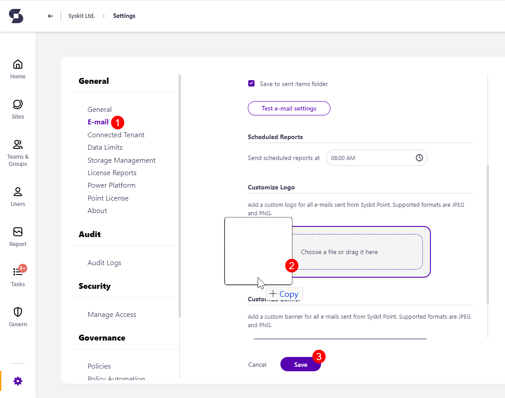
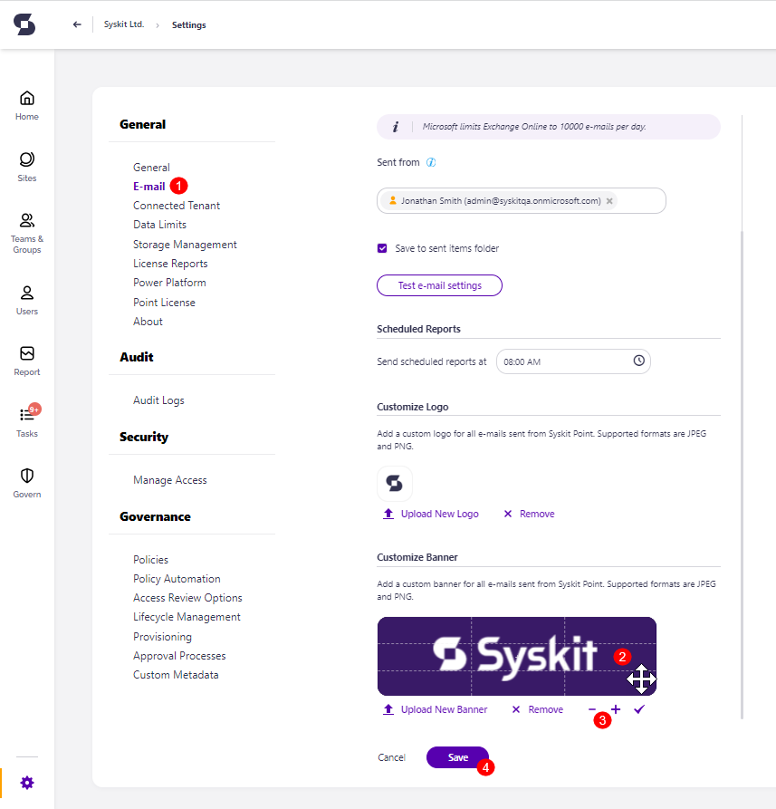
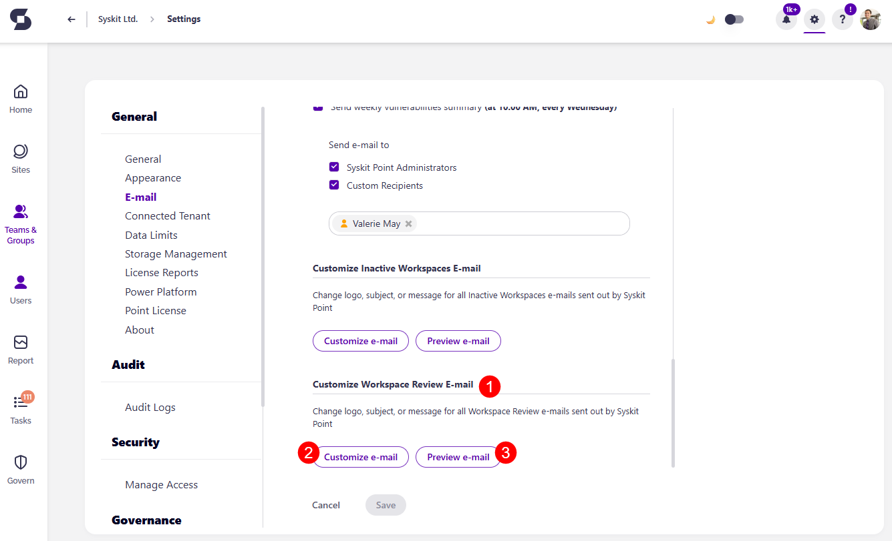
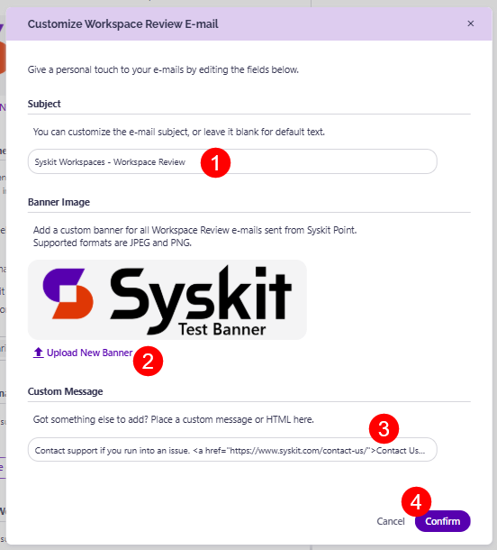
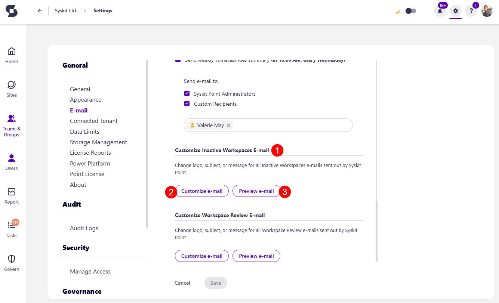
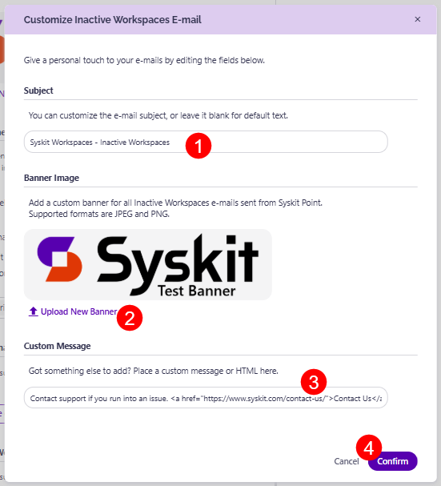
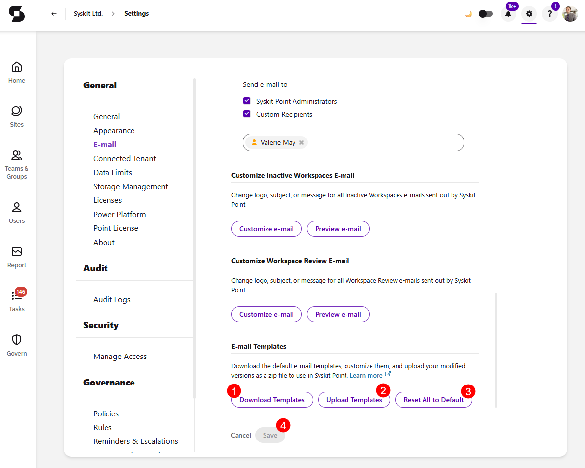

# Customize E-mails

:::info
**Customized E-mails** are available in the Security & Compliance plan and higher tiers. See the [pricing page](https://www.syskit.com/products/point/pricing/) for more details.
:::

Syskit Point **provides the option to customize e-mails sent to site owners** as a part of **Workspace Review**, **Inactive Workspaces**, **Access Review tasks** (replaced by Workspace Review), and other policy tasks.

E-mails are also used to receive [scheduled reports](../governance-and-automation/scheduled-reports.md) available in the **Reports** section of Syskit Point. 

The following aspects of the e-mails can be customized:

* **Logo**
* **Banner**
* **Subject**
* **Additional message in the body of the e-mail**

These changes can be performed in two locations within Syskit Point Settings:

* **General Settings &gt; E-mail section** 
* **Governance Settings &gt; Access Review Options** 

:::warning
**Please note!**  
Only Syskit Point Admin users can customize e-mails.
:::

## E-mail Settings

In E-mail settings, you can define:
 * **A global logo** that is used in all e-mails sent by Syskit Point
   * The recommended size for the logo is 512x50px
   * It is best to use a PNG image with a transparent background
 * **A global e-mail banner** that is used in all e-mails sent from Syskit Point
   * The recommended banner size is 600x170px 

To define a logo used in all e-mails:
* **Navigate to the E-mail Settings screen \(1\)**. 
* **Scroll down to see the Customize Logo section**
* **Drag and drop your logo file \(2\)** to define your logo; keep in mind the supported file formats - JPEG and PNG
* **Click Save \(3\)** to save your changes

To define a banner used in e-mails:
* **Navigate to the E-mail Settings screen \(1\)**. 
* **Scroll down to see the Customize Banner section**
* **Drag and drop your banner file** to define your banner; keep in mind the supported file formats - JPEG and PNG
* **Drag the added image \(2\)** to adjust the position
* **Zoom in or zoom out \(3\)** to adjust the view
* **Click Save \(4\)** to save your changes

:::info
**Hint!**  
**Modifying the logo and banner** as described here **is a global action**, meaning that it **will affect all e-mails**.
:::

## Customize Workspace Review E-Mail

:::info
**Hint!**  
The customization affects automatic e-mails sent for workspaces with assigned Workspace Review policies. For more information on that topic, visit the [following article](../governance-and-automation/workspace-review/setup-workspace-review.md).
:::

To customize the Workspace Review e-mail, navigate to **Settings** > **General** > **E-mail** > **Customize Workspace Review E-mail (1)**. 

Here you can:
* **Customize the Workspace Review e-mail (2)** by clicking the Customize e-mail button 
* **Preview the Workspace Review e-mail (3)**

After clicking the Customize e-mail button, you will see the following sections:

* **Subject (1)** -  only applies to the Workspace Review e-mail sent to the owners and administrators
* **Upload new banner image (2)** - only applies to the Workspace Review e-mail sent to the owners or administrators; initially, a default banner image is set up
* **Define custom message (4)** - only applies to the Workspace Review e-mail sent to the owners or administrators

When finished, click the **Confirm button (5)** to save your changes.

:::warning
**Please note!** 
The custom message can contain **plain text** or **HTML**. A **link has to be defined in the HTML form** `<a href="URL">LinkDisplayText</a>` where `URL` represents a web address to a web resource, and the `LinkDisplayText` is an arbitrary text that will be displayed in the e-mail, and, when clicked, lead to the defined URL.
:::

You can immediately see the e-mail changes by clicking the **Preview e-mail button**, and a preview dialog opens, showing what your e-mail would look like when sent.

## Customize Inactive Workspaces E-Mail

:::info
**Hint!**  
The customization affects automatic e-mails sent for workspaces with assigned Inactive Workspaces policies. For more information on that topic, visit the [following article](../governance-and-automation/automated-workflows/inactive-workspaces-admin.md).
:::

To customize the Inactive Workspace e-mail, navigate to **Settings** > **General** > **E-mail** > **Customize Inactive Workspace E-mail (1)**. 

Here you can:
* **Customize the Inactive Workspace e-mail (2)** by clicking the Customize e-mail button 
* **Preview the Inactive Workspace e-mail (3)**

After clicking the Customize e-mail button, you will see the following sections:

* **Subject (1)** -  only applies to the Inactive Workspace e-mail sent to the owners and administrators
* **Upload new banner image (2)** - only applies to the Inactive Workspace e-mail sent to the owners or administrators; initially, a default banner image is set up
* **Define custom message (4)** - only applies to the Inactive Workspace e-mail sent to the owners or administrators

When finished, click the **Confirm button (5)** to save your changes.

:::warning
**Please note!** 
The custom message can contain **plain text** or **HTML**. A **link has to be defined in the HTML form** `<a href="URL">LinkDisplayText</a>` where `URL` represents a web address to a web resource, and the `LinkDisplayText` is an arbitrary text that will be displayed in the e-mail, and, when clicked, lead to the defined URL.
:::

You can immediately see the e-mail changes by clicking the **Preview e-mail button**, and a preview dialog opens, showing what your e-mail would look like when sent.

## E-mail Templates

The **E-mail Templates** section in E-mail Settings, lets you download the Syskit Point built-in templates, edit them to match your organization's requirements, and upload your customized versions. You can also reset all e-mail templates to their default setting.

This is useful when you want to, for example, add organization-specific legal disclaimers or footer content to e-mails or adjust the HTML structure of a template to match your company's branding guidelines.

:::warning
**Please note!**  
**Uploaded templates take effect immediately.** All e-mails sent after the upload will use the new templates.
:::

To manage e-mail templates, navigate to **Settings** > **General** > **E-mail** > **E-mail Templates**.

Here you can:

* **Download Templates (1)** - clicking this downloads a zip file containing all e-mail templates included in your Point. The zip file you receive contains two folders:
  * **Default** - this folder always contains the original built-in templates.
  * **Custom** - this folder is included only when there are customized templates and contains the modified templates.
* **Upload Templates (2)** - clicking this lets you upload a zip file containing your modified templates to apply them. Two rules apply:
  * HTML files must be in the root of the zip, not in subfolders.
  * The file name must match the original template name exactly. 
    * Files with unrecognized names are ignored.
* **Reset All to Default (3)** - clicking this removes all customized templates and reverts to the default built-in Point templates.
* Clicking **Save** stores any changes you made. 

