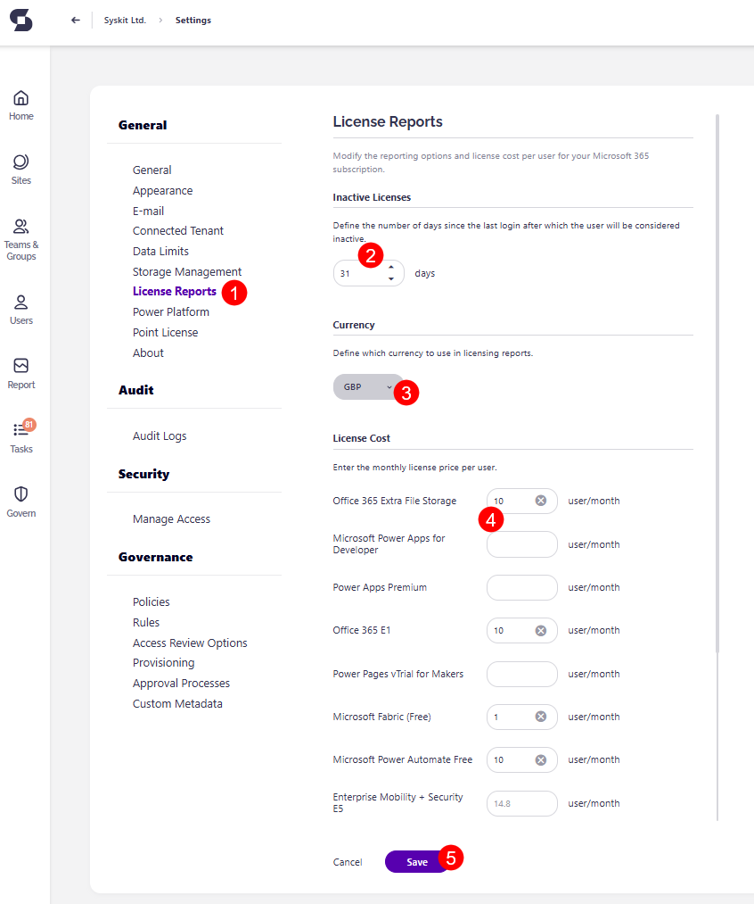

# Customize License Reports

:::info
Options described in this article are available only for users with the assigned Syskit Point Admin role. 
:::

License reports can be used to discover assigned, unassigned or inactive Microsoft 365 licenses, as well as check their overall cost. This helps optimize the use of licenses based on which licenses are underutilized. 

This article will show you how to:
* **Define the number of days after which users will be considered inactive**
* **Change the currency** used in license reports
* **Specify monthly license price per user**
* **Show/hide license reports for users with the assigned Syskit Point Collaborators role**

:::info
**License Reports** are available in the Security & Compliance plan and higher tiers. See the [pricing page](https://www.syskit.com/products/point/pricing/) for more details.
:::

## License Reports Settings

To modify license report settings, navigate to **Settings** &gt; **License Reports (1)**.
Here, you can:
* **Define the number of days after which users will be considered inactive (2)** – the value is used in the Inactive Users with Assigned Licenses and Licenses Usage by Service reports; by default, this is set to 30 days
* **Define the number of days an add-on license must remain unused to be considered an unused license (3)** – the value is used in the Inactive Users with Assigned Licenses and Licenses Usage by Service reports; by default, this is set to 30 days
* **Define monthly license price per user for**:
  * **Microsoft 365 Core and Enterprise Plans** licenses
  * **Microsoft Add-on** licenses
  * **Other** licenses
  * Prices entered here are used to calculate total costs on the Licenses Overview and License Distribution reports
  
Once you are finished with the modifications, **click Save (6)**.

## License Reports Visibility

:::info
By default, **license reports in Syskit Point are only visible for Syskit Point Admin users**. 
:::

To make the License reports visible for Syskit Point Collaborators : 
* **Navigate to Settings** > **Security** > **Manage Access (1)**
* **Check** the **Give users access to license reports option (2)** under Syskit Point Collaborators role 
* **Click Save (3)**

:::warning
**Please note!**  
When the **Give users access to license reports option (2)** option is enabled, Syskit Point Collaborators can access the following reports: 
* **Licenses Usage by Service**
* **License Distribution**
* **Inactive Licenses**

The **signed-in Syskit Point Collaborator can only see license data related to users he is the manager of**.   
:::