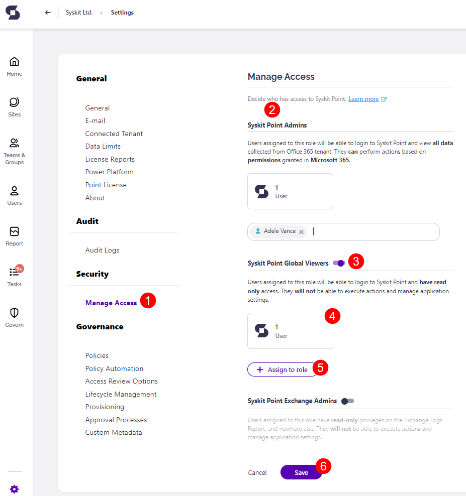
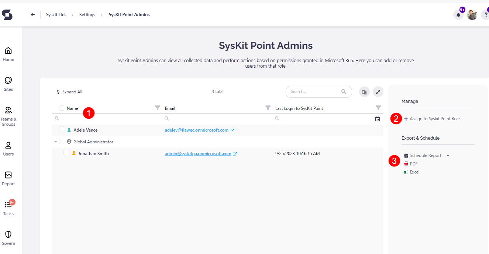
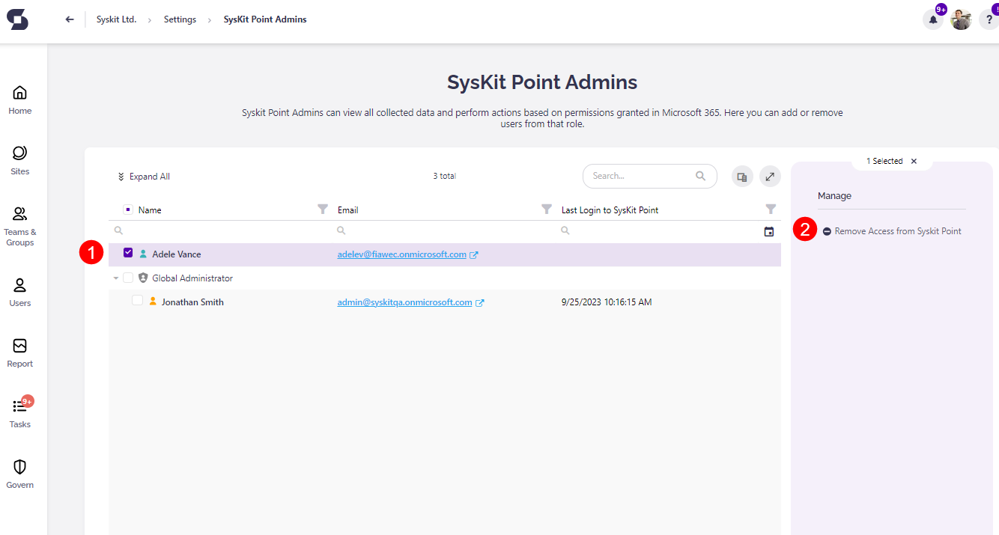
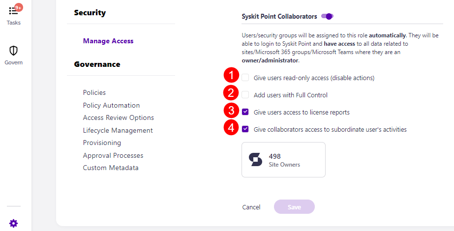
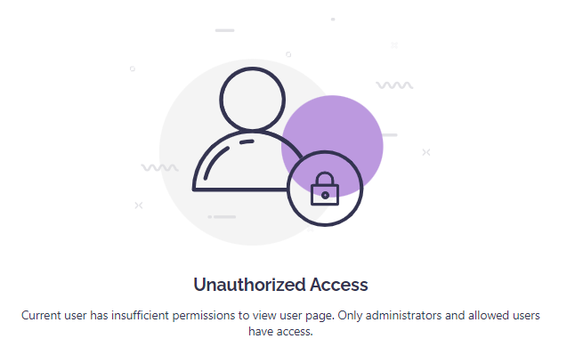

# Assign and Manage Access to Syskit Point

After deploying **Syskit Point**, your Microsoft 365 users can be given access to the **Syskit Point** web app.

By using the built-in **role-based security** of Syskit Point, you can easily manage who has access to Syskit Point and what features are available to them. Those assigned a role will be **able to view all data collected from the Microsoft 365 tenant and perform actions based on the permissions granted to them in Microsoft 365** or have access to all data related to sites, Microsoft 365 Groups, and Microsoft Teams.

* Level of access **depends on the roles assigned**.

This allows **site owners to perform Access Reviews on their site and complete Lifecycle Management tasks** to determine which workspaces should be archived or kept. 

Read on to learn more about the specifics of each role and how to assign them to your users. 

## Setting up Role-Based Access

To manage who has access to Syskit Point, navigate to **Settings** > **Security** > **Manage Access (1)**
Here, you will find:
* **All Syskit Point roles (2)** in a separate section
* **Toggle (3)** that enables a particular role; by default, all roles except the Syskit Point Admin role are initially disabled 
* **Tile with number of assigned users (4)** for each role; the total number of users with the assigned role is displayed in the tile
* **Assign to role (5)** button enabling you to add a user to a role easily
* **Save (6)** button to save changes

Clicking the tile showing the number of assigned users per role opens a **report for the corresponding role**
Here, you can:
* **See all users with the assigned role (1)**; by default, **Company Administrator and SharePoint Service Administrator Azure AD Roles are automatically assigned with the Syskit Point Admin role**
* **Assign (2)** new users to the role; you can add **users**, **Microsoft 365 Administration roles**, **security groups,** and **Microsoft 365 Groups**
* **Export or schedule (3)** the report

Additionally, you can **remove** a user from the role. To do so:
* **Select the user by clicking the checkbox next to the user name \(1\)**
* **Click the Remove Access from Syskit Point \(2\)** action

A **dialog** shows, asking you to **confirm** the removal action.

When the action is **completed**, the selected user **no longer has access** to **Syskit Point**.

:::warning
**Please note!**  
Removing user access from **Syskit Point** will not remove a user from your **Microsoft 365** environment.
:::

## Syskit Point Roles

Syskit Point offers five predefined access roles:

* **Syskit Point Admins**
* **Syskit Point Global Viewers**
* **Syskit Point Exchange Admins**
* **Syskit Point Collaborators**
* **Syskit Point Power Platform Admins**

### Syskit Point Admins

Users with the Syskit Point Admins role assigned can:

* **See all data** collected from your Microsoft 365 tenant
* **Manage all settings in Syskit Point** 
* **Perform actions** based on the permissions granted in Microsoft 365

During the initial user sync, Syskit Point will automatically add two **Microsoft Entra built-in roles**,  **Global Administrator** and **SharePoint Administrator** as **Syskit Point Admins**. 

Any user in your **Microsoft 365 environment** with that role will **automatically have full access to Syskit Point**.

:::warning
**Please note!**  
You cannot assign or remove a user from a **Microsoft 365 administration role** in **Syskit Point**.
:::

### Syskit Point Global Viewers

Users with the Syskit Point Global Viewers role assigned can see all data collected from your Microsoft 365 tenant.

They have **Read-Only** access and **cannot execute actions or manage application settings**.

**The Global Viewers role** gives the assigned users the ability to:

* **Sign in to Syskit Point**
* **Generate, view, and schedule reports**
* **See all data collected from Microsoft 365**

However, **Global Viewers will not be able to**:
* **Execute actions**
* **Manage Syskit Point settings**

### Syskit Point Exchange Admins

Users with the assigned Syskit Point Exchange Admins role can access the Exchange Logs report exclusively.

They have **Read-Only** access and **cannot execute actions or manage application settings**.

With **the Exchange Admins** role assigned, the user can:
* **View Exchange Log reports for your environment**
* **Have Read-Only access on the Exchange Logs report**
* **Cannot execute actions and manage application settings**

### Syskit Point Collaborators

The **Syskit Point Collaborators** role is the **only role assigned automatically to users or security groups based on their ownership permissions** in the Microsoft 365 tenant (e.g., site admins, Microsoft Teams, and Microsoft 365 Group owners).

When signed in to Syskit Point, they can:

* **Access all data related to Microsoft 365 workspaces** where they are owners/administrators
* **Perform actions based on the permissions granted** in Microsoft 365

Additional options enable you to control whether actions and specific reports are available to Collaborators in Syskit Point. 

The **Syskit Point Collaborators** role enables site admins, Microsoft Teams, and Microsoft 365 Group owners to:

* **Access Syskit Point**
* **See all information collected** from Microsoft 365 for workspaces that they have access to
* **Efficiently manage their workspaces** by running actions based on their assigned permissions
* **See user data collected** from Microsoft 365 for users they are the manager of

:::warning
**Please note!**  
When the Collaborators role is enabled, **Syskit Point automatically** assigns **site admins, Microsoft Teams, and Microsoft 365 Group owners** to **Syskit Point Collaborators** role.
:::

Additional options available when the Collaborators role is enabled:

* **Give users read-only access (1)** – when enabled, Collaborators cannot run actions in Syskit Point
* **Add users with Full Control (2)** – when enabled, users with Full Control permissions on workspaces will be assigned the Collaborators role
* **Give users access to license reports (3)** – allows access to License reports
* **Give Collaborators access to subordinate user’s activities (4)** – allows them to view the OneDrive tile, Analytics & Usage tile, and Audit log reports when accessing User details or workspaces they manage

:::warning
**Please note the following:**  
* Syskit Point Collaborators **cannot exceed the permissions** they have already been assigned **in Microsoft 365**.
* Syskit Point Collaborators will **not be notified that they have access** to Syskit Point **until a Syskit Point Administrator shares that** information with them. 
* **Any actions** performed by Collaborators in Syskit Point **are stored under their name in the Audit Logs**.
:::

### Syskit Point Power Platform Admins

:::warning
**Please note!**

* Assigning the **Power Platform Admin role in Syskit Point** to users **does not grant the Power Platform Administrator role in Entra ID** 
* **To successfully run actions** on Power Platform environments, apps, and flows, **Power Platform Admins in Syskit Point must have the Power Platform Administrator role assigned in Entra ID**
:::

When signed in to Syskit Point, Syskit Point Power Platform Admins can:
* **Access all data related to Power Platform environments, apps, and flows**
* **Perform actions on Power Platform environments, apps, and flows, given they have the Power Platform Administrator role assigned in Entra ID**

The **Syskit Point Power Platform Admins** role enables users to:
* **Access Syskit Point Power Platform reports**
* **Schedule Power Platform reports**
* **Perform Power Platform actions** on environments, apps, and flows
    * Note that the Power Platform Administrator Entra ID role must be assigned to successfully run actions on Power Platform environments, apps, and flows
* **Have access to the Power Platform Dashboard tile**

### Why Should You Enable Role-Based Access

**Role-Based Access** brings the following benefits:
* **Empowers all admins and owners** and users with **Full Control** permissions to manage their workspaces
* **Gives admins and owners access to all reports and relevant information without disclosing the content they are not allowed to see**

**For example**, **Syskit Point Admin** generates the **User Access** report. Instead of sharing the URL of the generated report with another **Syskit Point Admin**, they sent it to the **Syskit Point Collaborator** that doesn't have access to all the users in the said environment. This is where the **Role-Based Access** kicks in.

When said **Syskit Point Collaborator** opens the URL, the report will be generated but only contain **users** the Collaborator manages. Also, the **report will only show workspaces that the Collaborator owns**.

When **Syskit Point Collaborator** tries to **drill** to the **user details** page of a user they are not a manager of, they will be redirected to an **Unauthorized Access** page.

**As demonstrated, Role-Based Access provides a secure framework for collaboration in your Microsoft 365 environment**.