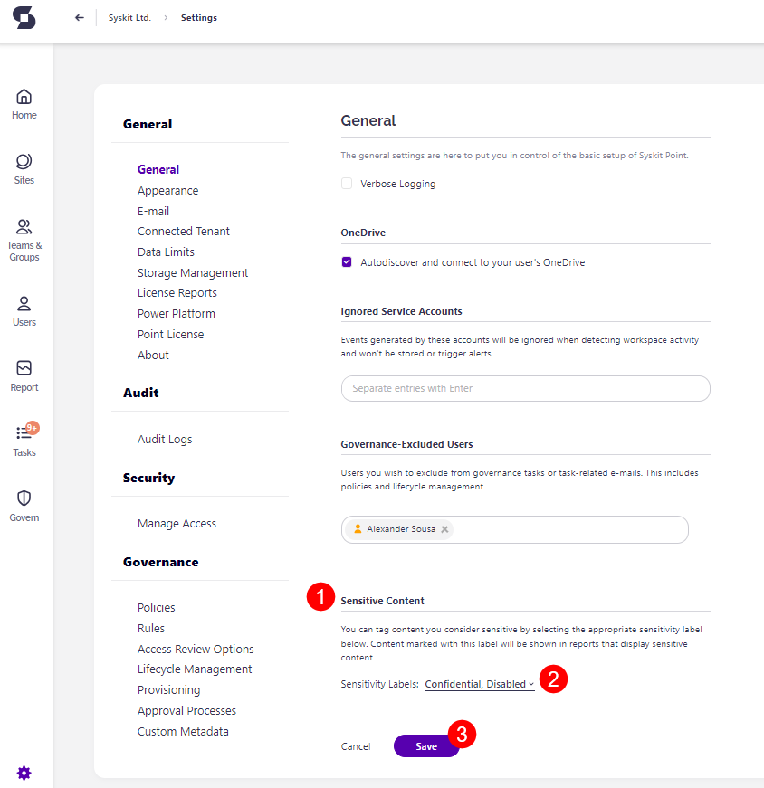

# Enable Sensitivity Labels

**Sensitivity labels help organizations classify and protect content** based on its sensitivity. Before sensitivity labels can be used in Syskit Point, they first have to be configured in Microsoft 365. This includes creating and publishing sensitivity labels in the Microsoft Compliance Center and enabling them for supported containers. 

To use sensitivity labels in Syskit Point, the following needs to be completed: 

**In Microsoft 365**, you'll need to:
* **Create and publish sensitivity labels** in the [Microsoft Purview compliance portal](https://compliance.microsoft.com/informationprotection?viewid=sensitivitylabels)
  * [Learn how to create and configure sensitivity labels and their policies in this Microsoft article.](https://docs.microsoft.com/en-us/microsoft-365/compliance/create-sensitivity-labels?view=o365-worldwide)
* **Ensure sensitivity labels are enabled for containers**  (Microsoft Teams sites, Microsoft 365 groups, and SharePoint sites)
  * [Learn how to enable sensitivity labels for containers in this Microsoft article.](https://docs.microsoft.com/en-us/microsoft-365/compliance/sensitivity-labels-teams-groups-sites?view=o365-worldwide#enable-this-preview-and-synchronize-labels)
  * By default, sensitivity labels in Microsoft only apply to documents and emails. This step also enables them to apply to SharePoint sites, Teams, and Microsoft 365 groups, which is what Syskit Point provisioning templates support.

:::warning
**Please note!**  
Sensitivity label changes can take up to 24 hours to replicate across all apps and services.
:::

**In Syskit Point:**
* **Ensure a service account is connected to Syskit Point**

The connected service account enables Syskit Point to:
* **Collect existing sensitivity labels**
* **Apply sensitivity labels when creating new workspaces with provisioning workflows**

## Service Account Requirements

When preparing a service account for Syskit Point, consider the following requirements:

* **Multifactor authentication can be enabled for the service account**, but it isn't mandatory
* **Service account password is set to never expire** to avoid repeated password re-entries in Syskit Point; [learn how to set a user's password to never expire here](https://docs.microsoft.com/en-us/microsoft-365/admin/add-users/set-password-to-never-expire?view=o365-worldwide#set-a-password-to-never-expire) 
* **Sensitivity labels should be published to the service account**; [find more information on how to publish sensitivity labels here](https://docs.microsoft.com/en-us/microsoft-365/compliance/create-sensitivity-labels?view=o365-worldwide#publish-sensitivity-labels-by-creating-a-label-policy)
* **Service account should not have the Global Administrator role assigned**
* **The Global Administrator has to give consent on behalf of the organization** for a certain user to be assigned to the service account
* **Service account must have a Syskit Point admin role** to provide custom templates for creating new workspaces
* **No licenses are required for the service account**

:::warning
**Please note!**  
To successfully **provision sensitivity labels onto newly created workspaces** when using the **Microsoft Authentication Flow** method, **only the service account** can create all provisioning templates.
:::

Learn more about how to set up multifactor authentication for Microsoft 365 by taking a look at [this Microsoft article](https://learn.microsoft.com/en-us/microsoft-365/admin/security-and-compliance/set-up-multi-factor-authentication?view=o365-worldwide)

## Sensitive Files

The Sensitive Content setting lets you **define which sensitivity labels Syskit Point treats as sensitive**. Files marked with those labels are then detected and highlighted across reports that display sensitive content.

:::warning
**Please note!**  
For sensitive files to be detected and displayed in Syskit Point reports, you need to configure this in Syskit Point's Settings.
:::

To enable sensitive files to be shown in reports, **go to Settings**.

* Under **General**, navigate to the **Sensitive Content section (1)**
* **Click the arrow (2)** to open the selection box where you can **check the box for the sensitivity labels** you want included in sensitive files reports
  * Selecting sensitivity labels lets you appropriately tag content you consider sensitive
  * Content marked with this label is shown in reports that display sensitive content
* **Click Save (3)** to finalize your selection

## Next Steps

To connect a service account in Syskit Point, please follow the instructions provided in [this article](../configuration/connect-service-account.md ).

Once the service account is connected to Syskit Point, you can specify a sensitivity label when creating provisioning templates.

To learn more about templates and available options while setting them up, open the [following article](../governance-and-automation/provisioning/templates.md).

## Related Articles

* [Manage Sensitivity Labels](../governance-and-automation/manage-sensitivity-labels.md)
* [Sensitivity Review](../governance-and-automation/sensitivity-review/README.md)
* [Sensitivity Labels Reports](../reporting/sensitivity-labels.md)