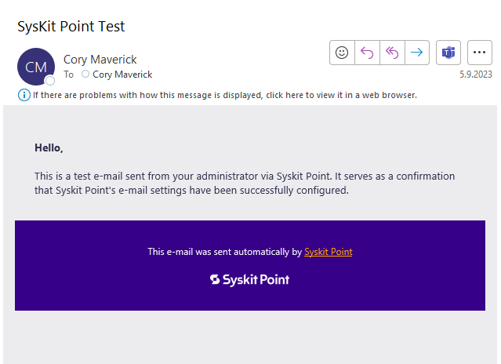
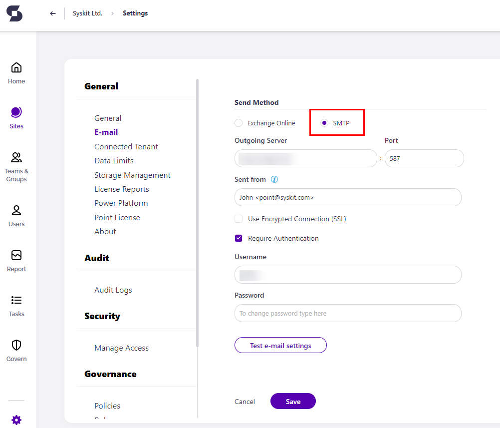

# Set Up E-Mail

**Syskit Point sends e-mails** to owners, administrators, and other users when policies are enabled and applied.

Here, you can find all the information needed to successfully configure e-mail settings, which Syskit Point will use to send the e-mails.

:::warning
**Please note!**\
Only users assigned to the **Syskit Point Admin** role can access and configure Settings in Syskit Point.
:::

For Syskit Point to be able to send e-mails, you need to configure the sending method. Two options are available:

* **Exchange Online**
* **SMTP** - Simple Mail Transfer Protocol

:::warning
**Please Note!**\
The e-mail address set up in this section will appear in the **Sent from** field in all e-mails sent from Syskit Point.
:::

## Exchange Online Settings

:::warning
**Please Note!**\
Exchange Online has a sending limit of 10000 e-mails per day.
:::

:::warning
**Please Note!**\
When setting up the e-mail, please use a supported mailbox address, as specified in the table below.
:::

| Mailbox type                  | Supported |
| ----------------------------- | --------- |
| Microsoft 365 user mailbox    | YES       |
| Shared mailbox                | YES       |
| Distribution list             | NO        |
| Microsoft 365 group           | NO        |
| E-mail enabled security group | NO        |

The Exchange Online method enables you to use an existing Exchange account in your Microsoft 365 tenant to send e-mails from Syskit Point. Here, you can:

* **enter a valid e-mail address in the Sent from field (1)**
* **choose whether to save e-mails sent by Syskit Point to the Sent items folder (2)**; by default, this option is turned on, meaning that all e-mails sent from Syskit Point will be stored in the **Sent** mailbox folder of the entered Exchange account
* **Send a test e-mail (3)** to check if the entered e-mail address is working properly

After you click the **Send test e-mail** button, the **Sent test e-mail** dialog opens. Here, **enter the e-mail address to which you want to send** the test e-mail. After a moment, you should receive an e-mail like the one pictured below.

Click the **Save** button to store your e-mail settings.

## SMTP Settings

Select the **SMTP method** if you are using an **SMTP** server in your environment. Here, you can enter the SMTP properties:

* **Outgoing Server**
* **Port**
* **Sent from** e-mail
   * The email format can also be the following: DisplayName \<email@domain.com\>
*   **Username** and **Password**; in case the **Require Authentication** option is enabled

    You can also choose whether to **Use Encrypted Connection (SSL)**.

You can check if the entered data is correct by **sending a test e-mail**.

Click the **Save** button once you confirm that the test e-mail was received.
