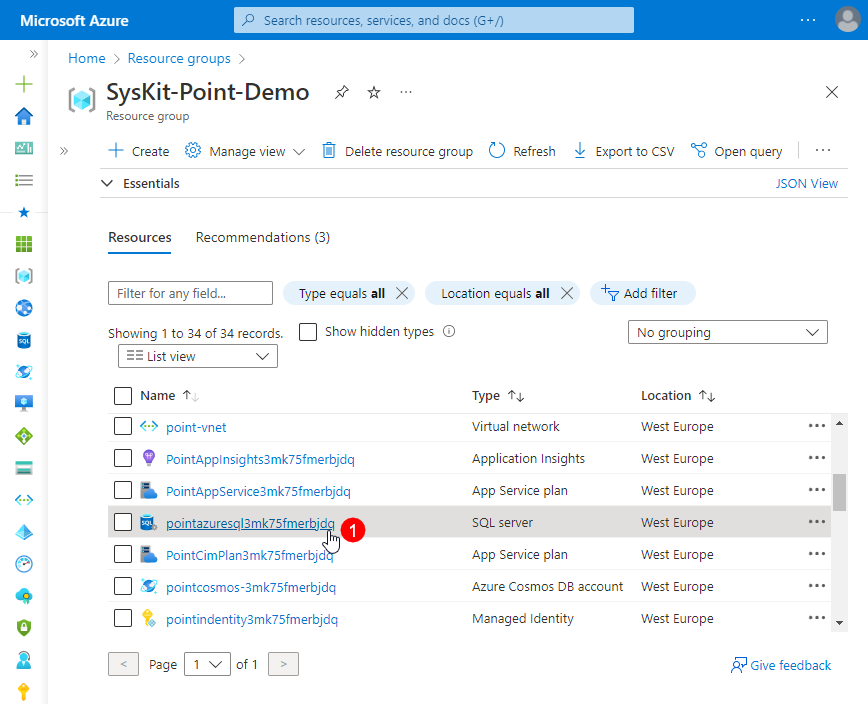
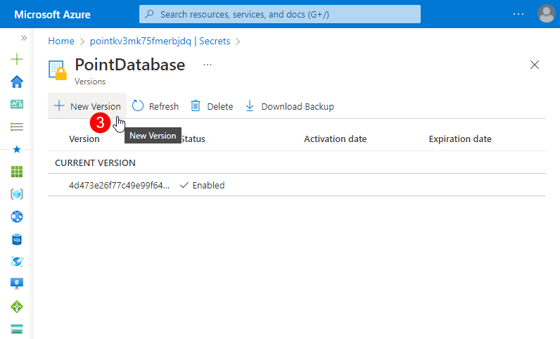
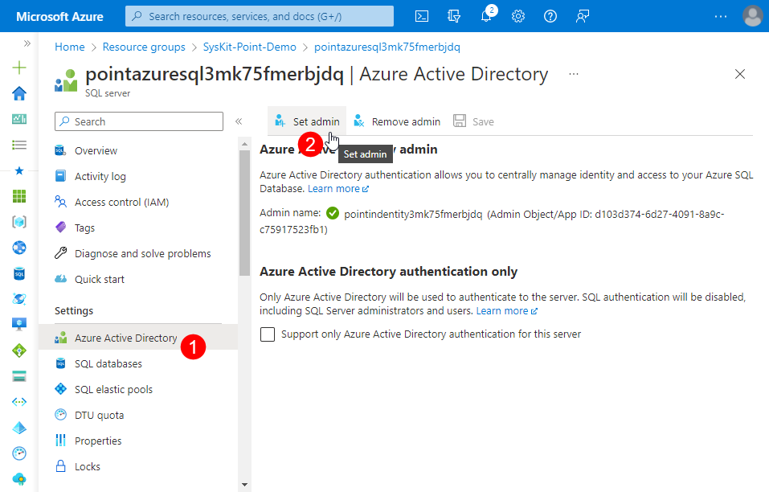

# Upgrade SQL to Managed Identity Authentication

Instead of using SQL authentication, you are now able to **use Managed Identity authentication with Syskit Point**. If you deploy Syskit Point after the [v2022.5 release](../releases/enterprise/syskit-point-2022-5/point-2022-5-release-note.md), Managed Identity will be the authentication method by default. 

Those that deployed Syskit Point before that release can manually upgrade to Managed Identity. 

## SQL Server Information

After updating Syskit Point with the latest release, Syskit Point will still continue using SQL authentication. 

In order to enable Managed Identity authentication instead of SQL authentication, complete the following steps:

* **Navigate to [Azure Portal](https://portal.azure.com/) and open the Syskit Point resource group**
* **Find and open the SQL Server resource (1)**; this can be located under Resources, with the **Type listed as SQL server**

* **Copy the SQL server name (2)** listed on the right side. The name is formatted as: servername.database.windows.net
  * This information will be needed for one of the next steps, so store it somewhere easy to access

## Upgrade to Managed Identity Authentication

* On the Syskit Point resource group, **click the Managed Identity resource (1)**
  * Located under Resources and marked as Managed Identity in the Type column

* **Copy the Client ID (2)**; located on the right side of the Managed Identity resource screen 
   * This will be needed later, so store the copied text somewhere it will be easy to locate

* Return to the **Syskit Point resource group** page
* **Click the Key Vault resource (1)** 
  * Located under Resources and marked as Key Vault in the Type column

* **Select the Access Policies option (2)**; located on the left side of the screen
* Click the **Create (3)** button at the top of the screen
  * This will provide the option to **Create an access policy**

* Under **Configure from a template** select the **Secret Management (4)** option and click on **Next (5)**

* Find and **select your system admin account (6)** and **click Next (7)**
   * With this, you will gain permission to perform changes in the key vault

* The Application section can be skipped, so **select Next**
* Under the **Review + Create** section, check to make sure all the information is correct and **click Create (8)**
  * This will complete the process

When this is set up, **the Access Policies screen should now show the name of the person selected** during the creation process under the **User** section. 

If this was completed successfully, proceed to the following steps:

* On the Key Vault resource, **select Networking (1)**
   * Located on the left side under Settings
* Select **Allow public access from specific virtual networks and public IP addresses (2)**
* Under Firewall, **click Add your client IP address** and **paste your public IP address (3)** here
* **Click Apply** when finished

* **Select Secrets** (1)
  * Located on the left side under Objects
* **Select the PointDatabase option (2)** from the list of available names

* On the PointDatabase screen, **click the New Version button (3)**

* On the form that opens, you will need to enter the following text as **Secret value (4)**

 `Data Source=tcp:{serverName},1433;Initial Catalog=SysKitPointDB;User Id="{managed identity client id}";Authentication=Active Directory Managed Identity;`

:::warning
**IMPORTANT!**  
There are two parts of the above text that will need to be changed:

Data Source=tcp:**\{serverName\}** should be pasted from your SQL server for Syskit Point. The text is formatted as: servername.database.windows.net

User Id="**\{managed identity client id\}**" needs to be changed. The Client ID you previously copied from your Managed Identity resource should be placed where the text says **managed identity client id**. 

:::

For example, after being edited with your server information, the text should look like this: 

 `Data Source=tcp:contoso.database.windows.net,1433;Initial Catalog=SysKitPointDB;User Id="00000000-0000-0000-0000-000000000000";Authentication=Active Directory Managed Identity;`

* When the **edited text** has been entered, **click Create**

After successfully setting this up, the next step will be removing the access granted to perform the previous changes to secure Syskit Point Azure resources. 

* **Under Networking, remove your IP address**
  * If this was successfully done, when clicking on Secret, the page should be empty
* On **Access Policies, select the created User and click delete**; when asked to confirm, click delete again

The last steps to finish setting up your Managed Identity authentication are the following:

* **Navigate back to the Syskit Point resource group**
* **Open the SQL Server resource**
* Once there, **click Microsoft Entra ID (1)**; located on the left side under Settings
* **Click the Set Admin (2)** button at the top of the screen

* In the search bar, **paste the client ID for the Managed Identity (3)** that was used in the previous steps and **click select (4)**

Once all of these steps have been completed, the only thing left to do for the Managed Identity authentication to be enabled is to **Restart Application Services**.