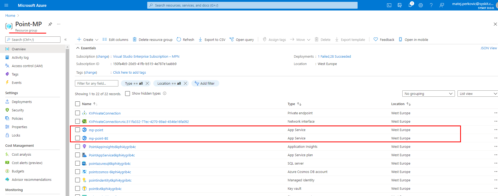
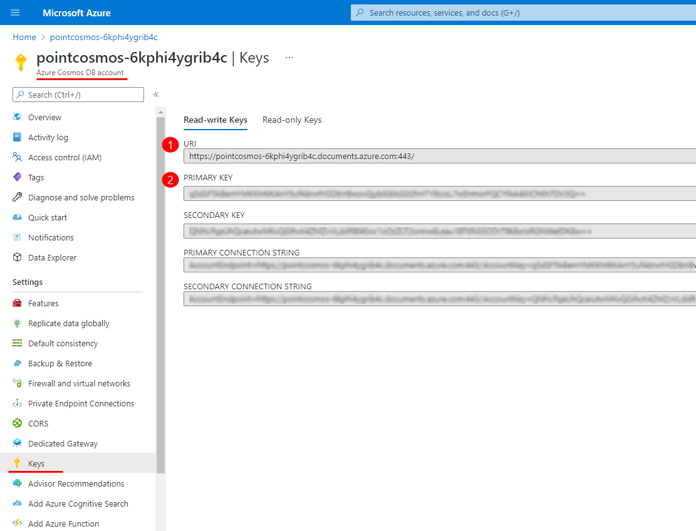

# Migrate Audit Logs

After you successfully finish **deployment of Syskit Point 20**, you can proceed with the migration of Audit logs collected with Syskit Point 19, stored in the Lucene Index, to Cosmos DB.


**Please note!**  
Necessary steps before the migration:
* Stop **Syskit Point Service** on the server where Syskit Point 19 is installed, and keep it that way during the whole process of migration
* Stop both **Web App Service** and **BE App Service** created during the Syskit Point deployment. Open **Microsoft Azure > your Resource group > here you will find App services**. Open each of them and in the **ribbon bar** on the **Overview screen** click the **Stop** button. See the picture below.


## Migration Steps
To begin with the migration:

1. Download the [**SysKit.Point.MigrationTool.exe**](https://downloads.syskit.com/point/files/SysKitPoint-MigrationTool.zip) to the server where the **Syskit Point** is installed.
2. Inside the **%ProgramData%\SysKit\Point** folder create a new file **migrationConfig.json**. [You can find the example migrationConfig.json file here](../../static/img/migrationConfig.json).
3. Modify the file and add the configuration parameters - here is the example of an edited configuration file:

`{
    "DatabaseId": "PointAudit",
    "TenantGuid": "024f552d-bcbc-4680-a63f-0716e6f3ed7d",
    "Endpoint": "https://pointcosmos-6kphi4ygrib4c.documents.azure.com:443/",    
    "Key": "q5dSFTABernYMKKM6KAnY6ufAbIwtYGDbIrBwgvGjybIE8XsS02hHTY9oJsL7wEnmorFQCYfAA4XIChKh7DV3Q==",
    "AuditIndexLocation": "C:\\\ProgramData\\\SysKit\\\Point\\\AuditIndex"    
}`

 Hint!
You can find the Tenant ID in the **Microsoft Entra ID admin center** > **Overview screen**. Follow the [link](https://aad.portal.azure.com/#blade/Microsoft_AAD_IAM/ActiveDirectoryMenuBlade/Overview) to access the screen.

Endpoint **(1)** and key **(2)** can be found in the **Microsoft Azure** > **Azure Cosmos DB account** > **Settings > Keys**. See the picture below.
    


4. Check the size of your Lucene Index. The migration process can be performed at once or in phases. 
    For large indexes, it is recommended to do it in phases. Here are the duration estimates based on the index size and Cosmos DB throughput:

      | Disk Size (GB) | RU/s | Duration (h) |
      | :---| :--- | :--- |
      | 1 | 2500 | 2.15 |
      | 10 | 2500 | 21.5 |
      | 50 | 2500 | 135 |
      | 100 | 2500 | 445 |
      | 1 | 10000 | 0.6 |
      | 10 | 10000 | 6.6 |
      | 50 | 10000 | 44 |
      | 100 | 10000 | 125 |

      | RU/s | Throughput(GB/h) |
      | :---| :--- |
      | 2500 | 0.465 |
      | 10000 | 1.65 |
 
5. If you want to separate the migration into several phases, add additional parameters to the **migrationConfig.json** to specify the Start and End dates like this: 

`{
    "MigrateFromDate": "2021-05-27", //NEWER DATE
    "MigrateUntilDate": "2021-05-26" //OLDER DATE
}`

6. Run the migration tool by starting the **SysKit.Point.MigrationTool.exe** file.

7. On the select operation step, enter value **2** to start the migration of the Lucene index.

8. Let the migration run. You can see the progress by checking the log files at **%ProgramData%\SysKit\Point\IndexMigrationLogs**. Make sure not to lock them, which could cause migration errors.  

9. After the migration has finished, decrease the **RU/s** to the initial value before the migration.

If you run into issues when migrating, contact the [Syskit support team](https://www.syskit.com/contact-us/) for more information.