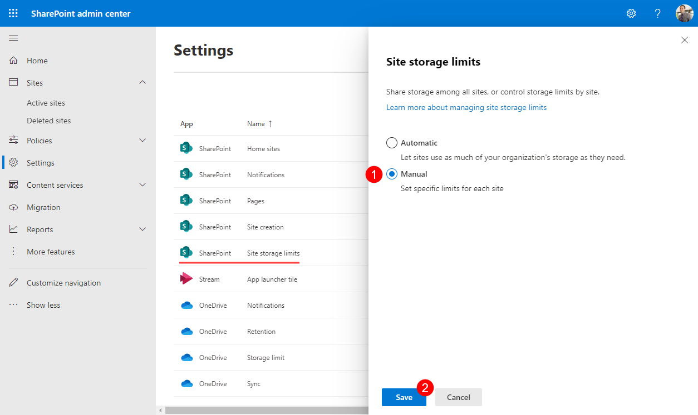
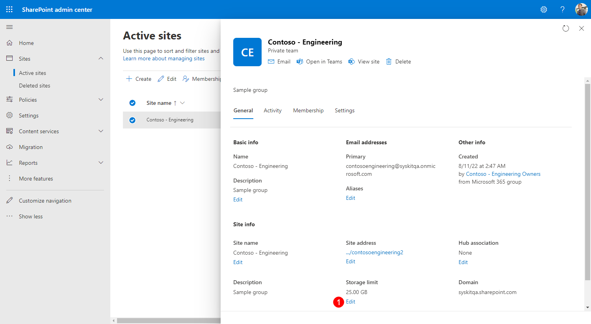
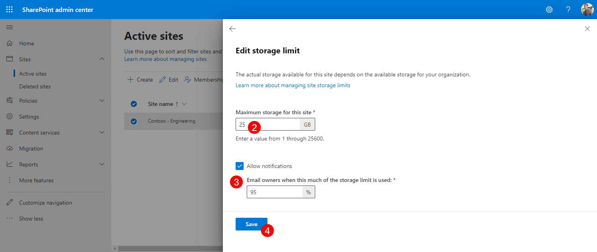

# Enable Manual Site Storage Limits in Microsoft 365

:::info
Steps described in this section can be performed with SharePoint Admin or Global Admin permissions only.
:::

By default, all SharePoint sites use a pool of SharePoint storage without any limits until the pool runs out of all available storage. 

To fine-tune how much total storage is available for each site, you can modify the default behavior by changing the settings in the SharePoint admin center.
To do so, follow these steps: 
* **Navigate to [SharePoint settings](https://go.microsoft.com/fwlink/?linkid=2185220)**
* **Select the Manual option (1)**
* **Click Save (2)**

Afterward, you can define the storage limit for each site:
* **Open SharePoint admin center > [Active Sites](https://go.microsoft.com/fwlink/?linkid=2185220)**
* **Select a site** - settings open on the right side
* **On the General tab**, **find the Storage limit option**, and **click Edit (1)** - Edit storage limit dialog opens
* **On the Edit storage limit dialog**, you can:
    * **Define maximum storage for the site (2)** - by default, it is set to 25TB, even though your available storage could be less than that
    * **Enable email notifications (3)** for site owners that are sent when a defined percentage of storage limit is used
    * **Save (4)** your changes

:::tip
Defined site storage limit and percentage of used storage defined for email notifications are synced and visible in Syskit Point.
:::

[Read this article to find all details on storage settings available in the SharePoint admin center](https://learn.microsoft.com/en-us/sharepoint/manage-site-collection-storage-limits). 