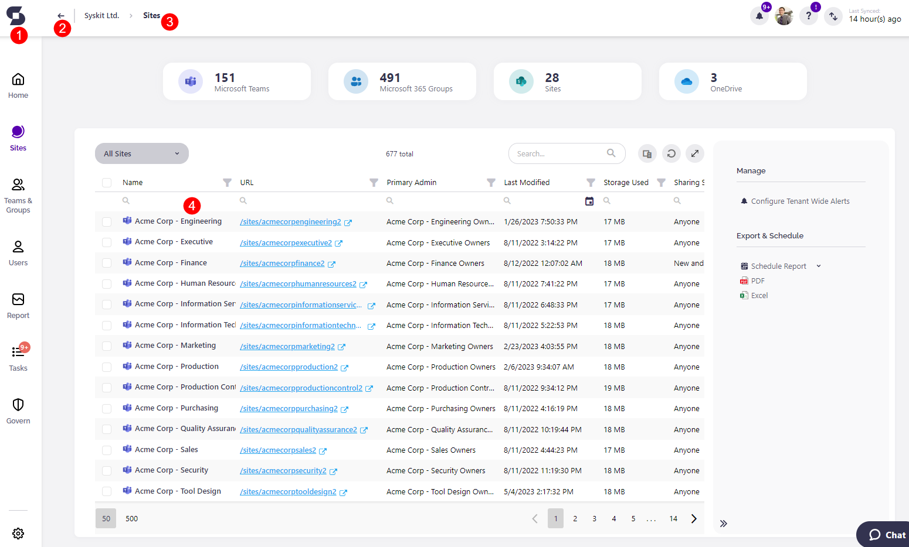
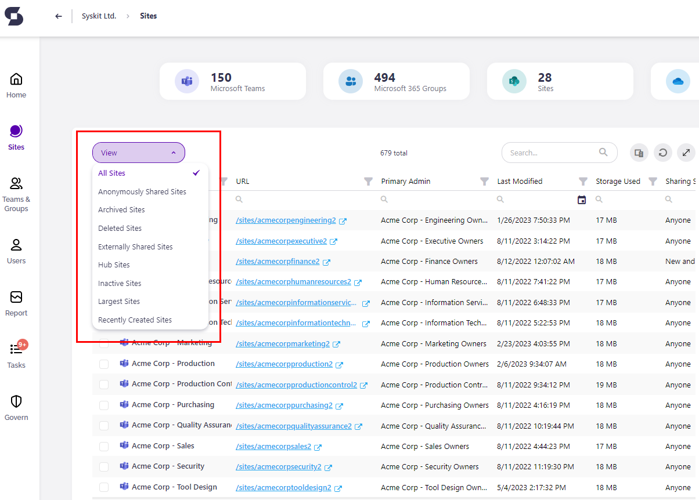
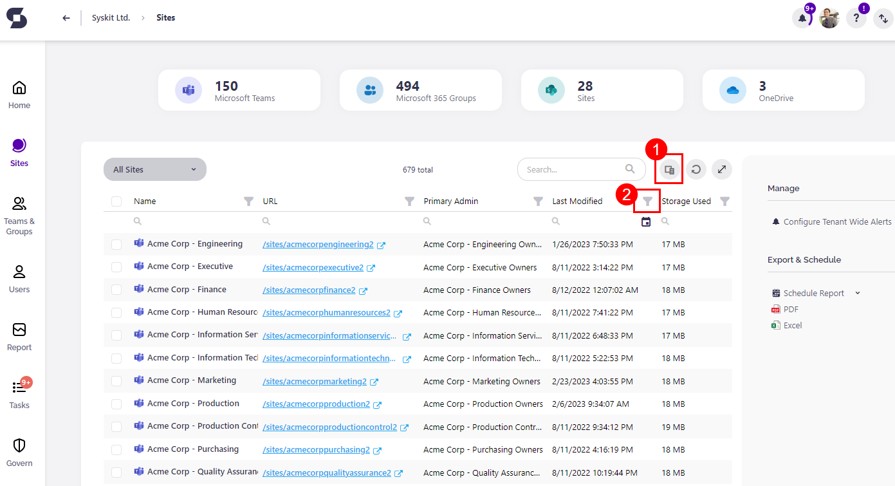
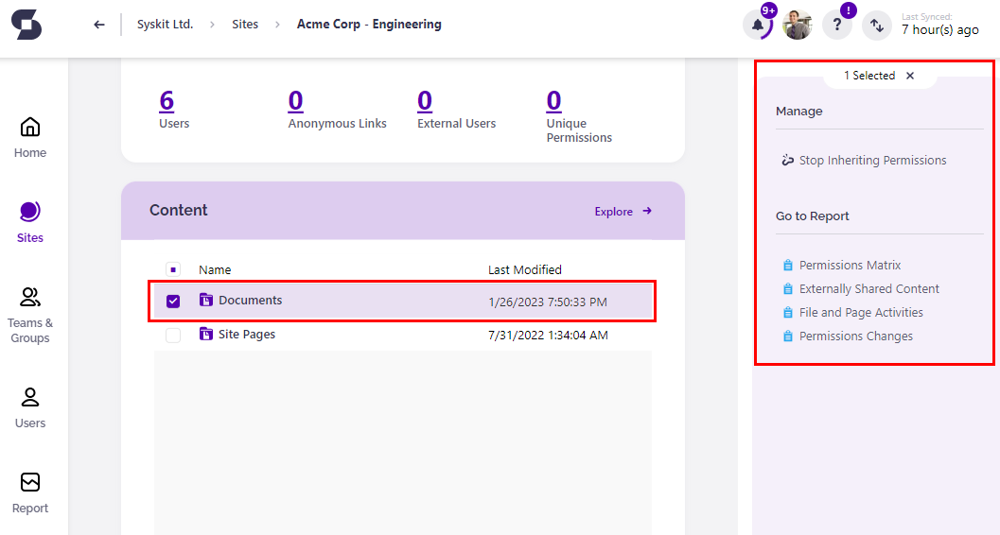

# Navigate Through Syskit Point

## Sign In Screen

Once opened in your browser, Syskit Point shows the Welcome screen. Click the **Sign in** button.

This action redirects you to the well-known Microsoft Sign-in screen.

Here, you have to enter your existing Microsoft 365 credentials.

:::warning
**Please note!** When signing in for the first time, using Global Administrator credentials and proceeding with [Role-based Access configuration](../configuration/enable-role-based-access.md) is advisable.
:::

After the sign-in, the Syskit Point Home screen opens.

## Home Screen

The home screen is where everything in Syskit Point starts.

You can see 8 major sections:

* **Inventory** - shows the number of each type of workspace in your tenant; clicking View All opens the Sites Overview screen &#x20;
* **Users** - shows the number of users in your environment; clicking View All opens the Users Overview screen
* **Storage** - shows the amount of your used tenant's storage, as well as which workspaces utilize the storage; clicking View All opens the Storage Metrics report
* **Security & Compliance** - shows the vulnerabilities in your environment through security and compliance checks; clicking View All opens the Security & Compliance checks dashboard
* **External Collaboration** - shows a list and number for all external collaboration in your environment
* **Active Access Review** - shows the progress of your active Access Review tasks; clicking View All opens the Govern Overview screen on the Scheduled Review section of the Access Review
* **Lifecycle Management** - shows the progress of your Lifecycle Management tasks; clicking View All opens the Govern Overview screen on the Overview section of Lifecycle Management
* **Microsoft 365 Licenses** - shows an overview of your Microsoft 365 Licenses; clicking View All opens the Licenses Overview report

On the left side of the screen, you will find buttons to access the following features:

* **Sites** – complete overview and inventory of all sites and ownerships. Full list of classic sites, sites connected to MS Teams and Microsoft 365 Groups, and OneDrive as well.
* **Microsoft Teams & Microsoft 365 Groups** – a complete overview of all Teams and Microsoft 365 Groups detected in your environment.
* **Users** – explore all users and see more details about their memberships and the permissions they hold across the sites.
* **Report** – create security and audit activities across your workspaces.
* **Tasks** - resolve current tasks and keep your environment secure and organized
* **Govern** - stay up to date with governance in your environment
* **Settings** - set up & configure your Syskit Point preferences; this is available and visible only to Syskit Point Administrators

To view a specific section, click the appropriate tile or button.

The top right corner contains 3 additional buttons:

* **Notifications** - shows alerts and actions that occurred recently in your Syskit Point environment
* **Profile** - includes your profile details and contains buttons that lead to **Scheduled Reports** and **Alerts** as well as the **Sing Out** button
* **Help** - quick access to Syskit Point documentation, contact us form, and what's new dialog

## Navigation

There are multiple ways of navigating through the application.

* **Main Navigation (1)** – click the Home orange circle to access the main sections of the application.
* **Back Button (2)** – takes you to the previous screen, the one that you were at before jumping to a different report.
* **Breadcrumbs (3)** – easily detect where you are currently located and, by clicking them, return back to the previous screen
* **Drill (4)** – clicking on the objects takes you to a more detailed report about that workspace.

## Built-in Views

Each overview screen comes with a set of predefined views to help you select the most important information for you. On the left-hand side of the report, click the drop-down menu to select the views you are most interested in.

## Custom Views

As an easy workaround, you can add additional columns on your own with the help of **column chooser (1)** or **column filter (2)** each column to get the desired results.

## Drill for Details

The basic principle in the application is - whenever you wish to see more details about a specific workspace, you **click the name to drill (1)** deeper. Workspaces, numbers, and details that can be drilled on will be marked with the underline when hovering over it or displayed in bold.

Everything is connected, and we made it accessible for you to navigate from a specific site to the user details and vice versa.

## External Links

Whenever possible, Syskit Point shows you an external link so you can, e.g., quickly open a site in SharePoint Online or send an email to Microsoft 365 Group. **External links (1)** are marked with an icon that suggests you will leave the current context, and to distinguish them from drill links mentioned above, they are colored blue.

## Contextual Actions & Reports

On the right-hand side of the screen, you can find suggested actions and reports that are connected to the current selection (site/user) or report on your screen.

There are two types of actions/reports:

* **Global Actions/Reports** - these actions are always visible and will create a report or perform an action for the specific site/user you are currently located at. **Example:** If you are exploring a site called Research and Development in detail, reports on the right-hand side will contain only information about that site.

* **Contextual Actions/Reports** - when you select something on the screen, additional actions and reports may appear. If you choose to create a report/perform an action, they will impact the currently selected object in one of the tiles. **Example:** If you select the Documents library in the Content tile, reports on the right-hand side will be related to that selection only, meaning that they will present information about that selected folder, not the entire site you are currently exploring.

## **What Can a Site Owner See?**

Syskit Point presents you with the inventory of your workspaces, meaning you are able to see Sites, Teams, and Microsoft 365 Groups you are the owner/administrator of.

Check the [following link](../configuration/enable-role-based-access.md) for more details about **role-based access configuration**.
