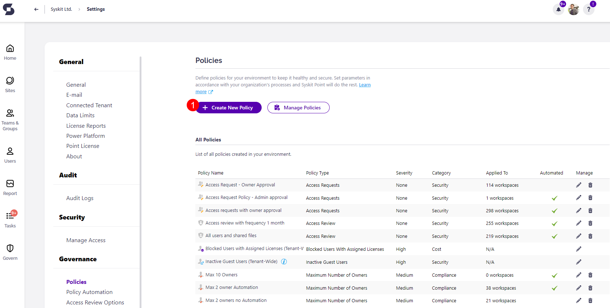
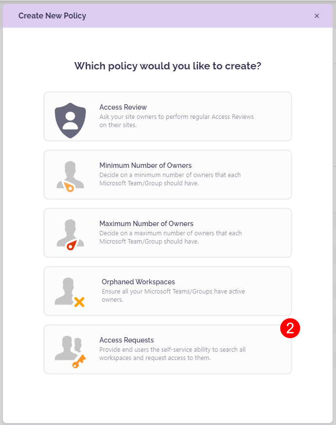
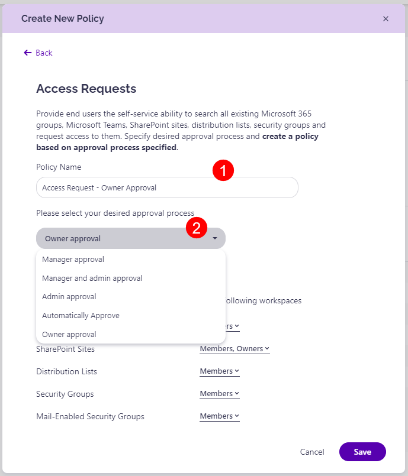
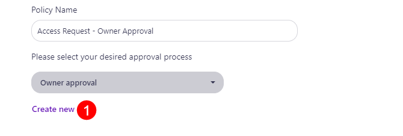
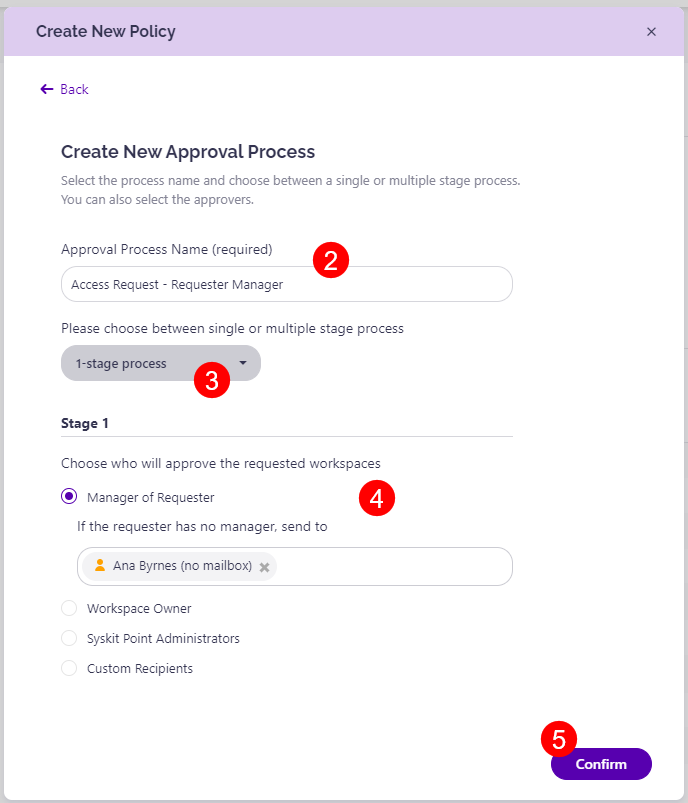
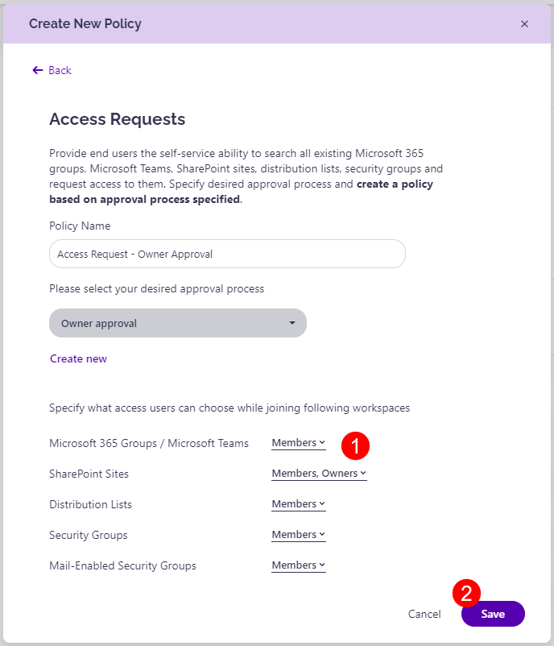

#  Access Requests Policy

To create the **Access Requests policy**, open Syskit point and go to **Settings**. 

Under Governance, select **Policies**. 

## Create Access Requests Policy

To create the Access Requests policy, complete the following steps:
 * **Click the Create New Policy (1) button** located on the left side under the Policies title.
   * A pop-up screen will appear, prompting you to select which policy to create.
* **Select Access Requests(2)** from the available list of policies.

Depending on the approval processes required for your workspaces, the following information needs to be specified:

* **Create the new policy name (1)**; depending on the type of Access Requests policy that will be created

* Select the **preferred approval process (2)** from the available list:
     * Manager approval
     * Manager and admin approval
     * Admin approval
     * Automatically Approve
     * Owner approval

* Alternatively, you can also create a new approval process if the above does not suit your workspaces' needs:
  * **Click Create New (1)**; located under the approval process dropdown menu
  * **Enter the name (2)** of your new approval process
  * Select between the **single or multiple-stage approval process (3)**:
    * 1-stage process
    * 2-stage process
    * 3-stage process
  * Depending on whether you selected the single or multiple-stage process, you will need to complete the below information:
    * **Select who approves the requested workspace (4)**:
      * **Manager of Requester**; you are also able to **add additional information** in case the requester has no manager by entering details in the section below
      * **Workspace Owner**; you are also able to **add additional information** in case the workspace has no owner by entering details in the section below
      * **Syskit Point Administrators**
      * **Custom Recipients**; for this option, you will need to enter the desired recipients' details in the section below
      * **Click Confirm (5)** once finished

* After setting the desired approval process, you need to **specify the level of access** (1); users can request to join as **Members, Owners**, or both. 
  * This can be set for the following workspaces: 
    * Microsoft 365 Groups/Microsoft Teams
    * SharePoint Sites
    * Distribution Lists
    * Security Groups
    * Mail-Enabled Security Groups

Once you complete the above steps, **click Save (2)**; this opens a pop-up stating that your **policy has been successfully created**. 

The new policy can now be found in the **list of all policies created in your environment**. 
  * The pop-up also allows clicking on Apply Policy and being taken to the Manage Policies screen directly. 


To enforce the new policy, it will need to be **applied to workspaces in your environment**. Take a look at the [Apply Access Requests article](apply-access-requests-policy.md) for instructions on how to apply your policy.

