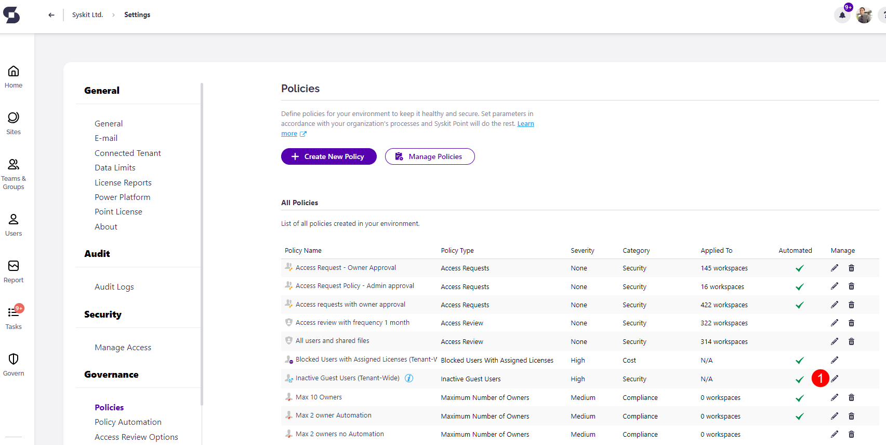
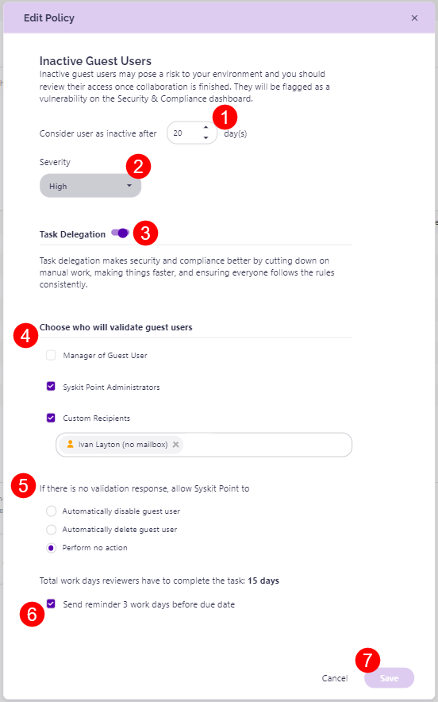

# Inactive Guest Users

Syskit Point provides a predefined **Inactive Guest Users policy** that is applied tenant-wide. 

To activate the policy, navigate to the Policies settings screen and **click the Edit Policy (1)** icon.

The **Edit Policy** dialog opens where you can:
* **Select when a user is considered inactive (1)** by choosing the amount of days that need to pass
* **Select the severity level (2)** for the policy
* **Enable Task Delegation (3)** by clicking the toggle next to it
  * **Select who will validate guest users (4):**
     * **Manager of Guest User**; when the option is selected, **the person responsible for the validation, in case the Guest User does not have a defined manager, needs to be chosen**
     * **Syskit Point Administrators**; this option is selected by default
     * **Custom Recipients**; when selected, use the input field to select custom users that will be responsible for the validation of Guest Users
  * **Select what Syskit Point should do if there is no validation response(5)**:
    * Automatically disable guest user
    * Automatically delete guest user
    * Perform no action
  * **Click the checkbox if you want a reminder sent (6)** 3 work days before the due date 
* Click **Save (7)** once you are done with the policy configuration.   

Based on your configuration, **Syskit Point will start the task delegation workflow when an inactive Guest User is detected**. 


**Please note!**
**You should have at least one user in your tenant with the Azure AD Premium P1 license assigned to detect sign-in times for guest users accurately.**


For details on how collaborators can [**resolve Inactive Guest Users  tasks**, navigate to the following article](../../point-collaborators/resolve-governance-tasks/guest-users-expiration.md).