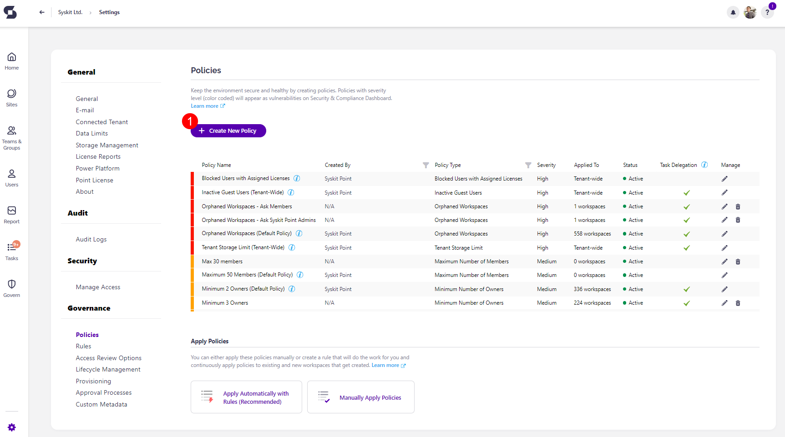

# Creating a Policy
To create a new policy, navigate to the Policies settings screen and click the **Create New Policy (1)** button.

The **Create New Policy** dialog opens, where you can select the type of policy to create.
You can choose from the following:
* **Access Review**
* **Minimum Number of Owners**
* **Maximum Number of Owners**
* **Orphaned Workspaces**
* [**Access Requests**](../../governance-and-automation/access-requests/README.md)
  * For more details on access requests in Syskit Point, read the [Access Requests section](../../governance-and-automation/access-requests/README.md).
* **Shadow Users**

**After you select the policy type**, you will be able to **define all policy settings**, described in more detail in the previously linked individual articles. 

[You can also find more information on Access Review policies in the following article.](../permissions-review/enable-permissions-review.md)

## Apply Policies

**When the policies are defined**, the last thing left to do is to **apply them to Microsoft Teams, Microsoft 365 Groups, OneDrive, and Sites**. 

Policies can be applied to workspaces either **manually or automatically**.  

### Apply Automatically

Applying policies automatically means that policies are applied to workspaces via [Rules](../automated-workflows/policy-automation.md) you create and the conditions you set within them. 

To ensure policies are automatically applied, open the Policies settings screen, navigate to the Apply Policies section, and click the **Apply Automatically with Rules button (1)**.

This redirects you to the **Rules** screen in the Settings of your Syskit Point. 

[For a detailed explanation of how Rules work and how to set them up, please read through the Rules article.](../automated-workflows/policy-automation.md) 

### Apply Manually

:::info
Rules can simplify policy assignments to workspaces by introducing conditions based on which the policies are automatically assigned. 
This way, existing workspaces and new ones that will be created in the future are covered without any manual intervention.
Where possible, we encourage you to use rules for applying policies. 
[To learn how to upgrade from manually applied policies to rules, read this article](upgrade-to-policy-automation.md).
:::

Applying policies manually means you can select the workspaces to which you want a specific policy applied. 

:::info
**If you have [Rules](../automated-workflows/policy-automation.md) set up**, when you manually apply a policy to a workspace that already had a policy of the same type assigned via Rules, the automatically assigned policy will be replaced with the new manually applied policy. 
:::

To start, open the Policies settings screen, navigate to the Apply Policies section, and click the Manually Apply Policies button.

The Manage Policies screen opens where you can:
* **Find workspaces that don't have any policies applied (1)**; when the tile is clicked, the report only displays workspaces that have no policies applied
* **Find the number of workspaces that have a specific policy type applied (2)**; when a tile is clicked, the report only displays workspaces with the selected policy applied
* **Filter the report per policy or workspace type (3)**
* **Select one or multiple workspaces (4)**
* **View all policies applied on a specific workspace (6)**
* **Click the Manage Policies button (6)**; if multiple workspaces are selected, clicking the arrow next to Manage Policies provides the options to choose between:
   * **Apply Policy**
   * **Remove Policy**
   * **Remove All Policies** 

After clicking the **Manage Policies (6)** button, the **Manage Policy** dialog opens, where you can **select a policy** and **apply** the chosen policy on the selected workspaces grouped by the policy type.

:::info

When manually applying a policy, you **receive a warning** that it will replace any automatically assigned policies. The warning will still appear even if you do not have Rules set up.  

:::

:::tip
**Once a policy is applied, Syskit Point automates detection for a policy vulnerability**. 
:::

You can find an article on how to create or edit each policy here:
* [**Minimum Number of Owners**](minimum-number-of-owners-admin.md)
* [**Maximum Number of Owners**](maximum-number-of-owners-admin.md)
* [**Orphaned Workspaces**](orphaned-resources-admin.md)
* [**Inactive Guest Users**](inactive-guest-users-admin.md)
* [**Blocked Users with Assigned Licenses**](blocked-users-with-licenses-admin.md)
* [**Orphaned Users**](orphaned-users-admin.md)
* [**Shadow Users**](shadow-users-admin.md)

