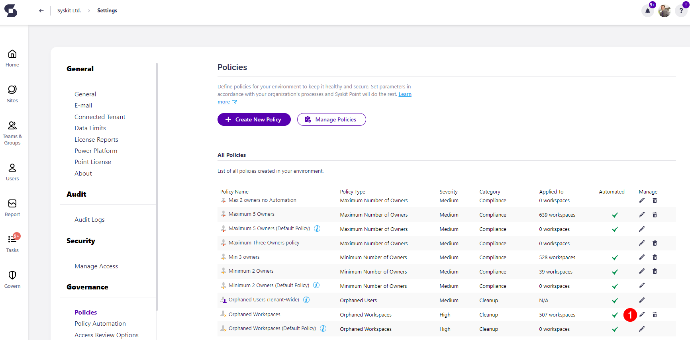
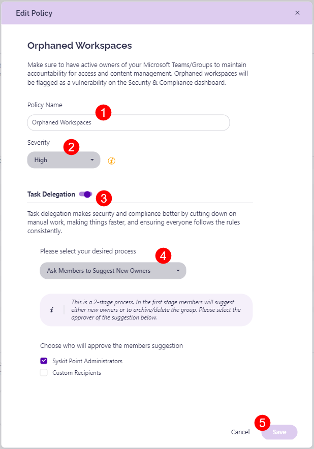

# Orphaned Workspaces

Syskit Point detects **workspaces that don't have active owners**, which helps you ensure there is always someone responsible for access and content management for your workspaces. 

:::warning
**Please note**, this policy can be applied to the following workspaces:
* **Microsoft Teams**
* **Microsoft 365 Group**
* **SharePoint Sites**
* **Viva Engage Community**
* **SharePoint Sites**

:::

A predefined policy - **Orphaned Workspaces** - can be found on the Policies screen. 

Click the **Edit (1)** icon to view all defined options for the policy. 

The **Edit Policy** dialog opens, where you can:
* **Define the policy name (1)**
* **Choose the severity level (2)**; this option is enabled by default
* **Enable Task Delegation (3)** by clicking the toggle next to it and selecting your task delegation preferences:
  * **Select between the 3 available processes (4)**:
    * [**Ask Specific Users to Assign New Owners**](#ask-specific-users-to-assign-new-owners)
    * [**Ask Members to Suggest New Owners**](#ask-members-to-suggest-new-owners)
    * [**Automatically Assign New Owners**](#automatically-assign-new-owners)
* Click **Save (5)** once you are done with the policy configuration 

:::info

**Please note the following:** 
* **The Orphaned Workspaces policy vulnerability is detected when there are 0 active owners assigned to a workspace.** 
  * If 1 owner is assigned to a workspace when resolving the Orphaned Workspaces vulnerability, Syskit Point will detect the [Minimum Number of Owners policy](../../point-collaborators/resolve-governance-tasks/minimum-number-of-owners.md) vulnerability, as the default requirement is to have at least 2 owners per workspace. 

* **Nested group members are counted** when resolving a policy.
  * If the required number of members, including those within nested groups, has not been added or removed, the Resolve button remains disabled until that condition is met.
* **Site Owners are determined by the SharePoint Owners group.**
  * Only users in the SharePoint Owners group are considered Site Owners and can resolve tasks. **Site Admins cannot resolve tasks** and are not considered Site Owners.

:::

## Ask Specific Users to Assign New Owners

The **Ask Specific Users to Assign New Owners** option is a **1-stage process**.

When an Orphaned Workspace is detected, **selected users (Syskit Point Administrators and/or custom recipients) receive a task to assign a new owner to the workspace**. No additional steps or user involvement are required beyond this. 

For more details on how this task is resolved from the specific user's perspective, take a look at the [Resolve Orphaned Workspace tasks article.](../../point-collaborators/resolve-governance-tasks/orphaned-resources.md#specific-users-assign-new-owners)    

## Ask Members to Suggest New Owners

The **Ask Members to Suggest New Owners** is a **2-stage process**, and is the default option selected.

In the first stage, **Members suggest new owners**:
  * When the Ask Members action is triggered, e-mails and tasks are sent to all members of the workspace
  * Members are asked to suggest one or more users as new owners
  * Members can resolve the task directly from the e-mail they receive
  * The suggestions are stored as members resolve their tasks, and stage one stays active until all members resolve their tasks

:::info

**Please note:**

**If the team has no members**, this action cannot be completed. In that case, the admins have to resolve the vulnerability by using one of the following actions;
  * Add Owners
  * Archive Workspace
  * Delete Workspace

:::

* In the second stage, **admins or designated reviewers get a new the task**:
  * After all members tasks are completed, a new task is created for admins or designated reviewers to take one of the following actions:
    * **Add Owners**, by approving the suggestions made by members or deciding on an owner yourself
    * **Archive** the workspace
    * **Delete** the workspace

For more details on how this task is resolved from the specific user's perspective, take a look at the [Resolve Orphaned Workspace tasks article.](../../point-collaborators/resolve-governance-tasks/orphaned-resources.md#members-suggest-new-owners)    

## Automatically Assign New Owners

When the **Automatically Assign New Owners** option is selected, Syskit Point **automatically assigns the last owner's manager as a new owner**. If the manager cannot be found, Syskit Point escalates the task to the user you defined when creating the policy.

When resolving the Orphaned Workspaces task by selecting the Automatically Assign New Owners option, Syskit Point tries to find the most appropriate owner by **using the following logic**:

* **Check for disabled or deleted owners** 
  * If the workspace had disabled or deleted owners, Point assigns ownership to the manager of one of those users.
    * The selected manager has to be an active user and is chosen based on the most recent sign-in. 
  * If no disabled or deleted owners are found, Point checks audit logs for users who were removed as owners within the last 7 days.
    * If such users exists, ownership is assigned to the manager of one of those users while using the same criteria as mentioned above.

* **Fallback to tasks**
  * If no suitable owner can be found during the above steps, resolution tasks are assigned to the configured resolvers and an e-mail is sent to them.
  * If an owner is found, but assignment fails, tasks are assigned to Syskit Point Admins, without sending an e-mail notification.