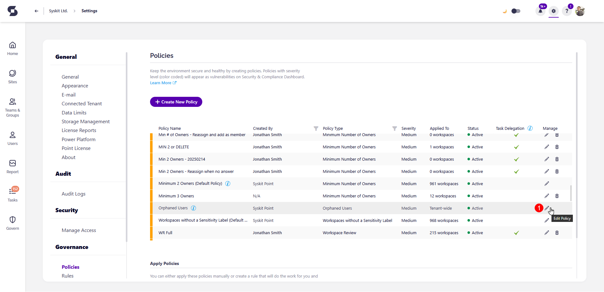
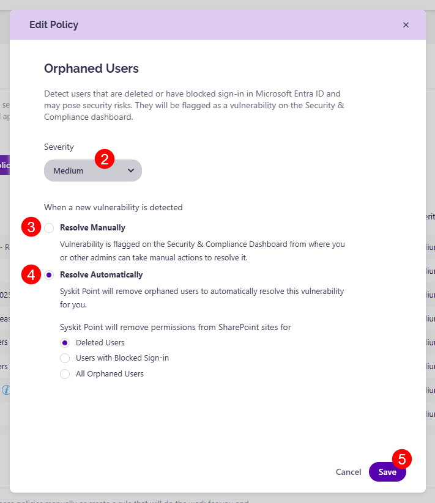

# Orphaned Users

Syskit Point provides a predefined **Orphaned Users policy** that is applied tenant-wide and cannot be deleted.

## Orphaned Users Explained

When a **user account is deleted from Microsoft Entra ID, or has sign-in blocked, their entry typically remains cached in the SharePoint UserInfo list** on every site they visited. This redundant entry becomes a problem when a new account is later created with the same username (UPN). Microsoft 365 assigns a new internal ID to the new account, but the UserInfo list still contains the old one, causing a mismatch.

**Symptoms of orphaned or mismatched user entries include:**
* "Access Denied" errors when users try to access a SharePoint site or OneDrive
* Inconsistent behavior in the people picker and sharing dialogs
* A new OneDrive URL with a numeric or GUID suffix appended to the expected address

**The root cause is a UserInfo list mismatch.** When an account is deleted and re-created with the same UPN, the new account receives a different ID. SharePoint and OneDrive still reference the old ID in the UserInfo list, causing access checks to fail.

Syskit Point detects these stale entries and removes them from the UserInfo list, the same course of action [recommended by Microsoft](https://learn.microsoft.com/en-us/troubleshoot/sharepoint/sharing-and-permissions/fix-site-user-id-mismatch). This prevents access issues and keeps the workspace membership clean.

:::info
**Removing a user from the SharePoint UserInfo list is a safe action with no data loss.** All site content, files, documents, and list items, is fully preserved. Metadata fields such as **Created By** and **Modified By** on existing content remain intact and are not overwritten or removed. The UserInfo list is only an identity cache; clearing stale entries does not affect any stored content. For more details, [take a look at this Microsoft article.](https://learn.microsoft.com/en-us/sharepoint/remove-users).
:::

## Orphaned Users Policy

To edit the policy, go to the Policies settings screen and **click the Edit Policy icon (1)** next to the Orphaned Users policy.

The **Edit Policy** dialog opens, where you can:
* Select the **Severity level (2)**.
   * The default severity level for this policy is **Medium**.
   * You can choose from **three levels of severity**:
     * High
     * Medium
     * Low
* Choose how you want to **resolve the policy when a new vulnerability is detected**: 
  * **Resolve Manually (3)** - selecting this option means the vulnerability is flagged on the Security & Compliance Dashboard, where you or other admins can take manual actions to resolve it.
  * **Resolve Automatically (4)** - selecting this option means Syskit Point automatically removes orphaned users to resolve the vulnerability when it is detected.
  * You can select which type of orphaned users should be automatically deleted by choosing one of three options:
    * **Deleted Users** - selecting this removes all deleted users from your workspaces.
    * **Users with Blocked Sign-in** - selecting this removes all blocked users from your workspaces.
    * **All Orphaned Users** - selecting this removes both blocked and deleted users from your workspaces.

Once you've selected the options that best suit your needs for this policy, **click the Save button (5)** to store your preferences.

:::info
* **Policy vulnerability is not detected for OneDrive workspaces where the Primary admin is blocked or deleted**, as this is expected during user offboarding and similar scenarios.
* **Primary admins cannot be deleted from a workspace** automatically. This requires manual intervention and replacing the deleted or blocked Primary admin with an active user. 
:::