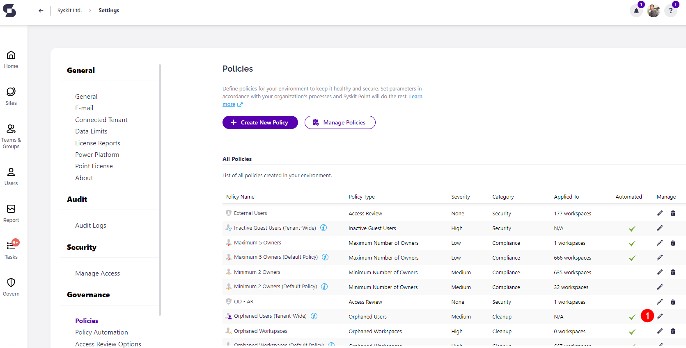

# Orphaned Users

Syskit Point provides a predefined **Orphaned Users policy** that is applied tenant-wide and cannot be deleted. 

This policy helps you identify and remove users who may pose risks or complications when managing workspaces.

To edit the policy, go to the Policies settings screen and **click the Edit Policy icon**.

The **Edit Policy** dialog opens, where you can:
* Select the **Severity level (1)**.
   * The default severity level for this policy is **Medium**.
   * You can choose from **three levels of severity**:
     * High
     * Medium
     * Low
* Choose how you want to **resolve the policy when a new vulnerability is detected**: 
  * **Resolve Manually (2)** - selecting this option means the vulnerability is flagged on the Security & Compliance Dashboard, where you or other admins can take manual actions to resolve it.
  * **Resolve Automatically (3)** - selecting this option means Syskit Point automatically removes orphaned users to resolve the vulnerability when it is detected.
  * You can select which type of orphaned users should be automatically deleted by choosing one of three options:
    * **Deleted Orphaned Users** - selecting this removes all deleted orphaned users from your workspaces.
    * **Disabled Orphaned Users** - selecting this removes all disabled orphaned users from your workspaces.
    * **All Orphaned Users** - selecting this removes both disabled and deleted orphaned users from your workspaces.

Once you've selected the options that best suit your needs for this policy, **click the Save button (4)** to store your preferences.

