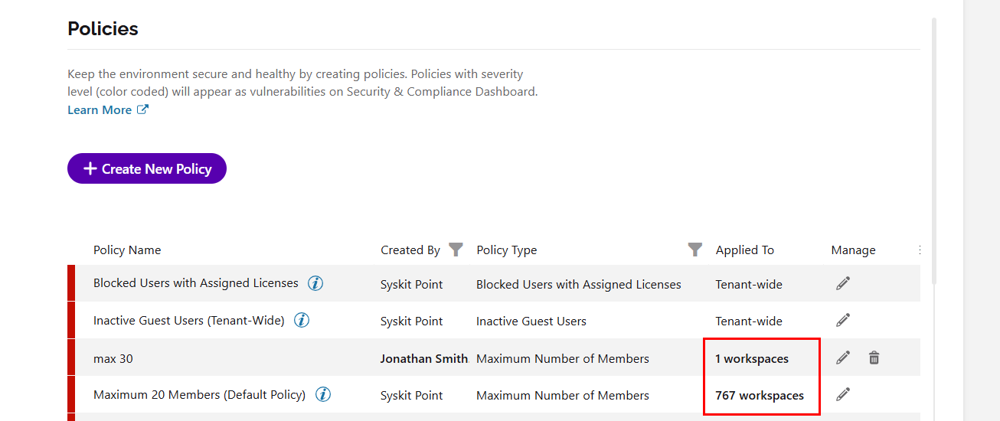
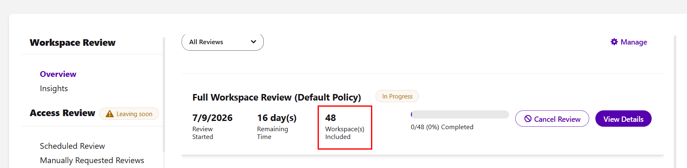

# Policy Impact Report

The **Policy Impact** report gives you a quick overview of everything a single policy currently affects in your tenant:

* The workspaces where the policy is applied
* The reviewers responsible for validating those workspaces, if the policies are task delegated

You can use this report to check a policy's reach before making changes or to find workspaces that might not have a reviewer assigned.

## Access the Policy Impact Report

The Policy Impact report can be accessed from two places:

* **From the Policies settings screen**; go to **Settings > Policies** and **click the number in the Applied To column** for a policy.
* **From the Workspace Review overview**; go to **Govern > Workspace Review** and **click the Workspaces included number** for a Workspace Review policy.

:::info

**Please note:**  

* The Policy Impact report is not available for **tenant-wide policies**, for example, the default Inactive Guest Users policy. For these policies, the number in the **Applied To** column is not clickable.
* Clicking the **Applied To** number for an **Access Review policy** opens the existing **Manage Reviewers** screen instead of the Policy Impact report.

:::

If the policy has **no workspaces applied** but has a rule assigned, the report is not shown. Once you click on the **0 workspaces**, a short message is displayed with two options:

* **Apply Automatically with Rules**; opens the **Rules** screen where you can review or edit rules.
* **Manually Apply Policies**; opens the **Manage Policies** screen where you can apply the policy to workspaces yourself.

For more details on both options, [take a look at the Apply Policies article.](manage-policies.md)

## Report Data

The Policy Impact report opens on the **Workspaces** view by default. For policies with task delegation enabled, you can **use the Workspaces/Reviewers toggle** at the top of the report to switch between:

* **Workspaces**; shows every workspace where the policy is currently applied.
* **Reviewers**; shows every reviewer responsible for validating the workspaces shown in the Workspaces view.

### Workspaces View

You can filter the **Workspace view** by:

* **All**; shows the total number of workspaces where the policy is applied
* **Workspace type filters** (Microsoft Teams, Microsoft 365 Groups, SharePoint sites, etc.); each tile shows the amount for that type of workspace. 
  * **Click a tile** to display only workspaces of that type.
* **Without Reviewers**; marked with a warning icon. 
  * **Click this tile** to display only the workspaces that have no active reviewer assigned for this policy.

The following information is available on the report:

* **Name** of the workspace
* **URL** of the workspace
* **Applied** shows whether the policy was applied to the workspace by a Rule or Manually
* **Active Reviewers** shows the number of reviewers responsible for validating the workspace
  * This column is not displayed for policies without task delegation
* **E-mail** of the workspace

Selecting any workspace provides the action to **Exclude from Policy**. 
* Completing this action removes the policy from the selected workspaces.
 * This action is only available when the policy was manually applied to the workspace.

If a workspace has no active reviewers, you can also perform the **Change Owners** or **Change Admins** actions. You can use these actions to assign an owner or admin to the workspace so that the policy has someone to delegate tasks to.

The report can be **exported** as a **PDF**, **XLSX** or **CSV** file.

### Reviewers View

Each row in the Reviewers view represents a user who is responsible for at least one workspace visible in the Workspaces view.

You can filter the **Reviewers view** by:

* **All**; the total number of reviewers for the policy
* **Governance Excluded Users**; shown only when the policy has excluded reviewers. 
  * Click this tile to display users who are excluded from governance
  * Excluded users are shown for reference and no actions can be performed on them from this report

The following information is available on the **Reviewers view**:

* **Name** of the user
* **E-mail** of the user
* **Department** the user belongs to
* **Assigned Workspaces** shows the number of workspaces they are a reviewer for

You can **export the report** as a **PDF**, **XLSX** or **CSV** file.

:::info

**Please note!**  

For policies **without task delegation**, such as **Access Requests**, reviewers are not tracked. In this case, the **Workspaces/Reviewers** toggle is hidden and only the Workspaces view is available.

:::

## Related Articles

* [Apply Policies](manage-policies.md)
* [Rules for Applying Policies Automatically](policy-automation.md)
* [Workspace Review](../workspace-review/README.md)