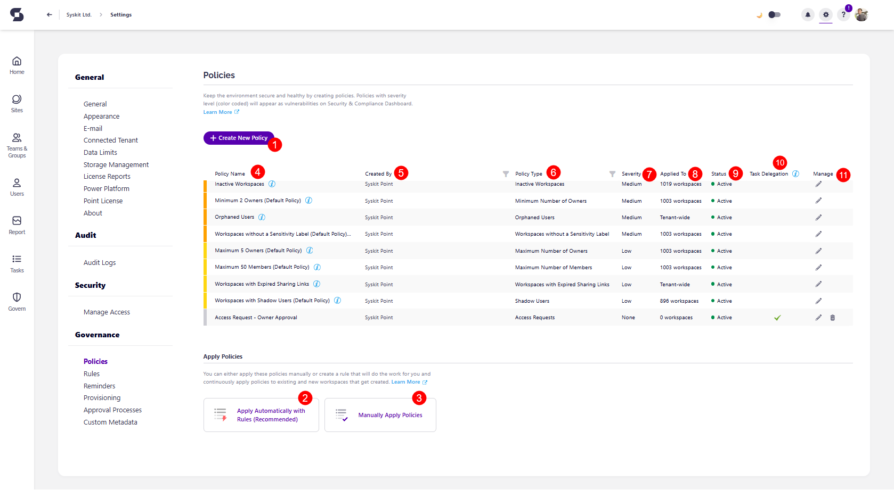

# Set Up Policies

:::info
**Policies** are available in the Governance plan and higher tiers. See the [pricing page](https://www.syskit.com/products/point/pricing/) for more details.
:::

## Prerequisites

To use the advantages of Policies in Syskit Point, you need to:

* [set up e-mail settings](../../configuration/set-up-email.md)
* [enable Syskit Point Collaborators role](../../configuration/enable-role-based-access.md)

Additionally, you can also [set up policy rules](../../governance-and-automation/automated-workflows/policy-automation.md) to have policies automatically applied to current and all future workspaces without having to assign them manually. 

:::warning
**Please note!**
Only users assigned the role of **Syskit Point Admin** can access and configure Settings in Syskit Point.
:::

## Detection vs Task Delegation

### Detection
Two modes of policy operation for Governance policies are available in Syskit Point: **Detection and Task Delegation**. 

The following are **detection-only policies** that are applied tenant-wide: 
* [**Blocked Users with Assigned Licenses (Tenant-Wide)**](../../governance-and-automation/security-compliance-checks/blocked-users-assigned-license.md) 
* [**Orphaned Users (Tenant-Wide)**](../../governance-and-automation/security-compliance-checks/orphaned-users.md)
* [**Workspaces with shadow users**](../../governance-and-automation/security-compliance-checks/workspaces-with-shadow-users.md) 
* [**Workspaces with too many members**](../../governance-and-automation/security-compliance-checks/workspaces-with-too-many-members.md)

When it comes to detection-only policies, Syskit Point detects a vulnerability in a workspace based on the applied policy. 

Syskit Point **does not create tasks or send any emails to workspace owners for policies that are configured to perform as detection-only**. However, the vulnerabilities are displayed on the new [Security & Compliance dashboard](../../governance-and-automation/security-compliance-checks/overview.md).

The purpose of this is to assist Syskit Point admins by reminding them there are potential issues in their Microsoft 365 environment every time they open Syskit Point. 

* **When you acquire Syskit Point, default policies are created - Minimum 2 Owners (Default Policy), Maximum 5 Owners (Default Policy), Orphaned Workspaces (Default Policy), Maximum 50 Members (Default Policy) - and applied to all your workspace via a default rule**; these policies serve to give you an overview of workspaces that are potentially not configured according to best practices; no need to worry, though - default policies are configured as **detection-only policies**, meaning that **Syskit Point will not create tasks or send emails**.

**The Workspaces With Shadow Users (Default Policy)** is not included in the default rule and, as a result, is not applied to any workspaces.

### Task Delegation

Task Delegation can be enabled in policy settings for each policy listed below.

**The following policies can be delegated**: 
* [Inactive Guest Users (Tenant-Wide)](../../governance-and-automation/security-compliance-checks/inactive-guest-users.md)
* [Maximum Number of Owners](../../governance-and-automation/security-compliance-checks/workspaces-too-many-owners.md)
* [Minimum Number of Owners](../../governance-and-automation/security-compliance-checks/workspaces-not-enough-owners.md)
* [Orphaned Workspaces](../../governance-and-automation/security-compliance-checks/orphaned-workspaces.md)
* [Tenant Storage Limit (Tenant-Wide)](../../governance-and-automation/security-compliance-checks/tenant-storage.md)

**When task delegation is enabled, Syskit Point creates tasks and sends emails to users as defined in the policy settings**.

**Please note!**\
Summarized policy vulnerability emails will be gradually rolled out, beginning with the Point Cloud 2024.2.45 release.
After this change, Syskit Point will no longer send individual e-mails for each workspace or user where a policy vulnerability was discovered.  
:::

**The emails are summarized per policy type**:
* One email shows up to 10 workspaces grouped by governance policies; if there are more workspaces with vulnerabilities, they will not be listed; instead, the total number of such workspaces is given in the email
* Reminder emails are also grouped - owners, admins, or other users defined as resolvers will get an email listing all workspaces with vulnerabilities where they have a task due in 3 days
* Emails sent when Syskit Point automatically resolves vulnerabilities with a defined action are also summarized.

* **Access Requests** and **Access Review** policies don't represent vulnerabilities and will not appear on the Security & Compliance dashboard; think of them as automation-only policies.
* **When you acquire Syskit Point, default policies are created with task delegation disabled.** Edit the default policies settings to enable task delegation.

:::info
**Please note!** If a user, security group, or mail-enabled security group is added to the Governance-Excluded Users list, they do not receive any Governance-related tasks or task-related e-mails. [For more details on setting up Governance-Excluded Users, take a look at this article.](../../configuration/exclude-users-tasks.md)
:::

## Syskit Point Policies

Syskit Point enables creating and using policies that will make sure the following is set correctly and reviewed when needed:
* **Ownership on Microsoft Teams and Microsoft 365 Groups**
* **Inactive Guest Users**
* **Blocked Users with Assigned Licenses**
* **Orphaned Users**
* **User's access**
* **Tenant-wide Storage Usage**

When dealing with policies, you can either:
* **Adjust predefined policies and apply them to your workspaces**, or
* **Create new policies from scratch and apply them to your workspaces**
* **Set up policy rules to have policies automatically applied to current and new workspaces**

:::tip
**For simple use cases** where the same policies are applied to all workspaces, you can **adjust the predefined policies to speed up the configuration**. 
**For a more complex setup**, you can **create multiple policies of the same policy type** and **apply them to a subset of your workspaces**.
:::

## Available Policies

Take a look at the articles below to learn how to set up each governance policy:

* [**Minimum Number of Owners**](minimum-number-of-owners-admin.md) - when enabled and applied to Microsoft Teams and Microsoft 365 Groups, this policy **detects whether a team or group has fewer owners** than defined in the policy settings
* [**Maximum Number of Owners**](maximum-number-of-owners-admin.md) - when enabled and applied to Microsoft Teams and Microsoft 365 Groups, this policy **detects if a team or group has more owners** than defined in the policy settings
* [**Orphaned Workspaces**](orphaned-resources-admin.md) - when enabled and applied to Microsoft Teams and Microsoft 365 Groups, this policy **detects teams and groups that have no active owners**
* [**Inactive Guest Users**](inactive-guest-users-admin.md) - **detects when a guest user is inactive** for a period of time and helps you remove access in a timely and efficient manner
* [**Blocked Users with Assigned Licenses**](blocked-users-with-licenses-admin.md) - **detects blocked users in your tenant that still have licenses assigned**, which helps you optimize cost
* [**Orphaned Users**](orphaned-users-admin.md) - **detects users that are blocked from signing in or deleted** but still have access to SharePoint content
* [**Access Request**](../access-requests/README.md) - provides end-users with the **ability to request access to existing Microsoft Teams & Groups, sites, distribution lists, and security groups in the Microsoft 365 environment**; Syskit Point administrators can define workspaces visible to end-users and who is responsible for the approval of access requests
* [**Access Review**](../permissions-review/README.md) - enables Syskit Point admins to enforce regular Access reviews for workspace owners on their workspaces
* [**Tenant Storage Limit**](tenant-storage-admin.md) - **detects when total tenant storage usage exceeds the defined percentage**
* [**Workspaces with Shadow Users**](shadow-users-admin.md) - **detects users that have access to specific content but are not members** of the Microsoft 365 Group or Team associated with it
* [**Workspaces with Too Many Members**](workspaces-with-too-many-members-admin.md) - **detects which workspaces have more than the maximum number of members** predefined by your organization's policies

By clicking on the names of each policy, you can **find an article with information on enabling and managing** all mentioned policy types. 
 
[For information on how to apply your created policies, take a look at this article.](manage-policies.md)

## Policy Settings

To **open the Policies settings screen**, navigate to **Settings** &gt; **Governance** &gt; **Policies**.

Here, you can:
* **Create a new policy (1)**
* **Manage and apply policies to Microsoft Teams, Microsoft 365 Groups, OneDrive, and sites (2)**
* **View all predefined policies by name (3)**; Syskit Point comes with multiple predefined policies to help you get started
* **View additional information about each policy**; the following information is available **policy type (4)**, **severity of policy(5)**, **category policy fits under (6)**, **to how many workspaces a policy is applied (7)**, and **whether the policy is automated or not (8)**
* **Manage policies (9)**; **Edit** and **Delete** actions are provided for each policy, **except for those applied tenant-wide and the default policies used by the default rule**

## Modifying Policy Settings

When you decide to modify existing governance policies, there is a notification showing what you can expect to occur based on the changes made. 

 Here is a summary of policy updates and expected results:

* **Modifying detection options for policies are applied within 24 hours**. For example, changing the minimum number of required owners would take up to 24 hours to apply.
  * Once changes are made, previously detected vulnerabilities and tasks are examined again and closed if the workspace no longer violates the defined parameters. 
  * All workspaces are rechecked; if any vulnerabilities now exist, they are detected, and tasks are created if needed.
 * **Turning on the task delegation for the first time results in tasks being created and emails being sent** within 24 hours.
* **Modifying the task delegation options**, in case the task delegation is already enabled for a policy, results in new options being applied to future vulnerabilities. **Existing tasks stay the same.

:::info
**Hint**! If you want to apply new task delegation options to all tasks, turn off task delegation - which closes all existing tasks - and turn it on again, which creates new tasks with the new settings applied. 

:::

 * **Turning off the task delegation results in closing previously opened tasks**. 
   * You will continue to see the detected vulnerabilities on the Security and Compliance checks dashboard even though the related tasks are closed.

## Resolving Policy Tasks

For more information on how collaborators **can resolve specific policy vulnerabilities**, navigate to the articles given below:
* [Resolve Minimum Number of Owners vulnerabilities](../../point-collaborators/resolve-governance-tasks/minimum-number-of-owners.md)
* [Resolve Maximum Number of Owners vulnerabilities](../../point-collaborators/resolve-governance-tasks/maximum-number-of-owners.md)
* [Resolve Orphaned Workspaces vulnerabilities](../../point-collaborators/resolve-governance-tasks/orphaned-resources.md)
* [Resolve Inactive Guest Users vulnerabilities ](../../point-collaborators/resolve-governance-tasks/guest-users-expiration.md)
* [Resolve Tenant Storage vulnerabilites](../../point-collaborators/resolve-governance-tasks/tenant-storage-limit.md)