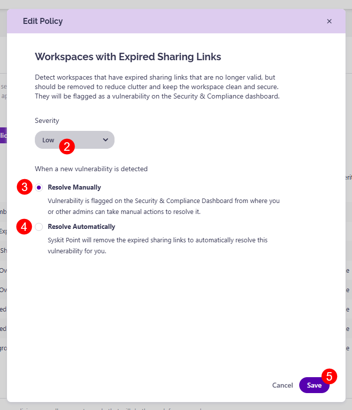

# Workspaces with Expired Sharing Links

Syskit Point provides a predefined **Workspaces with Expired Sharing Links policy** that is applied tenant-wide and cannot be deleted. 

This policy helps you identify workspaces with expired sharing links and remove them, as they may pose a security risk and cause unnecessary noise when auditing access or creating reports.

To edit the policy, go to the Policies settings screen and **click the Edit Policy icon (1)** next to the Workspaces with Expired Sharing Links policy.

The **Edit Policy** dialog opens, where you can:
* Select the **Severity level (2)**.
   * The default severity level for this policy is **Low**.
   * You can choose from **three levels of severity**:
     * High
     * Medium
     * Low
* Choose how you want to **resolve the policy when a new vulnerability is detected**: 
  * **Resolve Manually (3)** - selecting this option means the vulnerability is flagged on the Security & Compliance Dashboard, where you or other admins can take manual actions to resolve it.
  * **Resolve Automatically (4)** - selecting this option means Syskit Point automatically removes expired sharing links from workspaces to resolve the vulnerability when it is detected.

Once you've selected the options that best suit your needs for this policy, **click the Save button (5)** to store your preferences.

