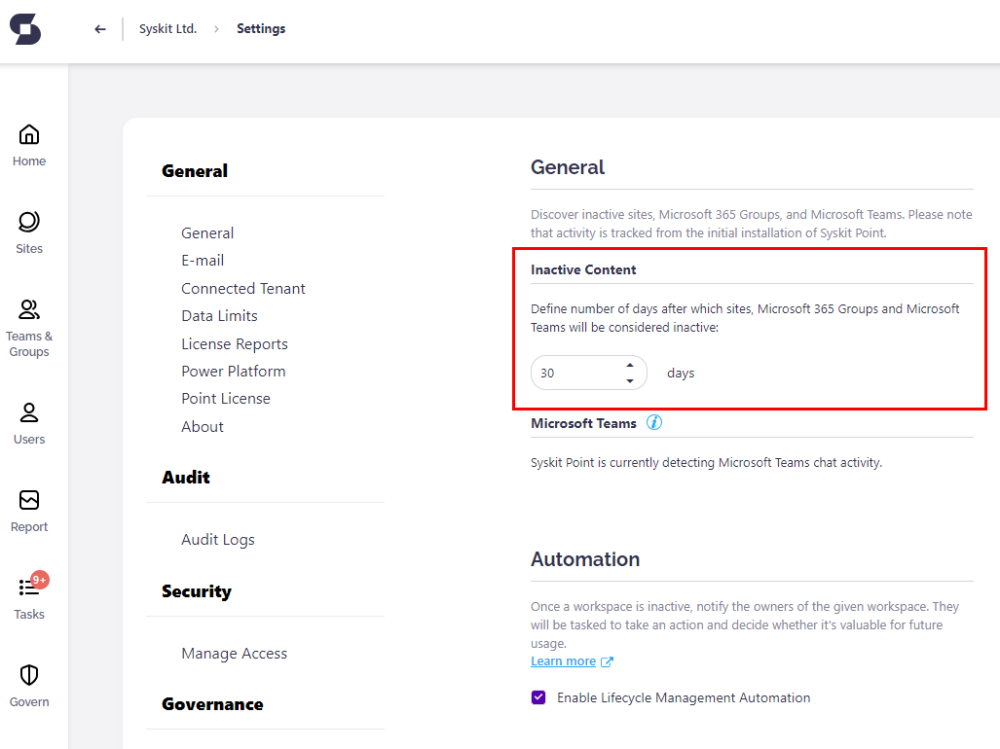
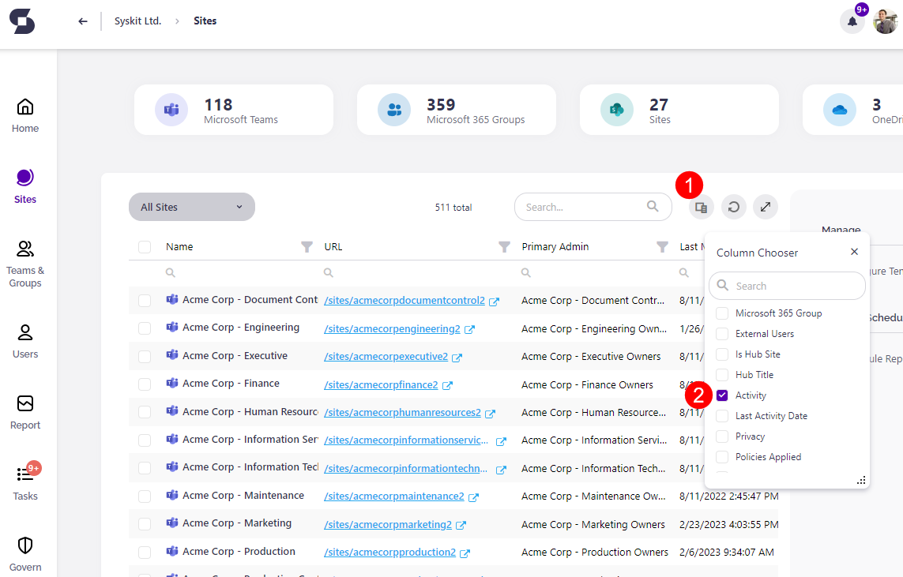
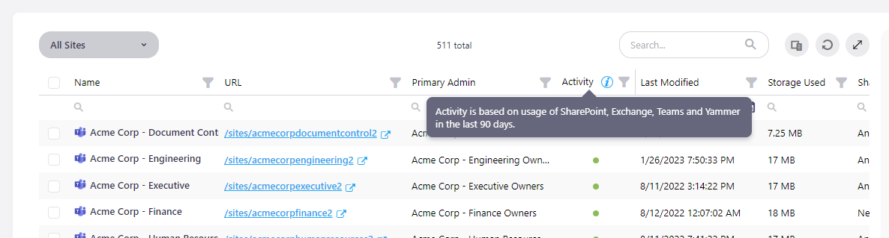
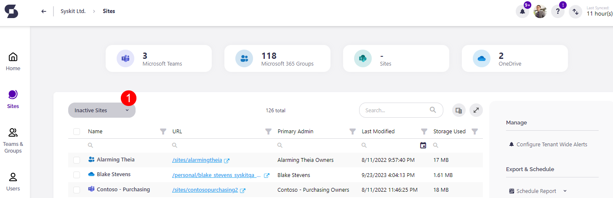
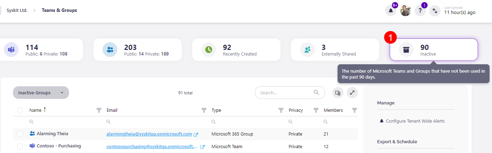
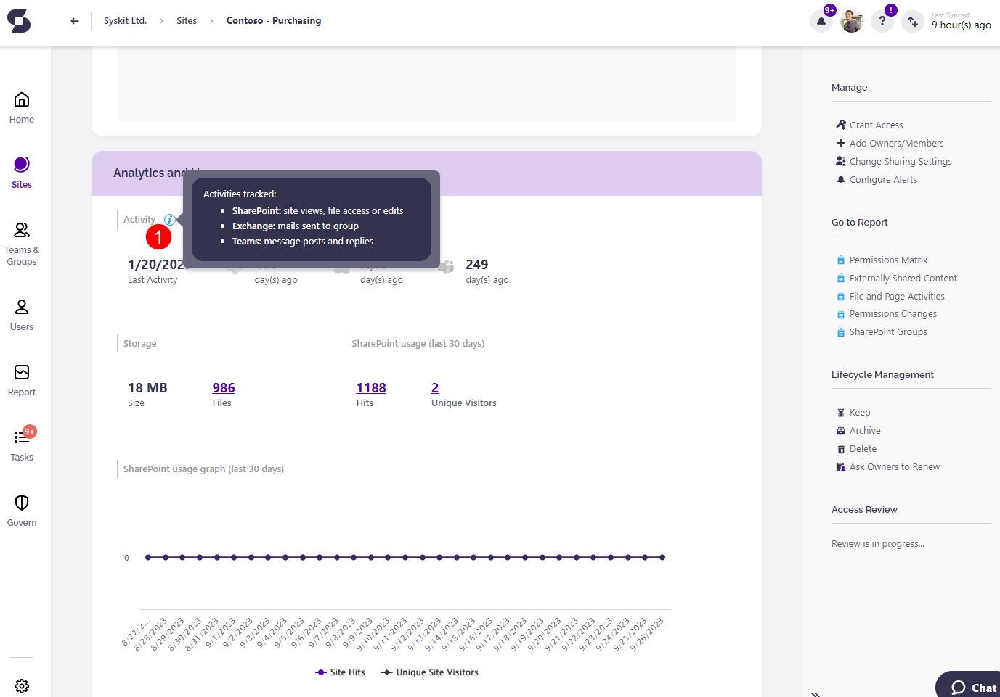

# Identify Inactive Workspaces

Have you ever wondered how to discover all inactive workspaces in your Microsoft 365 environment?  
It is important to have this kind of information because you want a well-organized and clutter-free Microsoft 365 environment.  
Now, you can find it all in one place with the help of **Syskit Point**.

## Monitored Workloads

To decide whether something is inactive in your Microsoft 365 environment, we collect activity data for the following workloads: **SharePoint**, **Exchange**, **Viva Engage**, and **Microsoft Teams**.

**SharePoint activity** is collected via Microsoft 365 audit logs. The last activity is based on the latest date when a file was viewed, edited, or downloaded.

For the collection of **Exchange activity**, Syskit Point uses the Microsoft 365 Groups activity report available in the Microsoft 365 admin center. The **last activity is based on the latest date when an email was delivered** to a group.

The **Viva Engage activity** collection is also accomplished through the Microsoft 365 admin center usage report for Viva Engage Groups activity. The **last activity is based on the latest date a message was read, posted, or liked** by the group.

**Microsoft Teams activity** is collected using protected APIs in Microsoft Graph. The **last activity is based on the latest date when a message was posted or replied to**.

**Data for Exchange, Viva Engage, and Microsoft Teams activities are collected by Syskit Point's dedicated service within non-working hours**, between 7:00 PM and 7:00 AM.

:::warning
**Please note!  
Activity is being monitored from the Syskit Point installation onward!** This applies to SharePoint and Exchange workloads since historical data for these workloads is not available in usage reports.
:::

## Define What Is Inactive

You can **configure what is considered to be inactive** in Syskit Point by changing the number of inactive days, after which workspaces will be marked as inactive. To do so, open the **Settings** page from any screen within the application and go to the **Governance &gt; Lifecycle Management** screen, where you will find the **Inactive Content** section. **Enter the number of days** in the field and click the **Save** button to update the value. The number of days can be set to a value between 30 and 1000.

## View Inactive Workspaces in Syskit Point

There are several places in Syskit Point where you can find activity information at. Let's get to know them.

### Sites Overview Screen

When you open the Sites Overview screen from the **Welcome Home** screen, click the **Column Chooser icon \(1\)** and mark the **Activity column \(2\)** to show it in the grid.

You can see the **blue info icon** in the Activity column header.

When you **hover over the info icon**, you will see which workloads are included in evaluating the activity for Sites, Microsoft Teams, Microsoft 365 Groups, and OneDrive sites. There is also information for which period \(number of days\) was the activity assessment made. In the grid, you have a **column filter** to help you see just the active or the inactive workspaces.

Hover over circle icons for each row to get more information about the **activity**. The **circle is colored gray** if there **was no activity since the application started collecting the activity data**. If the **circle is colored** **green**, the **content is** **active**. The date of the last activity is displayed on hover.

:::info
**Hint!** If more than one workload was active, then the latest date among all workloads will be shown.
:::

There is also a separate **Inactive Sites view \(1\)** available, accessed from the View drop-down menu. By selecting it, the Activity column becomes visible in the grid.

### Microsoft Teams & Groups Overview Screen

The **Microsoft Teams & Groups Overview screen** has a similar representation of Microsoft Teams and Microsoft 365 Groups' workload activity as the Sites Overview screen. The **Activity column is**, **by default**, **shown** as the last column in the grid. The same rules of displaying the activity data are applied here, as explained for the Sites Overview screen. Additionally, here you can find a separate **Inactive** tile above the grid. By clicking the tile, the **Inactive Groups (1)** view is shown.

### Details Screen

You can **access** **Details** **screens** for Sites, Microsoft 365 Groups, and Microsoft Teams by **clicking the link in the Name column** on **Overview** screens. The activity information inside the Details screens is shown in the **Analytics and Usage** tile. Hover over the **blue info icon (1)** to see for which workloads are the activities tracked.

:::warning
**Please note!**  
Workload activity data is shown only for the **root site level**. Document libraries, lists, folders, and list items **won't have the Activity section displayed** in the **Analytics and Usage** tile.
:::

### Inactive Workspaces Report

The easiest way to **find all inactive workspaces** is by using the **Inactive Workspaces report**, which you can find in the Report Center. 

[For more details on the Inactive Workspaces report and the actions available, take a look at this article.](../../reporting/analytics-reports.md#inactive-workspaces-report) 
