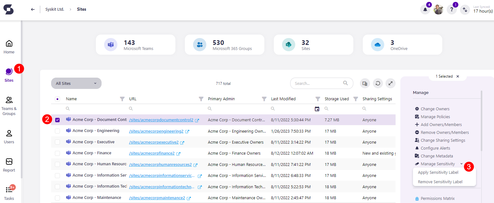
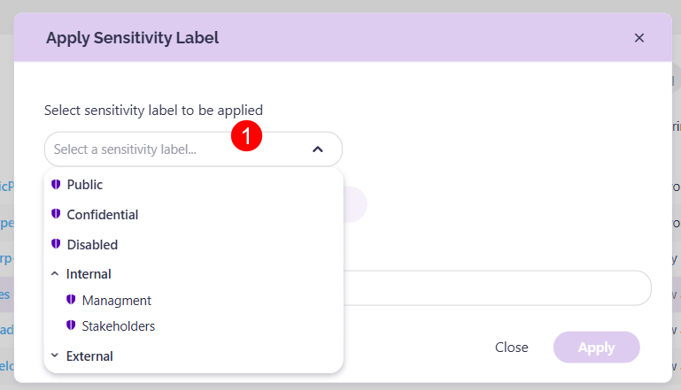
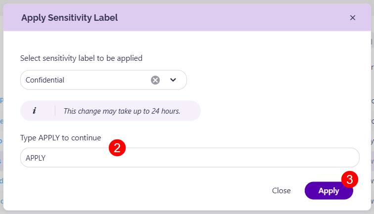
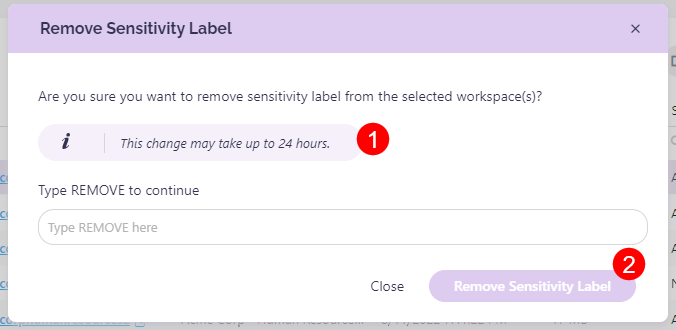

# Manage Sensitivity Labels


**Please note!**  
To use sensitivity labels, a service account needs to be connected to Syskit Point. For details on how to set up sensitivity labels, take a look at the [Enable Sensitivity Labels article](provisioning/enable-sensitivity-labels.md). 


Once set up, **Syskit Point admins and workspace owners can apply or remove the sensitivity labels from workspaces**. 

These changes can be done on the **Sites Overview** and the **Microsoft Teams & Groups Overview** screens.

Complete the following steps to manage your sensitivity labels:
 
* **Click the Sites button (1)** located on the left side of the Syskit Point screen.
   * This can also be done by clicking the Teams & Groups button, but in this example, we will be using Sites.
* **Select one or more workspaces (2)** you want to change the sensitivity label for. 
* **Click the arrow next to the Manage Sensitivity button (3)** to see your options; located on the right side of the screen.
  * **The Apply Sensitivity Label** and **Remove Sensitivity Label** actions show up.

Clicking Apply Sensitivity Label opens the Apply Sensitivity Label pop-up.

To apply a sensitivity label to the workspace:
  * **Select the sensitivity label (1)** you want to apply to the workspace.
  * **Type APPLY (2)** in the designated space.
  * **Click Apply Sensitivity Label (3)** to finalize.

Clicking Remove Sensitivity Label opens the Remove Sensitivity Label pop-up.
  * To remove the sensitivity label **type REMOVE (1)** in the designated space.
  * **Click Remove Sensitivity Label (2)** to finalize.


**Please note!**  
The sensitivity label changes can take up to 24 hours to apply to all apps and services. 

