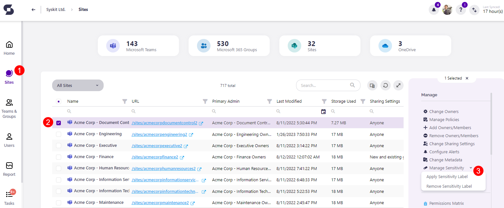
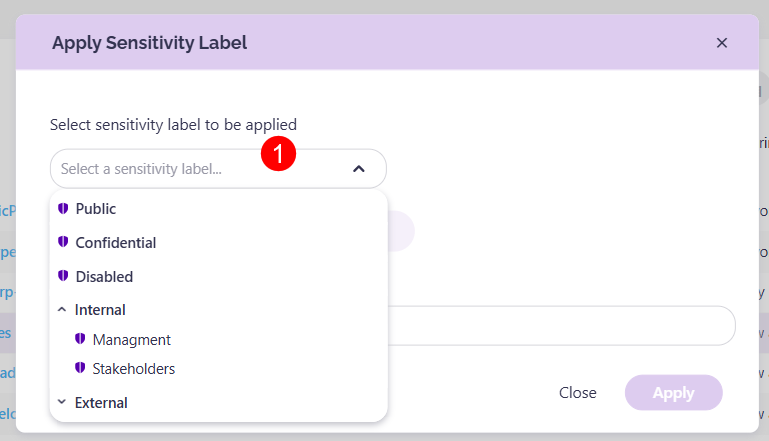
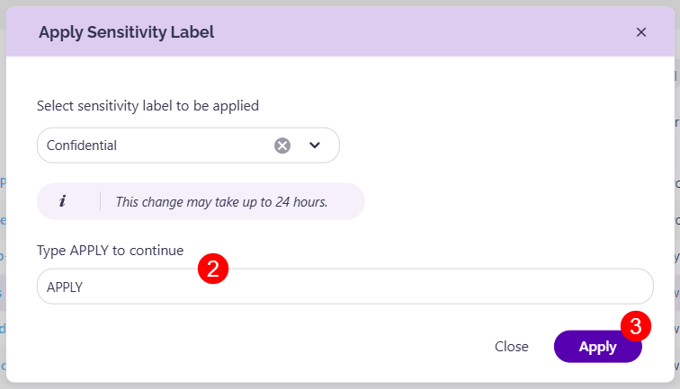
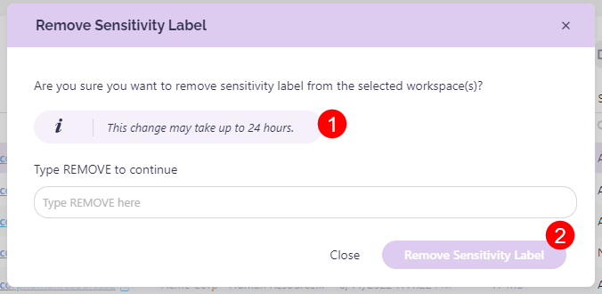

# Manage Sensitivity Labels

:::warning
**Please note!**  
To use sensitivity labels, a service account needs to be connected to Syskit Point. For details on how to set up sensitivity labels, take a look at the [Enable Sensitivity Labels article](provisioning/enable-sensitivity-labels.md). 
:::

Once set up, **Syskit Point admins and workspace owners can apply or remove sensitivity labels from workspaces**.

These changes can be made on the **Sites Overview** and **Microsoft Teams & Groups Overview** screens.

Complete the following steps to manage your sensitivity labels:
 
* **Click the Sites button (1)** located on the left side of the Syskit Point screen.
   * You can also do this by clicking the Teams & Groups button, but in this example, we will use Sites.
* **Select one or more workspaces (2)** for which you want to change the sensitivity label.
* **Click the arrow next to the Manage Sensitivity button (3)** to see your options, located on the right side of the screen.
  * **Apply Sensitivity Label** and **Remove Sensitivity Label** actions appear.

Clicking Apply Sensitivity Label opens the Apply Sensitivity Label modal.

To apply a sensitivity label to the workspace:
  * **Select the sensitivity label (1)** you want to apply to the workspace.
  * **Type APPLY (2)** in the designated field.
  * **Click Apply Sensitivity Label (3)** to confirm.

Clicking Remove Sensitivity Label opens the Remove Sensitivity Label modal.
  * To remove the sensitivity label, **type REMOVE (1)** in the designated field.
  * **Click Remove Sensitivity Label (2)** to confirm.

:::warning
**Please note the following:**
* Sensitivity label changes can take up to 24 hours to apply to all apps and services.
* In some situations, Microsoft creates two event logs: one in SharePoint and one in Azure Active Directory. 
* When a sensitivity label is not updated via the SharePoint Admin Center, Microsoft does not create a site log for the sensitivity label change, only a log for the associated group.

:::