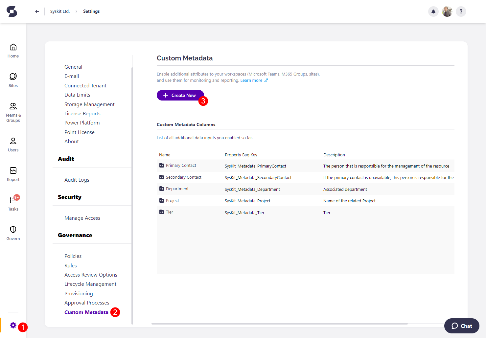
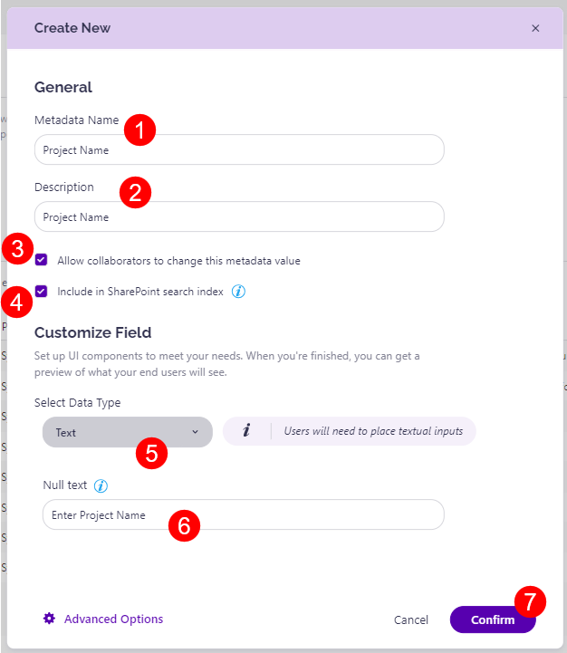
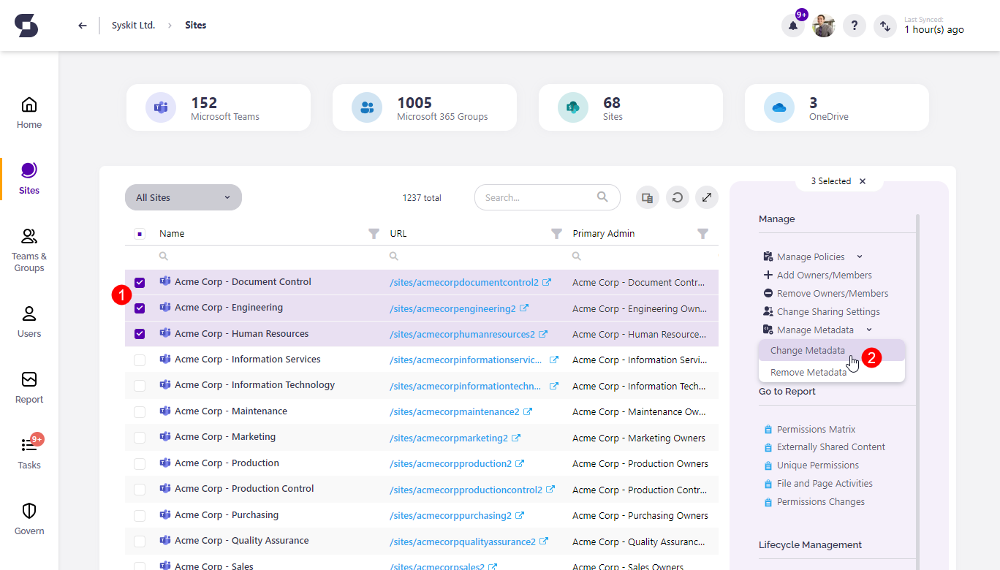
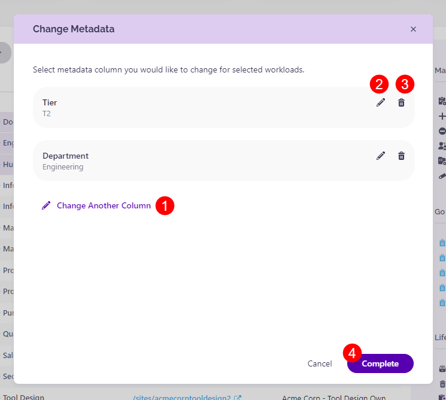
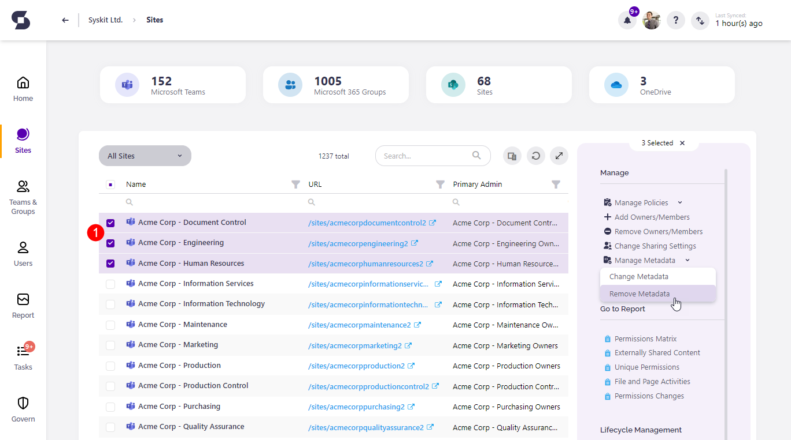
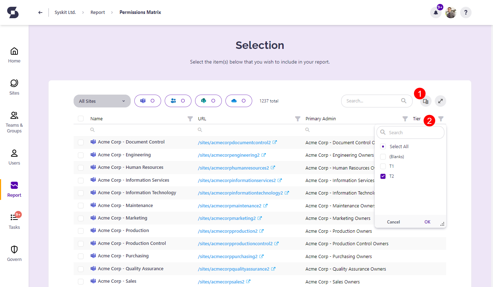
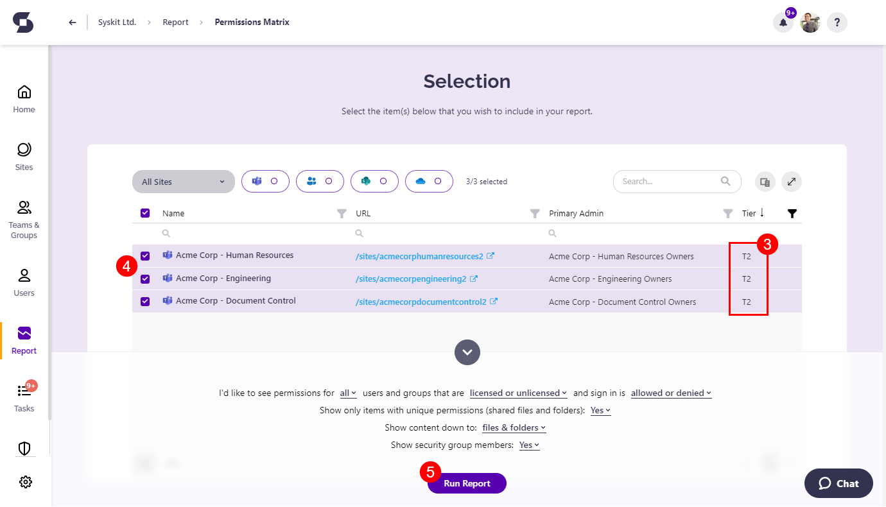

# Custom Metadata

:::info
**Managing Custom Metadata** is available in the Governance plan and higher tiers. See the [pricing page](https://www.syskit.com/products/point/pricing/) for more details.
:::

In the context of Microsoft 365, the metadata in Syskit Point provides detailed information on **Microsoft Teams, Microsoft 365 Groups, Sites, and OneDrive**.

**Essential metadata** is natively available in  Microsoft 365 and collected by Syskit Point during the sync process. 

Here are some examples of such metadata:

 * **The Microsoft Teams Owner**
 * **The date of creation for a site**
 * **The storage used by a site**
 * **And other useful information**

With Syskit Point's custom metadata feature, you can:

* **Leverage custom metadata** to expand on the existing information and better describe Microsoft Teams, Microsoft 365 Groups, Sites, and OneDrive concerning your business processes and policies.

* **Organize and find workspaces**, and **generate reports** based on custom metadata.

* **Provision new workspaces** from templates that define the custom metadata to be specified. 

## Create Custom Metadata
This section will explain how to set up custom metadata in Syskit Point. 

To start, take the following steps:
* In the main menu, click **Settings (1)**
* Select the **Custom Metadata (2)** option in the Governance category
   * This screen provides insight into what **custom metadata has already been set up**, along with the option to create new custom metadata.  
* Click the **Create New (3)** button to create new custom metadata.

Once the create new metadata dialog opens, fill in the following information.
* **Metadata Name (1)**; the name of the metadata.
* **Description (2)**; the description of the metadata for end users.
* **Enable collaborators to change the created metadata (3)** by checking the Allow collaborators to change this metadata value option.
  * By default, this option is disabled.
  * When enabled, owners can modify metadata on their workspaces.
* **Include this metadata in the SharePoint search index (4)**.
  * **Selecting this checkbox** ensures that the custom metadata you've defined is included in SharePoint Online Search, which means that SharePoint sites can be searched using the custom metadata you've specified.
* Select the **data type (5)** of the new metadata under the Customize Field.
  * In the dropdown menu, there are several data types to choose from
    * **Text**
    * **People**
    * **Date**
    * **Dropdown**
    * **Yes/No**
    * **Number**
* Use the **null text (6)** area to add a short hint describing the input field for end users.
* When satisfied, click **Confirm (7)** to save the metadata definiton.

 :::info
**Hint!** To connect to metadata from your environment, click the Advanced Options action and insert the property bag key in the designated space.
:::

## Change Custom Metadata

After setting up custom metadata, the information can be changed directly from a specific workspace.

To change the custom metadata that has been set up on workspaces, select Sites or Microsoft Teams & Groups from the Home page.

* On the Sites overview screen, **select one or multiple workspaces (1)** to edit their metadata.
* Click **Manage Metadata > Change Metadata (2)** option available on the right side of the screen.

 

On the Change Metadata dialog:
* **Specify custom metadata (1)** by clicking the Change Another Column action
  * After defining a value for a custom metadata, click Save
* **Edit (2)** or **Remove (3)** custom metadata you want to change
* **Click Complete (4)** when finished
  * This will start the process of changing the custom metadata, and once completed, the information input will be displayed under the selected workspaces.

## Remove Custom Metadata

To remove custom metadata:
* On the Sites overview screen, **select one or multiple workspaces (1)** to remove the custom metadata.
* Click **Manage Metadata > Remobve Metadata (2)** option available on the right side of the screen.

 

Remove Metadata dialog opens; **select the metadata you want to remove**, and **click Remove**.

## Filter Workspaces by Metadata

When generating a report, you can filter out workspaces with desired custom metadata values:

* Go to Reports and select a report to generate.
* On the Selection step, use the **Column Chooser (1)** to select custom metadata, thus making the custom metadata column and values visible on the Selection step.
* Once the custom metadata column is added, use the **filter dropdown menu (2)** in the custom metadata column to filter and show workspaces with selected metadata values. 

 
**Workspaces with selected custom metadata values (3) are displayed**.
* **Select (4)** one or more of the filtered workspaces to include in the report.
* Click **Run Report (5)** to generate the report for selected workspaces. 

This can be applied to any reports from the Report section that include **Sites, Microsoft Teams & Groups, and OneDrive**.