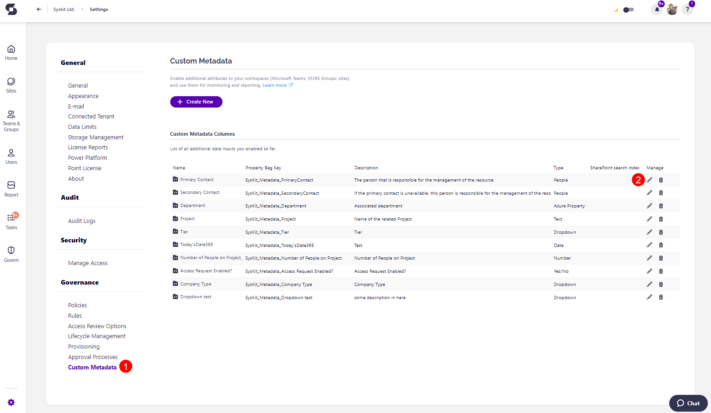
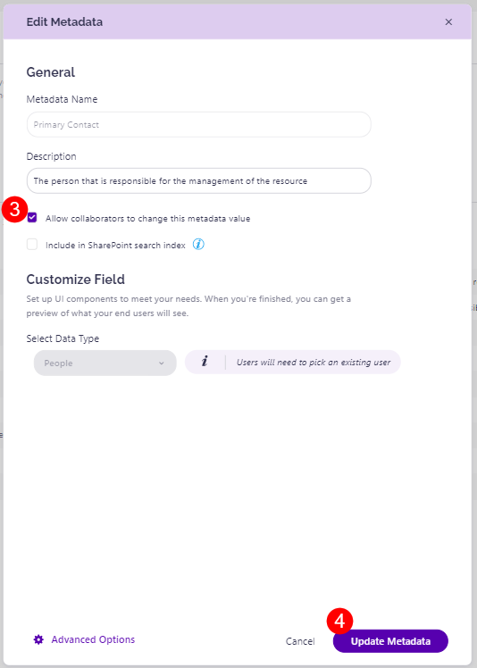
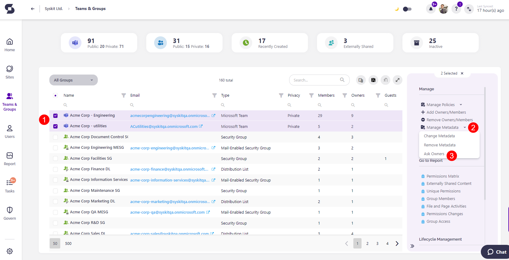
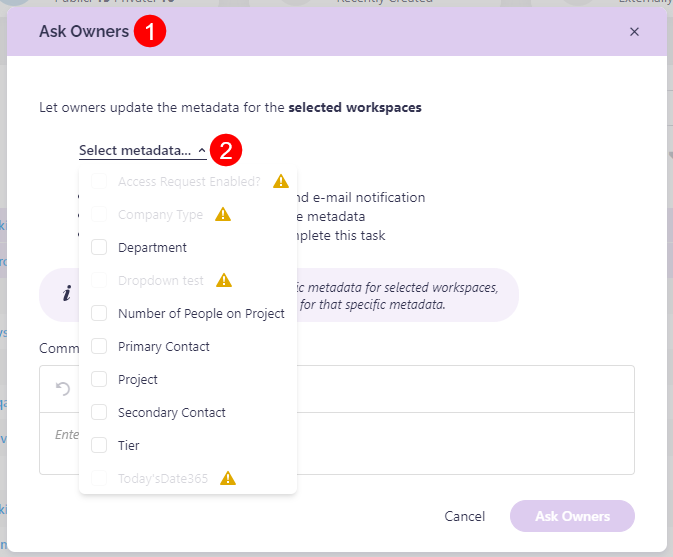
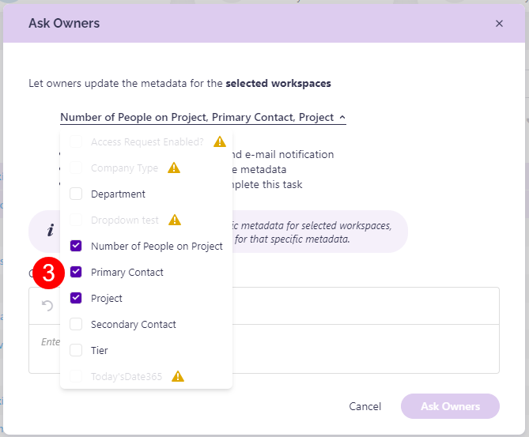
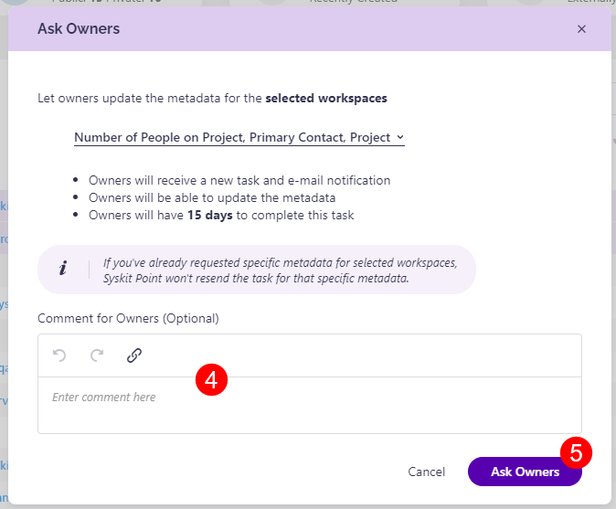

# Request Metadata Review 

Metadata, explained in simple terms as data that describes other data, is often the easiest way to structure, categorize, and manage your organization's content. 

In the context of Microsoft 365 and Syskit Point, metadata helps classify, search, and retrieve workspaces more efficiently, making it a great management tool. However, outdated, incorrect, or missing metadata can also lead to misfiled information and inefficient sorting and make it difficult to manage your environment successfully. 

That’s why it’s important for collaborators to review and update metadata regularly. Regularly performing Metadata Reviews ensures that your workspace metadata is accurate and relevant, ultimately improving productivity and governance.

With the Metadata Review feature, you can select metadata you want collaborators to review and update. 

:::warning

**Please note:** To be able to request a review from workspace owners in Syskit Point, **ensure the following**:
* The Collaborator role is enabled. 
    * For more details, read the [Assign and Manage Access to Syskit Point article](../../configuration/enable-role-based-access.md#syskit-point-collaborators).
* Metadata is be editable by collaborators. 
    * Continue reading this article and discover how to allow collaborators to manage custom metadata.

:::

## Enable Collaborators to Manage Metadata

:::warning
* This section explains how to enable the metadata you want reviewed by workspace owners. **If your metadata is already enabled for review, you can skip this section.**

* If the Collaborator role is not enabled in your environment, take a look at the [Assign and Manage Access to Syskit Point article](../../configuration/enable-role-based-access.md#syskit-point-collaborators). Collaborators must be allowed to enable and request a metadata review.  

:::

To select the metadata you want collaborators to manage, go to Syskit Point settings and complete the following:

* In the Governance section, click the **Custom Metadata (1)** option. 
* Click the **Edit button (2)** for the metadata you want to edit
    * This opens the Edit Metadata screen
* **Click the Allow collaborators to change this metadata value checkbox (3)**
* **Click the Update Metadata button (4)** to finalize your selection 

Once your preferences have been saved, you can request Metadata Reviews from collaborators.

## Request Metadata Review

Once you've [defined which metadata can be managed by collaborators through Syskit Point](#enable-collaborators-to-manage-metadata), you can request a review by going to the **Sites Overview or Teams & Groups Overview**. 

:::warning
**Please note:** Metadata that was not approved for owner review cannot be requested.
:::

In this article, we are using the **Teams & Groups Overview** screen. To request a review, complete the following:

* **Select one or more workspaces (1)** where you want the metadata review to be performed
* On the right side of the screen, **click the arrow next to the Manage Metadata action (2)** and **select the Ask Owners (3)** option

The **Ask Owners (1)** pop-up appears, where you can:

* **Click the Select metadata (2)** action, and a dropdown list of all metadata in your environment opens
* **Select the metadata (3)** you want the review performed for
 * If the metadata is a faded gray color and cannot be selected, the administrator did not enable metadata management for collaborators on that specific metadata, or a review for that metadata is already in progress.
* Once you've selected the metadata, you can **leave a comment (4)** for the owners 
* **Click the Ask Owners (5)** button to finalize the selection and send the task to the workspace owners

:::info
**Please note:** If you've already requested a review for **specific metadata for selected workspaces**, you cannot select that metadata **until the pending review** for that metadata **is completed**.
:::

After that, a pop-up confirms that the task has been sent and lets you know that you can **check the newly created tasks by going to the Governance screen, selecting Metadata Review, and clicking Requested Reviews**. 

:::info

**After a metadata review is requested:**
* Owners will receive a new task and e-mail notification.
* Owners will be able to update the metadata.
* Owners will have **15 days** to complete this task.

**After a Metadata Review is completed or if it is overdue**, administrators receive an e-mail informing them of that 1 day after completion.

:::

## Relevant Articles 

* [Monitor Metadata Review](monitor-metadata-review.md)
* [Resolve Metadata Review Tasks](../../point-collaborators/resolve-governance-tasks/metadata-review.md)
* [Manage Custom Metadata](manage-custom-metadata.md)