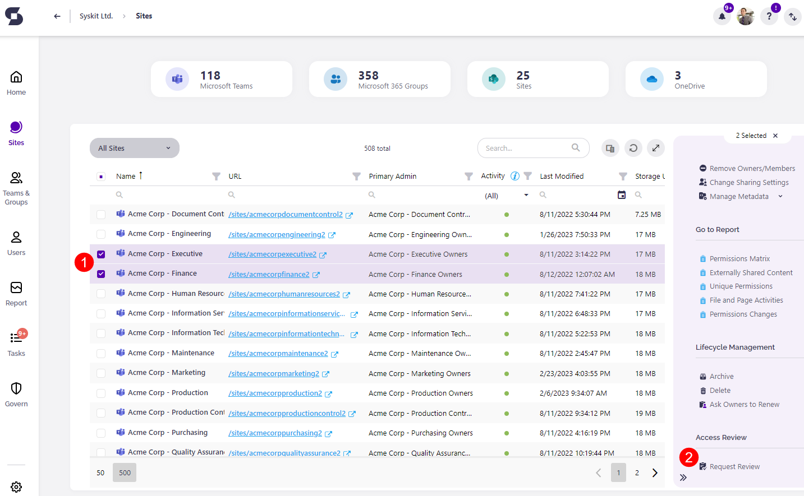
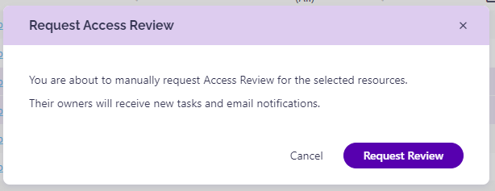
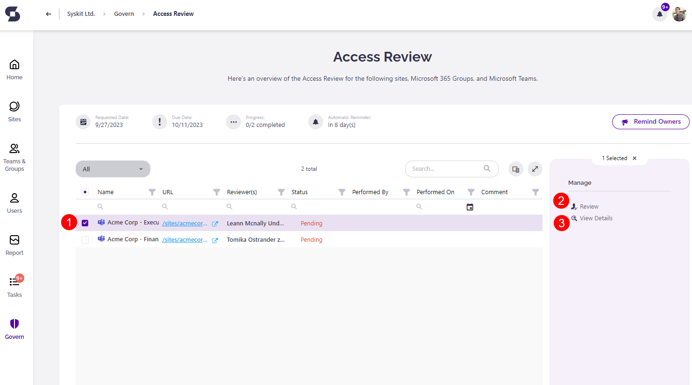
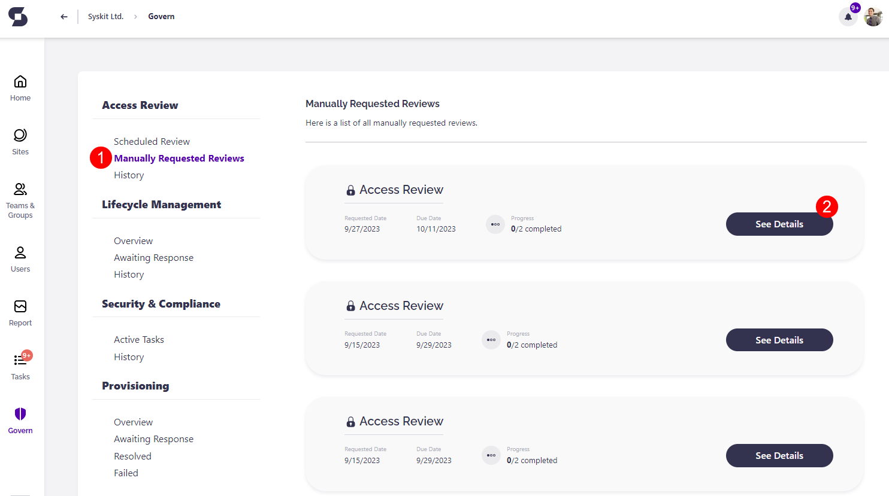
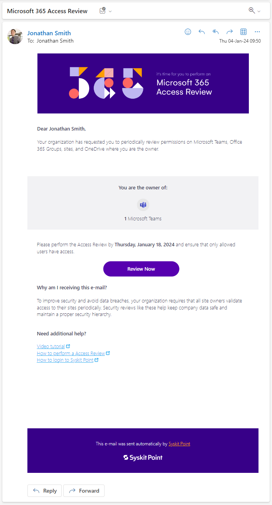
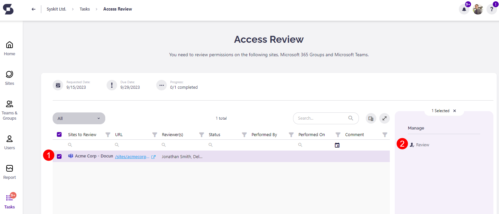
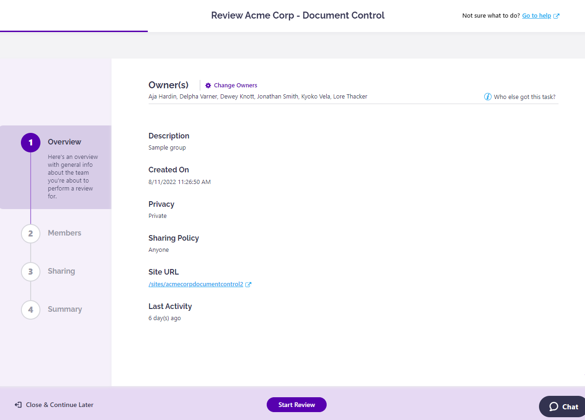
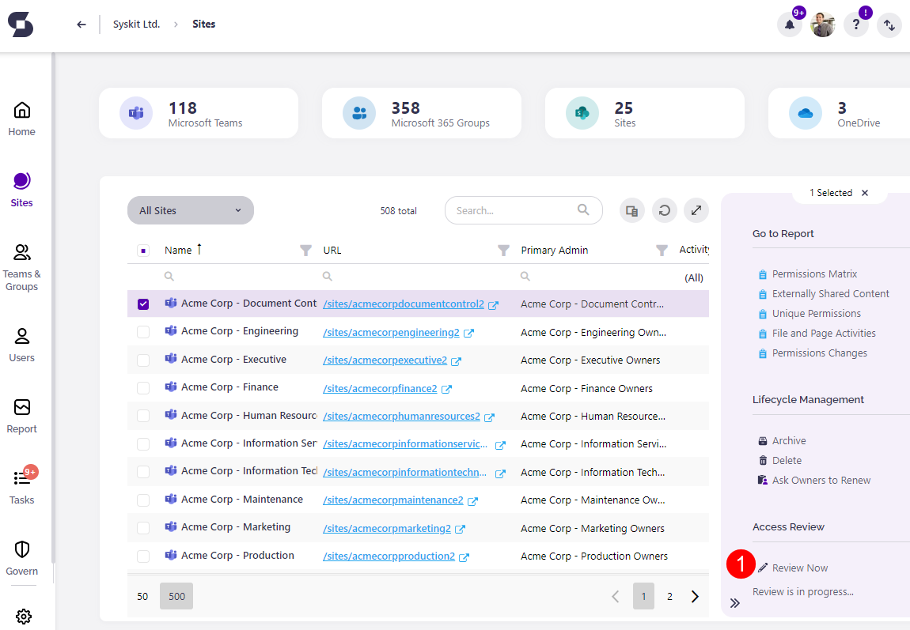

# Manually Request Access Review in Syskit Point

:::warning

**Automated Access Review is evolving into [Workspace Review](../workspace-review/setup-workspace-review.md)**, a more powerful solution that covers not only access but also ownership, privacy, sensitivity, and overall workspace security. 

**⚠️ Note: Access Review will be retired in January 2027**. For a richer governance experience, we recommend completing your current reviews and then moving to Workspace Review. 

Learn more in the [Workspace Review documentation](../workspace-review/).
:::

**Access review**, in the context of the Microsoft 365 environment, is an activity where a person responsible for a Microsoft 365 workspace - be it a Communication site, Microsoft Team, Microsoft 365 Group, or OneDrive - checks whether permissions given to users inside \(internal\) and outside \(external\) of company, comply with the organizational rules and guidelines.

While the **Automated Access Review** was introduced in Syskit Point 14, Syskit Point 15 brings the **Manually Requested Access Review** to the table.

:::tip
Use **Manual Access Review** in situations **when you need a fast response on an urgent issue**, such as sudden offboarding of a user, or unauthorized external sharing, where you want a workspace to be checked as soon as possible.  
You can also **use the Manual Access Review to test and prepare** your users for the **Automated Access Review**.
:::

:::info
**Learn more!**  
To find more about the Automated Access Review, visit the [following article](enable-permissions-review.md).
:::

## Request Review

To manually create an Access Review, use the **Request Review action**, **available for Syskit Point Admin users** on the following screens:

* **Sites overview**
* **Microsoft Teams & Groups overview**
* **Site or Group details**

:::warning
**Please note!**  
You must be signed in to Syskit Point with a Syskit Point Admin account to see the Request Review action.
:::

To manually request an Access Review, do the following:

* **Open the Sites Overview screen**
* **Select the desired workspace \(1\)**; you can also select multiple workspaces at once
* **Click the Request Review Action \(2\)** available in the side panel

Request Access Review dialog will appear.

After confirming the request, you will be redirected to the Access Review overview screen, where you can:

* **Select a site, Microsoft 365 Group, or Microsoft Team \(1\)**; you can also select multiple workspaces at once
* **Review the workspace \(2\)** - only available for owners and administrators when a single workspace is selected
* **View the Access Review Details \(3\)** 

To see all Manually Requested Reviews, follow these steps:

* **Click the Governance tile** located on the left side of the screen; the Governance screen opens
* **Click the Manually Requested Reviews category \(1\)**
* **Click the See Details button \(2\)** to open the Access Review report 

The Access Review report for manually requested reviews offers the same capabilities as for the automated Access Review. You can find more information on how to [monitor the progress of the created Access Reviews here](monitor-permissions-review.md).

## Workspace Owners

After the manual Access Review request is sent, **the workspace owners will receive an Access Review request e-mail** in their mailbox.

The link in the email leads you directly to the Access Review task in Syskit Point. Here, you can:

* **select a workspace \(1\)**
* **perform the Access Review \(2\)**

The **Access Review wizard** opens, where you can **perform actions**, **check permission changes**, and, in the end, **complete the Access Review** for a workspace. Actions and reports available here are the **same as in the Automated Access Review** tasks. You can find them all described in greater detail [here](../../point-collaborators/resolve-governance-tasks/access-review.mdx#access-review-wizard).

If a workspace has an Access Review active, you can access the Access Review details screen from the overview screen by clicking the **Review Now \(1\)** action link, visible when the workspace is selected.

