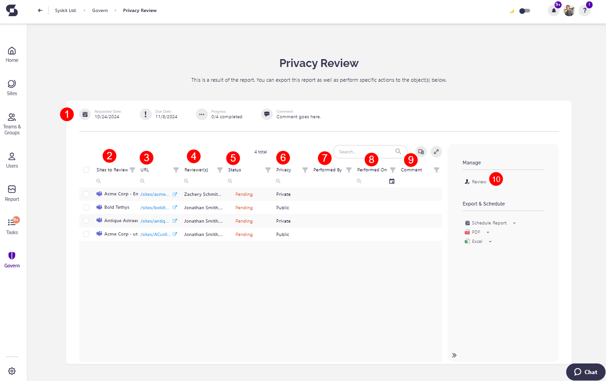

# Monitor Privacy Review

**You can find active and completed Privacy Reviews on the Govern screen** in Syskit Point.

The **Requested Reviews** screen shows all the currently requested Privacy Review tasks. 
Open the Privacy Review by clicking the **View Details** button.
Here you can find:
* **Basic Privacy Review information (1)**
    * Date when the Privacy Review was requested
    * Due date
    * Progress - number of workspaces where the review was completed next to the total number of workspaces included in the review
    * Any comment that was left when requesting the review
* **All workspaces included in the review (2)**
* **The URL for the workspace (3)**
* **Reviewers for each workspace (4)**
* **Status of the review for each workspace (5)** 
* **Privacy state of the workspace (6)** 
* **Who performed the review (7)** if completed
* **When the review was completed (8)**
* **Comment provided by the reviewer (9)**
* **Review action (10)**
    * Click this action to perform the Sensitivity Review
    * For more information about the reviewer experience, read the [Privacy Review article](../../point-collaborators/resolve-governance-tasks/privacy-review.md)

**Clicking the name of a workspace where the review is already completed opens the Summary screen that lists all changes done by the reviewer during the Privacy Review.**
* The Summary screen can also be accessed by selecting a workspace and clicking the View Details action in the side panel.

Navigating to the **Govern > Privacy Review > History** screen and clicking **View Details** for a Privacy Review shows past **Privacy Review tasks**. 

Here, you can find the list of performed changes, as described for the active Privacy Review tasks.

## Relevant Articles 

* [Request Privacy Review](request-privacy-review.md)
* [Complete Privacy Review Tasks](../../point-collaborators/resolve-governance-tasks/privacy-review.md)