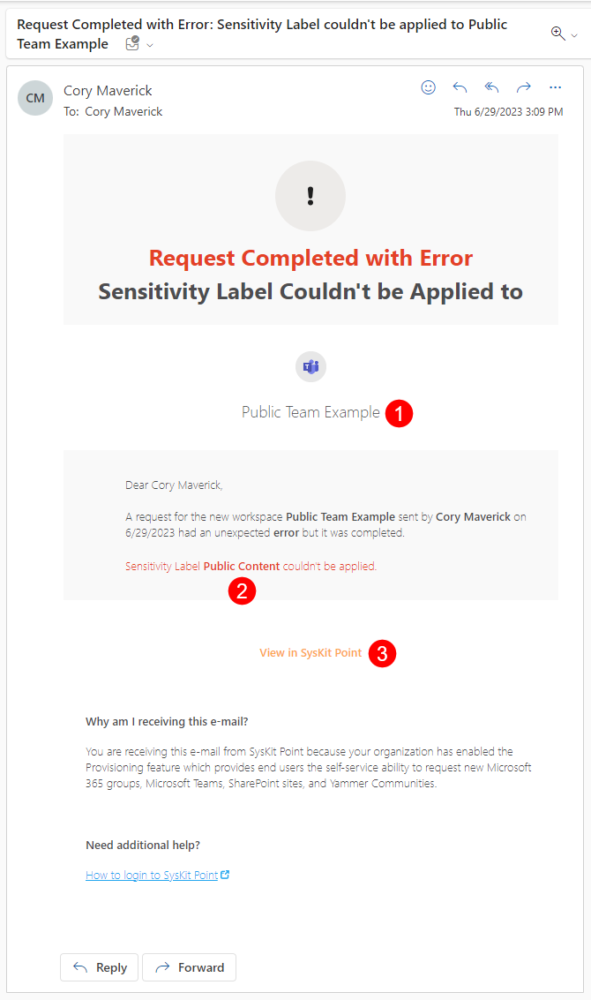

# Provisioning Failure Notifications

**Syskit Point admins** can define who gets an e-mail if Syskit Point fails in provisioning new workspaces.

Syskit Point sends e-mails in the following situations:
* **Provisioning of a new workspace fails**
* **Applying a sensitivity label to the newly created workspace fails**
* **Applying additional settings to the newly created workspace fails** - for example, setting an option to hide a Microsoft 365 Group from the Global Address List

Having someone responsible for resolving such instances when they occur is critical, as is notifying them of their occurrence. 
**Syskit Point provides an easy setup to ensure the right people get notified when issues arise**.

## Define E-mail Notification Recipients

To define who will get e-mail notifications:
* **Navigate to** Settings > Governance > Provisioning
* **Scroll to the end of the page** and find section **Provisioning Request Failure Notifications**
* **Choose e-mail recipients** - two options are available
    * **Syskit Point Admins** - enabled by default; all users with the role assigned will receive an e-mail
    * **Specific users** - select the checkbox and start typing the user's name to add specific users; click the user to add; continue typing to search and add a new user
* **Save** when finished

:::info
**If you want to turn off the provisioning failure notifications** deselect both available options in the described settings and save your changes.
:::

## Provisioning Failure E-mail

Below, find an example of the notification e-mail in case applying a sensitivity label failed. 
Recipients can expect to get an e-mail with the following information:
* **Workspace where the failure happened (1)**
* **Sensitivity label name that couldn't be applied (2)**
* **View in Syskit Point link (3)** that opens provisioning overview screen for SysKit Point admins

Based on the provided information, notification recipients can further troubleshoot the issue or resolve it by applying the sensitivity label manually on the affected workspace.

