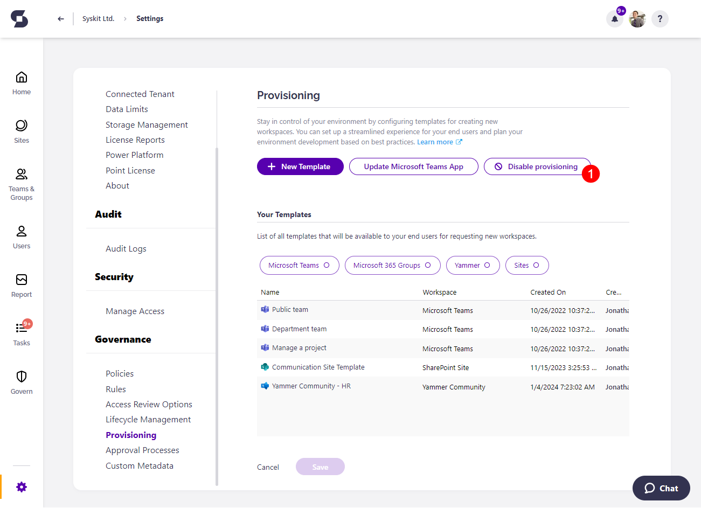
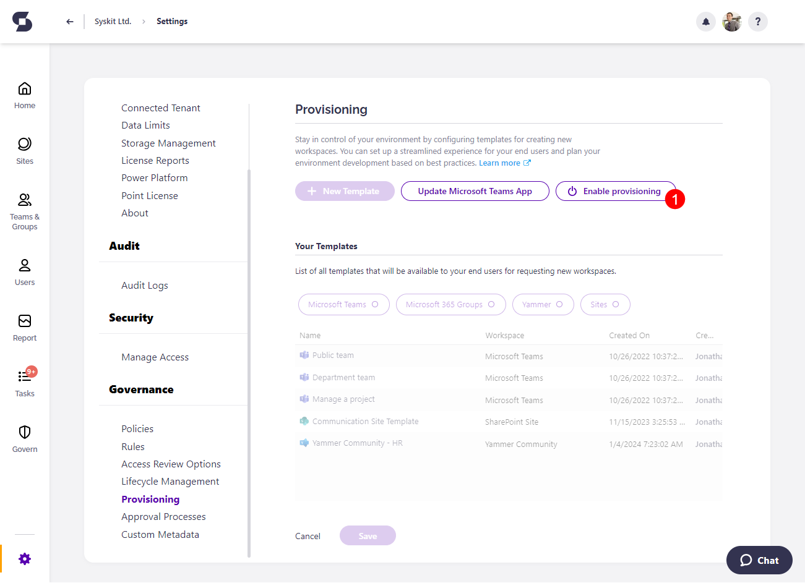

# Enable/Disable Provisioning 

When the Syskit Point Teams app is deployed, **Provisioning is marked as enabled by default**; however, there is an option to disable it. 

:::info
**If Provisioning is disabled**, the Request Workspace button will no longer be visible in the Syskit Point Teams app.
:::

## How to Enable or Disable the Feature

You can change the status of the Provisioning feature by going to **Settings and under Governance selecting Provisioning**.

This will open the Provisioning screen, and on the right side, under the title, you will see the button to **Disable or Enable provisioning**. 

As the feature should be enabled by default, if you, as the admin, want to use Access Requests only, you can disable provisioning by clicking the **Disable provisioning (1)** button.

  * Clicking Disable provisioning will open a pop-up that will ask you to confirm your decision by **clicking Disable**.
  * Clicking Disable **will not erase any previously created provisioning templates**.
  * If there are any pending Workspace requests, you **will still have the ability to complete them** after clicking Disable.
  * Once Provisioning is disabled, the **Request Workspace button will not be visible** in the Syskit Point Teams app. 

Once disabled, you can still enable provisioning at any point by clicking the **Enable provisioning (1)** button.

  * Clicking Enable provisioning will open a pop-up that will ask you to confirm your decision by **clicking Enable**.
  * Clicking Enable **will allow your end-users to request new workspaces**.
  * Once Provisioning is enabled, the **Request Workspace button will be visible** in the Syskit Point Teams app. 
