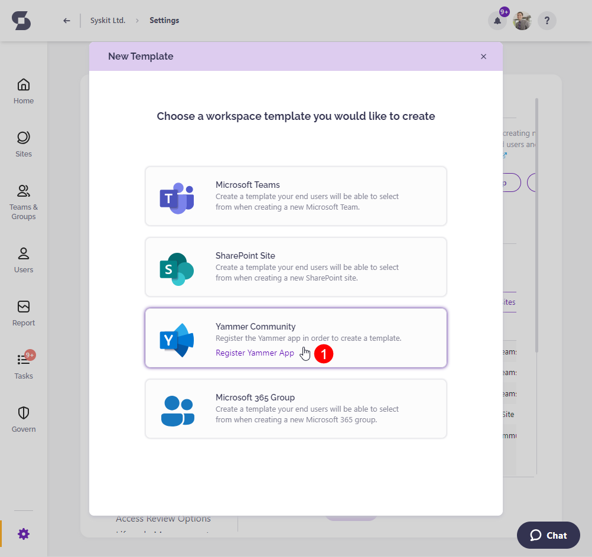
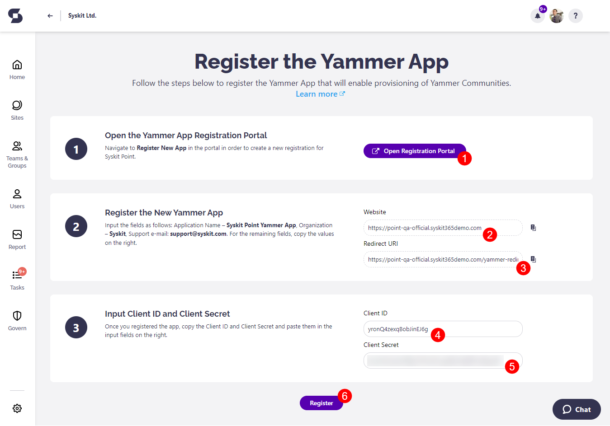
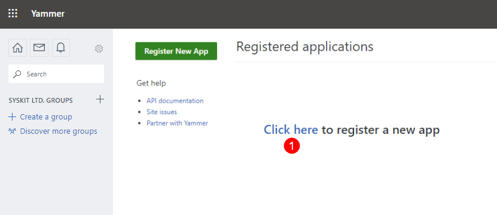
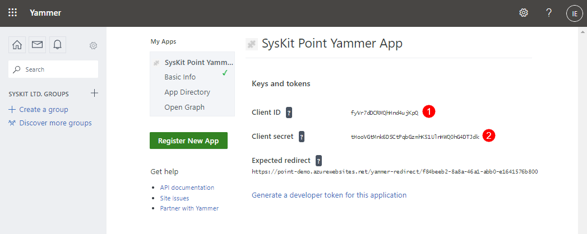

# Register Viva Engage App

To be able **to create Viva Engage community templates**, you need to **register a new Viva Engage app in the Viva Engage portal and Syskit Point**. 

Start by **navigating to Settings** > **Provisioning**, and click the **New Template** button.
The following screen opens:

**Click the Viva Engage Community tile (1)** to continue.

The Viva Engage app registration screen opens, guiding you further through the app registration.

## Register the Viva Engage App in Syskit Point

The Viva Engage app registration screen in Syskit Point enables you to:
* **Open the Viva Engage app registration portal (1)**, where you will be able to **register a new Viva Engage app**
* **Copy the Website (2) and Redirect URI (3) data required in the Viva Engage portal when registering a new Viva Engage app**
* **Input the Client ID (4) and Secret (5) data, which you can access in the Viva Engage portal after the new Viva Engage app registration is created**
* **Register the Viva Engage app (6)** in Syskit Point after entering the required data 

Next, **open the Viva Engage portal** by clicking the **Open the Viva Engage app registration portal button (1)**

## Register a New App in the Viva Engage Portal

A **new browser tab opens, showing the Registered applications screen in the Viva Engage portal**. 
* **Click the link (1) to continue**

A registration dialog opens, where you need to:
* **Enter the application name (1)** - enter `Syskit Point Viva Engage App`
* **Enter organization (2)** - enter `Syskit`
* **Enter support e-mail (3)** - enter `support@syskit.com`
* **Enter website (4)** - **copy and paste the value provided on the Syskit Point app registration screen** described in the previous section
* **Enter Redirect URI (5)** - **copy and paste the value provided on the Syskit Point app registration screen** described in the previous section
* **Check the agreement checkbox (6)**
* **Click Continue (7)** when finished

Once finished, a new screen loads, showing the following **information about the registered Viva Engage app**:
* **Client ID (1)**
* **Client Secret (2)**

**Copy and paste the information provided here to the Viva Engage app registration screen in Syskit Point**, as described in the previous section.

## Next Steps

After you register the Viva Engage app in Syskit Point, you will be redirected to the Viva Engage template creation dialog.
Here, you can **set up your first Viva Engage template** that will be available in the Syskit Point Teams app.

To learn more about templates and available options while setting them up, open the [following article](templates.md).

