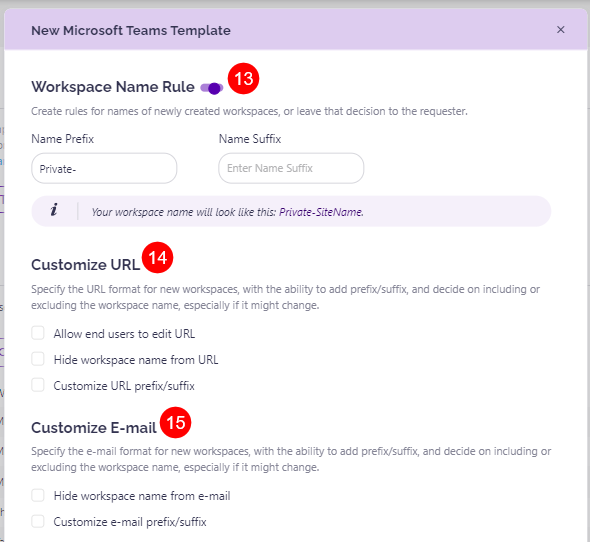
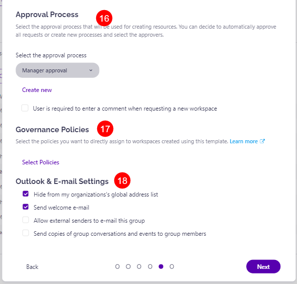

# Templates

To start with the configuration, open the **Settings > Governance > Provisioning (1)** screen.

**Your Templates** list shows you which workspace templates will be available and visible for your end-users to request in the Syskit Point Teams app.

By default, Syskit Point provides **three templates (2)**.

1. **Manage a project**
2. **Department team**
3. **Public team**

Available actions for these templates are listed under the **Manage (3)** column and allow you to:

* **Edit (4)**
  * Use it to review and modify how the default template is configured - Syskit Point allows you to change any setting available to fit your needs.
* **Delete (5)**
  * If you do not wish to use these default templates or make them available for your end-users, make sure to delete them from this list.

You can create custom templates by clicking the **New Template (6)** button.

## Create a New Provisioning Template

To create your custom template, click the **New Template** button.

First, choose the type of workspace for which you want to create the template.

Templates can be created for the following workspaces:

* **Microsoft Teams**
* **SharePoint Site**
* **Viva Engage Community**
* **Microsoft 365 Group**

:::warning
**Please note!**\
When creating a provisioning template in Syskit Point, if you want to use existing Microsoft Teams templates or site templates, set your browser language to English (USA). That way, the correct format of calls directed from Syskit Point to Microsoft endpoints is ensured, which uses Locale set to "en-US" (LocaleID equals 1033).
:::

### Microsoft Teams Template

When creating a template for Microsoft Teams, you will need to define the following:

* **Name (1)** – A name you provide here will be used as a template name that is visible to your users
* **Description (2)** – Describe in short when to use this template; end-users will see it when requesting a new workspace using a list of templates
* **Content & Structure (3)** - choose an existing workspace or from scratch with a blank template
  * [For more details on this section, take a look at the Content & Structure article](content-and-structure.md)

To review currently available templates in your M365 tenant and use them in Syskit Point:

1. Navigate to the Microsoft Teams [admin center](https://admin.teams.microsoft.com/)
2. Under the tab Teams, select **Team templates**
3. Click the name of the template to review the apps and channels they include
4. Copy the Template ID and paste it into the Syskit wizard

To create a brand-new Teams template in the admin center, follow the [Microsoft guide](https://docs.microsoft.com/en-us/microsoftteams/create-a-team-template).

* **Privacy (4)** – set if workspaces created using this template will be public or private. You can leave this decision to your end-users as well.

* **Owners (5)** – allows multiple options:
  * Predefine owners that are always added to this type of workspace
  * Allow end-users to specify additional ones in addition to predefined users
  * Leave this option altogether to the end-user who is requesting a new workspace
* **Members (6)** – allows multiple options:
  * Predefine members that are always added to this type of workspace
  * Allow end-users to specify additional ones in addition to predefined users
  * Leave this option completely to the end user who is requesting a new workspace

* **Sharing Settings (7)** - choose from available options:
  * Anyone
  * New and existing guests
  * Existing guests only
  * Only people in your organization

Please note that available options depend on defined tenant-level external sharing policies. For example, if sharing files and folders using links that don't require sign-in is not allowed, the Anyone option will not be enabled.

* **Sharing Permission (8)** - helps control the way things on the site can be shared. Choose between:
  * Site owners and members can share files, folders, and the site. People with edit permission can share files and folders.
  * Site owners, members, and people with edit permission can share files and folders, but only owners can share the site.
  * Only site owners can share files, folders, and the site.

* **Allow Access Requests (9)** - decides who receives access requests for all workspaces created from the template. The options are:
  * Owners
  * Specific user(s)
    * If a specific user(s) is selected, the name of at least one specific user needs to be entered in the provided space.
* **Sensitivity Label (10)** - choose from available sensitivity labels available in your tenant to define which are applied on all workspaces created from the template.
  * To use sensitivity labels in Syskit Point, make sure to set up your environment as described in the [following article](enable-sensitivity-labels.md).
* **Terms & Conditions (11)** - define the terms & conditions text displayed to end-users when they request a new workspace.
* **Custom Metadata (12)** - custom metadata provides expanded information collected and included in reports. Set up which fields users will need to input or select for the custom metadata when using the template.
  * If no custom metadata was created, it can be set up directly in the form by selecting **Create New Custom Field**.
  * For more information on managing and creating custom metadata, take a look at [this article](../metadata/manage-custom-metadata.md).

* **Workspace Name Rule (13)** – predefined suffix or prefix that will be added to the name of a workspace created using this template.
  * For example, setting the prefix to **Marketing** results that each workspace created from this template will be named in a form **Marketing – (Request Name)**
  * **Select the checkbox Apply naming rule to workspace URL and e-mail** to have **all workspaces created from this template have the same URL based on the Name Prefix and Name Suffix** you entered into the form
* **Customize URL (14)** - here, you can select how the URL of the workspace will look like when the workspace is created
  * Allow end users to edit URL
    * Selecting this lets workspace owners and end users edit the URL based on their preference
  * Hide workspace name from URL
    * Selecting this hides the workspace name from the URL, which means when the workspace is created, instead of the workspace name, the URL contains a number identifier (6-10 randomly generated numbers)
  * Customize URL prefix/suffix
    * Selecting this gives the ability to change the URL prefix and suffix
  * [For more details on this, take a look at this article.](hide-workspace-name.md)
* **Customize E-mail (15)** - with this, you decide how the e-mail of the workspace will look like once the workspace is created
  * Hide workspace name from E-mail
    * Selecting this hides the workspace name from e-mail of the created workspace, which means that instead of the workspace name, the e-mail contains a number identifier (6-10 characters)
  * Customize e-mail prefix/suffix
    * Selecting this gives the ability to change the e-mail prefix and suffix
  * [For more details on this, take a look at this article.](hide-workspace-name.md)
* **Approval process (16)** – define who is responsible for approving the requests using this template.
  * All requests using this template will need to be approved by specified people before the workspace is created.
  * By default, you will see four types of approvals available:
    * Manager approval – The manager of the end-users requesting new workspace needs to approve this request
    * Admin approval – Syskit Point admins need to approve this request
    * Manager and admin approval – Requires approval from both the manager of the requester and Syskit Point admins
    * Automatically Approve – Templates using this option don’t require approval. The workspace will be created immediately when the end-user sends a request.

Additionally, you can enable comments for requesters when they request a new workspace in this section.

Read more about Approval processes and how to create custom ones in this [article](approval-processes.md).

* &#x20;**Governance policies (17)** – predefine a set of rules to be applied to the workspace automatically upon creation. Currently, available policies are:
  * Access reviews
  * Maximum number of owners
  * Minimum number of owners
  * Orphaned Workspaces

Read more about setting up these governance policies and customizing them to your needs [here](../automated-workflows/set-up-policies.md).

* **Outlook & Email Settings (18)** – define if the newly created workspace will:
  * Be **hidden** from your organization's global address list
  * Send a **welcome e-mail**
  * If a **service account is added to the template**, two additional options are available:
    * Allow external senders to e-mail this group
    * Send copies of group conversations and events to group members

* **Template availability (19)** – defines the group of users that are able to select the template when submitting requests for new workspaces.
  * Everyone - the template is available to all users in your organization
  * Specific - the template is available to users that meet specified conditions
    * If selected, the condition type needs to be selected from the dropdown menu.
* When everything has been finalized click **Create Template (20)**.

Once you complete this process, your new template will appear in the **Templates** list and will become visible for end-users in the **Syskit Point Teams app** when requesting a new workspace.

### SharePoint Site Template

When creating a SharePoint Site template, there are a couple of differences compared to the Microsoft Teams template.

* **Site Template** - you can choose the site template for the SharePoint Site workspace created from this template
* **Primary Site Collection Admin** – allows multiple options:
  * Predefine the primary site collection admin
  * Allow end-users to specify the primary site collection admin
* **Additional Site Collection Admins** – allows multiple options:
  * Predefine site collection admins that are always added to this type of workspace
  * Allow end-users to specify additional ones in addition to predefined admins
  * Leave this option altogether to the end-user who is requesting a new workspace
* **Site Members** – allows multiple options:
  * Predefine site members that are always added to this type of workspace
  * Allow end-users to specify additional members in addition to predefined members
  * Leave this option altogether to the end-user who is requesting a new workspace

:::info
**Please note**: SharePoint Site templates do not have a Customize E-mail option.
:::

### Viva Engage Community Template

When creating a Viva Engage Community template, there are a couple of differences compared to the Microsoft Teams template.

* **Community Admins** – allows multiple options:
  * Predefine community admins that are always added to this type of workspace
  * Allow end-users to specify additional ones in addition to predefined community admins
  * Leave this option altogether to the end-user who is requesting a new workspace
* **Community Members**
  * Predefine community members that are always added to this type of workspace
  * Allow end-users to specify additional community members in addition to predefined community members
  * Leave this option altogether to the end-user who is requesting a new workspace

:::info
**Please note:** Viva Engage templates do not have URL & E-mail customization options.
:::

### Microsoft 365 Group Template

Find all options available when creating a Microsoft 365 Group template described in the [Microsoft Teams Template section](templates.md#microsoft-teams-template).
