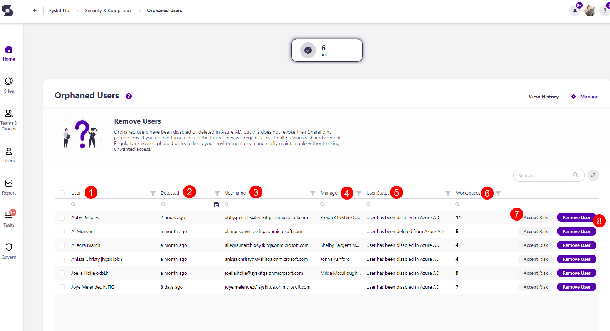

# Orphaned Users

Syskit Point detects users that have been disabled or deleted in Microsoft Entra ID but still have access to SharePoint content, which could lead to security risks in case they become active again. 

Orphaned users are **all the users that have been blocked or deleted from Microsoft Entra ID** and:
  * Have access to workspace content, or
  * Had access to workspace content and visited the SharePoint site containing that content but lost access in the meantime
  * [For more details on Orphaned Users in Syskit Point, take a look at the FAQ article.](../../faq/orphaned-users.md)

The Orphaned Users policy is **a tenant-wide policy, and it cannot have task delegation enabled**. That means that no tasks are created to resolve this policy vulnerability, and no emails are sent to collaborators.

The orphaned users **are still detected** and shown on the Security and Compliance dashboard. **This means that Syskit Point detects a vulnerability on a workspace** based on the applied policy, but it does not create tasks or send any emails to collaborators. 

The purpose of this is to assist Syskit Point admins by
bringing awareness of potential issues in their Microsoft 365 environment. 

On the Security & Compliance dashboard, click the **Orphaned Users** button to see the report.

The Orphaned Users screen opens, showing a list of all **users that have the sign-in blocked or are deleted from Microsoft Entra ID** without having their SharePoint permissions revoked.

The report itself provides information on:
  * **User (1)** name
  * **Detected (2)** - when the policy vulnerability was detected
  * **Username (3)** - the email of the blocked users
  * **Manager (4)** - the name of the person that manages this user
  * **User Status (5)** - status of the user (removed or disabled)
  * **Workspaces (6)** - the number of workspaces this user is a member of

You can complete the following actions for the policy vulnerability:
  * **Accept Risk (7)** - this means you will close the policy vulnerability without making any changes to the current state of the workspace
  * **Remove User (8)** - this will remove the user from the SharePoint site and connected groups, and resolve the policy vulnerability

By **selecting all (9)** or more than one user, you can perform the bulk action for **Remove User (10)** or **Accept Risk (11)**. 

**Clicking the Remove User** action opens the Remove User dialogue. 
  * To replace the user as Primary Admin, **select the checkbox (1)** that states *If the user is a Primary Admin replace them with*
    * If the selected user is a Primary Admin on chosen sites/OneDrive, Microsoft does not allow their removal. In order to remove them, they have to be replaced as Primary Admin with an active user
  * Once selected, a space is provided where you should **type the name or email of the user (2)** you want as the new Primary Admin
* **Type REMOVE (3)** in the space provided and **click Remove (4)** to finalize your decision. 

