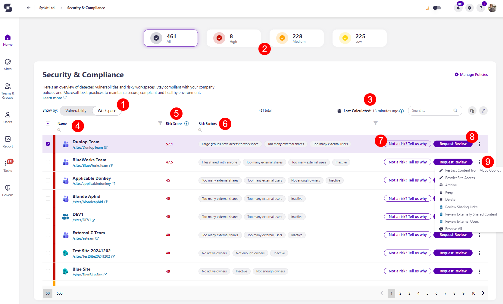

# Risky Workspaces

Syskit Point detects workspaces that were determined to be risky, based on various health factors of the workspace.

Risk is determined .... 

The Risky Workspaces view can be accessed on the Security & Compliance checks screen.  

You can locate the Risky Workspaces view for Security and Compliance checks by:

* **Clicking the number of Risky Workspaces** on the Security & Compliance Dashboard tile
* **Navigating to the Security and Compliance** screen and selecting **Show by: Workspace (1)**

Here, you can find:
* The **top filters (2)** can filter the report to show the following:
  * **All** risky workspaces
  * **High** risk workspaces
  * **Medium** risk workspaces
  * **Low** risk workspaces

The risky workspaces report provides information on:

* **Time (3)** when the workspace risk factor was last calculated
  * This is calculated automatically every few hours
* **Name (4)** of the workspace
* **Risk Score (5)** - shows a numerical score for the risk assessment, calculated based on various health factors
* **Risk Severity (6)** - shows the level of severity for the risky workspace 
* **Risk Factors (7)** - shows all of the potential vulnerabilities that were detected on the risky workspace
* **Clicking the ellipsis (8)** in the right corner of each workspace provides options for reports that can be generated to highlight the vulnerabilities for that workspace

