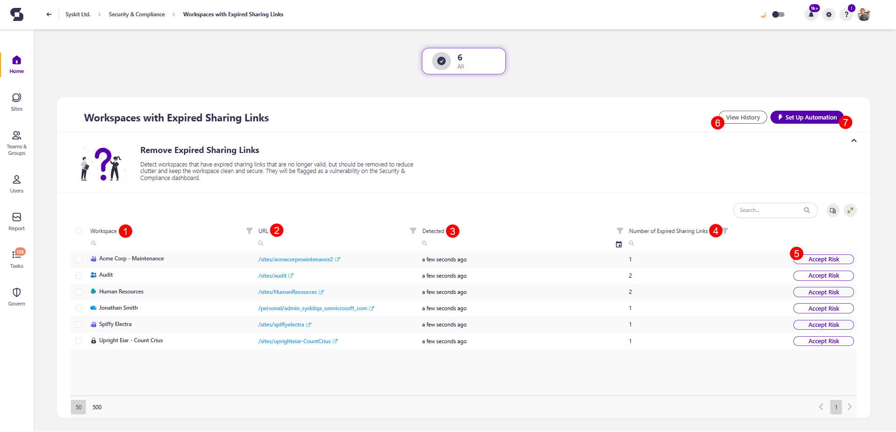

# Workspaces with Expired Sharing Links

Syskit Point detects expired sharing links in workspaces, which should be deleted to reduce clutter and increase security.

Expired sharing links don't provide access anyway; therefore, deleting them poses a low-impact action, but still contributes to improved security posture of your tenant.

## Workspaces with Expired Sharing Links Policy

The Workspaces with Expired Sharing Links is **a tenant-wide policy, and it cannot have task delegation enabled**. That means that no tasks are created to resolve this policy vulnerability, and no emails are sent to collaborators.

The Workspaces with Expired Sharing Links policy vulnerability **is still detected** and shown on the Security and Compliance dashboard. **This means that Syskit Point detects the vulnerability in a workspace** based on the policy, but it does not create tasks or send any emails to collaborators. 

There are 2 options on how to resolve the detected vulnerability:
* **Manually** - admins remove expired sharing links manually.
* **Automatically** - Syskit Point automatically removes expired sharing links from workspaces.

[Use this link to find more information on the Workspaces with Expired Sharing Links Policy.](../automated-workflows/workspaces-with-expired-sharing-links-admin.md)

## Workspaces with Expired Sharing Links Report

Here, you can find more details about the detected vulnerability.

On the Security & Compliance dashboard, click the **Workspaces with Expired Sharing Links** vulnerability to open the report.

The Workspaces with Expired Sharing Links screen opens, showing a list of all **workspaces with expired sharing links**.

The report itself provides information on:
  * **Workspace (1)** name
  * **URL (2)** of the workspace with expired sharing links
  * **Detected (3)** - shows when the vulnerability was detected.
  * **Number of Expired Sharing Links (4)** for each workspace 

Here, you can also run the **Accept Risk (5)** action for a selected period.
The Remove Sharing Link action will be added in the upcoming release to additionally simplify manual vulnerability resolution.

You can also:
* **View History (6)** of all resolved vulnerabilities.
  * For each workspace, you can see details about the performed expired sharing links removal actions and the policy vulnerability resolution.
* **Set Up Automation (7)** for the Workspaces with Expired Sharing Links policy.
  * Click the button to open the Workspaces with Expired Sharing Links policy settings and select from one of the available automation options.
  * **Syskit Point can automatically remove expired sharing links and resolve the vulnerability**, which is the recommended option here.

:::info
* **It can take up to 24 hours for the vulnerabilities to appear on the Security & Compliance dashboard and for the expired sharing links to be deleted if the automatic resolving option is selected.**
:::

