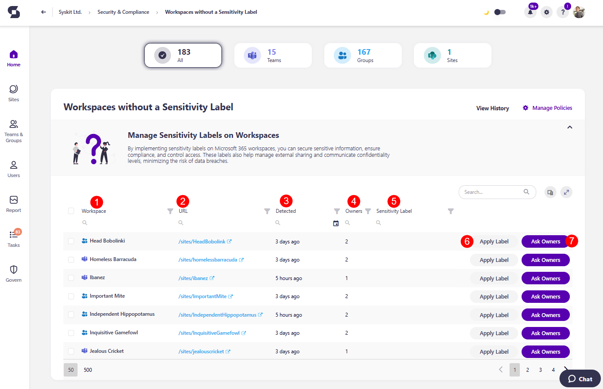
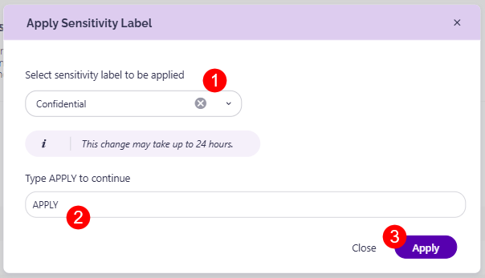
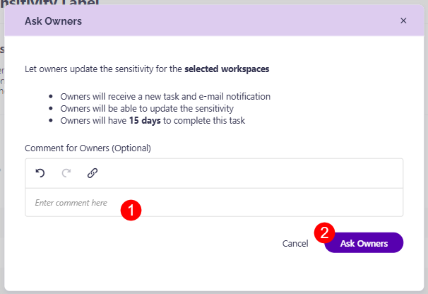

# Workspaces Without a Sensitivity Label

Syskit Point detects workspaces without a sensitivity label assigned, which could lead to security risks in case classified information isn't properly hidden behind the appropriate sensitivity label. 

The Workspaces Without a Sensitivity Label policy **cannot have task delegation enabled**. That means that no tasks are created to resolve this policy vulnerability, and no e-mails are sent to collaborators.

The workspaces without a sensitivity label **are still detected** and shown on the Security and Compliance dashboard. **This means that Syskit Point detects a vulnerability on a workspace** based on the applied policy, but it does not create tasks or send any e-mails to collaborators. 

The purpose of this is to assist Syskit Point admins by
bringing awareness of potential issues in their Microsoft 365 environment. 

On the Security & Compliance dashboard, click the **Workspaces Without a Sensitivity Label** button to see the report.

The Workspaces with Shadow Users screen opens, showing a list of all **workspaces that do not have a sensitivity label assigned to them**.

The report itself provides information on:
* **Workspace (1)** - name of the workspace
* **URL (2)** - the URL for the workspace
* **Detected (3)** - when the policy vulnerability was detected
* **Owners (4)** - the number of owners the workspace has
* **Sensitivity Label (5)** - shows which, if any, sensitivity label is applied

You can complete the following actions for the policy vulnerability:
* **Apply Label (6)** - this lets you apply a sensitivity label to the workspace directly and immediately resolve the vulnerability
* **Ask Owners (7)** - this asks workspace owners to review the sensitivity level of their workspace and assign the appropriate label 

Clicking the **Apply Label** button opens the Apply Sensitivity Label confirmation module, where you can:

* **Select the sensitivity label (1)** that should be applied to this workspace
* **Type APPLY (2)** in the space available
* **Click the Apply button (3)** to finalize your decision and assign the selected sensitivity label to the workspace

To ask the workspace owners to assign the sensitivity label to this workspace, click the **Ask Owners button**.

This opens the Ask Owners confirmation module that states that: 
* Owners will receive a new task and e-mail notification
* Owners will be able to update the sensitivity
* Owners will have 15 days to complete this task

You can also **leave a comment (1)** for the Owners explaining what you expect from them.
* Once you are done, **clicking Ask Owners (2)** finalizes your request and sends the task to the owners



**Please note**: When selecting the Ask Owners action, the owners will receive the task as part of the Sensitivity review. 

[For details on how to complete the task, take a look at the Complete Sensitivity Review Tasks article](../../point-collaborators/resolve-governance-tasks/sensitivity-review.md).

