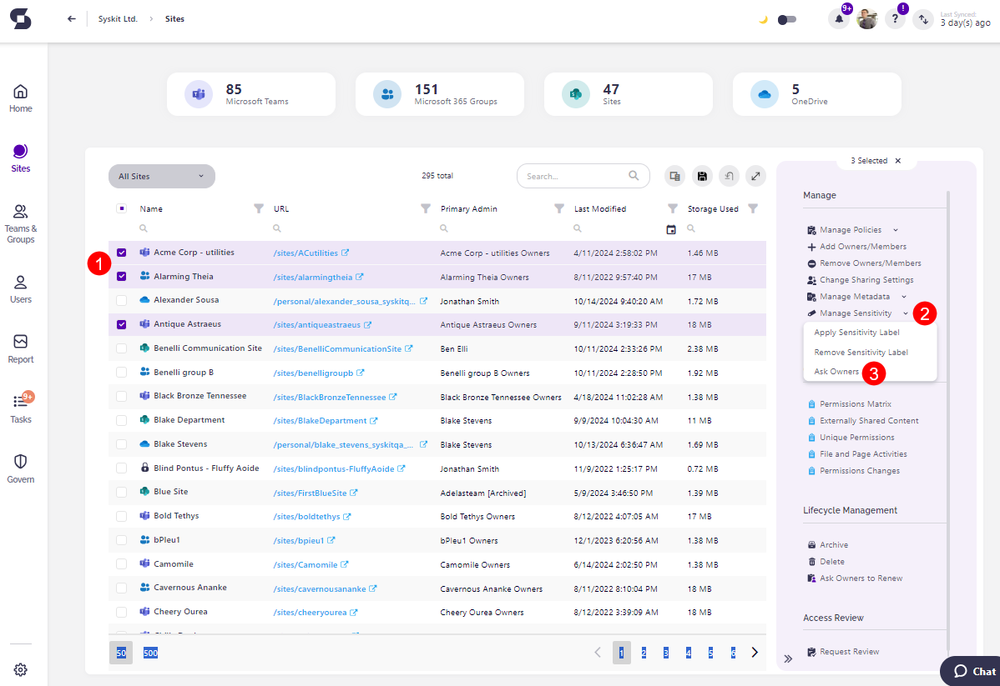
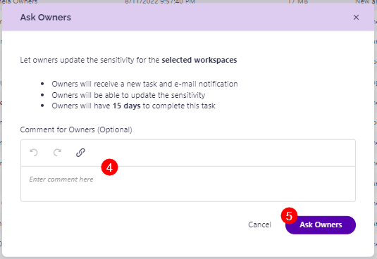

# Sensitivity Review

Sensitivity labels, designed to classify and protect your data, should be kept up-to-date to reflect any changes to your business needs, handling practices, or compliance requirements. For example, if a certain workspace starts dealing with sensitive matters, the sensitivity level of that workspace might need to be updated. 

Regularly reviewing sensitivity labels helps prevent unauthorized access, ensures data is correctly classified, and avoids any potential security risks. 

The best way to ensure all workspaces are properly classified is to involve workspace owners in this process. Owners have firsthand knowledge of the data within their environments and can ensure the labels applied align with both your company policies and the specific needs of their teams.

With the new Ask Owners to Review Sensitivity action, you can now select workspaces that you want owners to review the sensitivity level for.



**Please note:** You can Ask Owners to review Sensitivity Labels for Microsoft Teams, Microsoft 365 Groups and Sites.



## Ask Owners to Review Sensitivity

Here's how to request owners to review the sensitivity labels on their workspaces. 

* Navigate to the **Sites Overview screen** by clicking the Sites button on the left side of the screen
    * The same actions can also be taken from the **Teams & Groups Overview** screen.
* **Select one or more workspaces (1)** that you want to request a sensitivity labels review for
* On the right side of the screen, **click the arrow next to Manage Sensitivity (2)** button 
* **Click the Ask Owners action (3)**, and a confirmation dialog opens 
* Here, you can **leave a comment (4)** if you feel one is needed and **click the Ask Owners button (5)** to request a review

After that, the dialog confirms that the task has been sent and lets you know that you can **check the newly created tasks by going to the Governance > Sensitivity Review > Requested Reviews** screen. 



**After a sensitivity labels review is requested:**
* Owners receive a new task and e-mail notification.
* Owners can update the sensitivity label.
* Owners have **15 days** to complete this task.

**After a Sensitivity labels review is completed or if it is overdue**, administrators receive an e-mail informing them of that 1 day after completion.



