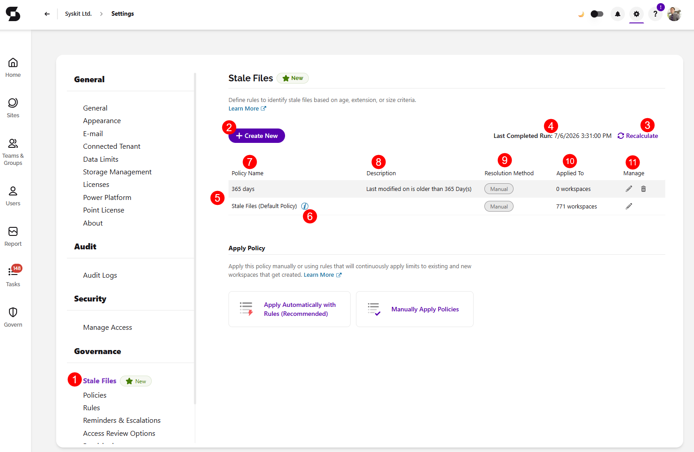
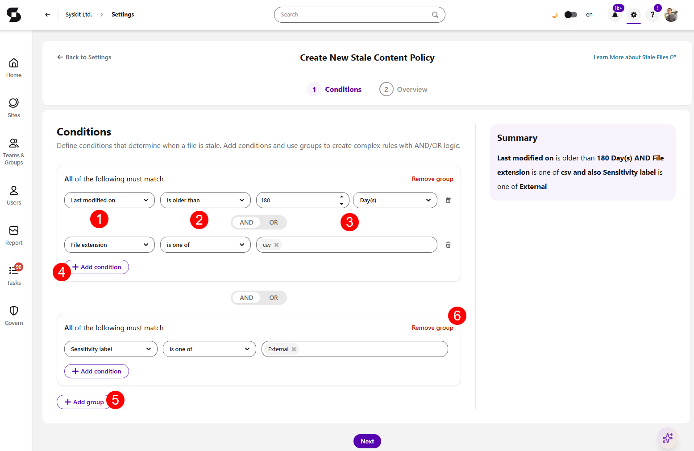
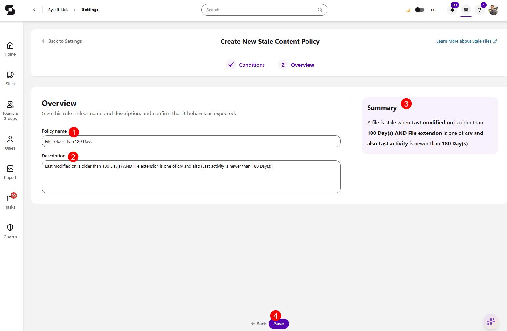

# Stale Files

:::info

**Stale Files policies** are available in the Governance plan and higher tiers. See the [pricing page](https://www.syskit.com/products/point/pricing/) for more details.

<!-- IS THIS TRUE? Check before release. -->

:::

Stale files affect your tenant in two ways: 
 * They **consume active SharePoint storage quota**, which increases your Microsoft 365 storage costs, and
 * They **hurt Copilot readiness**, since Microsoft 365 Copilot bases its answers on your tenant's content, and outdated files used in AI responses can mislead users.

The **Stale Files policies** let you define what stale means for different parts of the Microsoft 365 tenant in order to easily archive stale files. Instead of one broad rule, admins can set up policies with different criteria that can detect the right content for cleanup, show you how much stale content exists tenant-wide and where it's where it can be found, before taking action.

To use Stale Files policies, you need to [Configure Storage Management](../../configuration/configure-storage-management.md) with **Collect storage data** enabled.

Microsoft only tracks when files were last modified, not when they were last accessed. Files that are read often but rarely edited can look stale even if they are not, which leaves you with inaccurate information for cleanup. 

By combining certain properties in a single rule, you can get an accurate view of what is actually stale, instead of finding files that have just not been modified but are still actively used.

## Stale Files Settings

To open the Stale Files settings screen, navigate to **Settings** > **Governance** > **Stale Files (1)**. The section is located directly above Policies.

Here, you can:

* **Create a new Stale Files policy (2)**
* **Recalculate now (3)** - files are automatically reevaluated daily, but clicking this manually triggers the assesment of your files against the current policies rules 
  * If this action is currently running, the button is gray and cannot be clicked
* **View the last time stale files were recalculated (4)** - shows the last time your files were assessed based on your existing stale files policies
* **View all existing policies by name (5)**, including the default policy
  * There is a **default Stale Files policy (6)** that cannot be deleted, only edited 
* **View the following additional information about each policy**:
  * **Policy Name (7)** - shows the name of the stale files policy
  * **Description (8)** - shows the description entered for the stale files policy
  * **Resolution Method (9)** - shows what the resolution method for the policy is
  * **Applied to (10)** - shows how many workspaces the policy is applied to
  * **Manage (11)** - shows the edit and delete actions
    * Clicking Edit opens the edit module, as described in the Create New Policy section below
    * Clicking Delete erases the policy from the list, this acrion is not available for the default policy as it cannot be deleted

## Create New Stale Files Policy

To create a new Stale Files policy, click **Create New** on the Stale Files settings screen. This opens the Create New Stale Content policy screen where there are two steps: **Conditions** and **Overview**.

### Step 1 - Conditions

On the first step, you can use the condition builder to define what makes a file stale. 

You can combine multiple conditions using **AND / OR** groups so a single rule captures the exact activities you want to recognize.

* Each condition consists of a **Property (1)**, an **Operator (2)**, and a **Value (3)**
  * At least 1 condition has to be created for a stable content policy to be valid
* When you've selected the initial condition, **Click Add Condition (4)** button to add another condition
* To add another group of conditions that should apply, **click the Add Group (5)** button
* When more than one group is created, you have the **Remove group (6)** action available
  * At least one group has to be created for a stale content policy to be valid

The following properties are available:

| Property | Operators | Example |
|---|---|---|
| **Last modified on** | is older than, is in the last, is before, is after, is between | `is older than 365 days` |
| **Last activity** | is older than, is in the last, is before, is after, is between | `is older than 90 days` |
| **File size** | is more than, is less than, is between | `is more than 100 MB` |
| **Total size** (all versions combined) | is more than, is less than, is between | `is between 1 GB and 5 GB` |
| **File extension** | is one of | `is one of mp4, mov, avi` |
| **Sensitivity label** | is one of | `is not one of Confidential, Legal` |
| **Retention label** | is one of | `is one of General` |

Once you've made your selection, a **summary panel** provides you with a summary of your policy as you add conditions, so you can verify the logic before saving.

Click **Next** to continue to the Overview step.

### Step 2 - Overview

On the Overview screen, you will be asked to:

* Enter a **Policy Name (1)**
* Enter a policy description in the **Description (2)** field
  * The description is auto-filled with the rule summary text. 
  * Any manual edits to the description are saved even if you go back and change conditions
* Review the **Summary (3)** panel one more time
* Click **Save (4)** to save your New Stale Files Policy

After saving, the **Apply Policy** dialog opens. You can apply the policy individually to workspaces by clicking Manually Apply Policies, or you can apply the policy automatically via [Rules](../automated-workflows/policy-automation.md) by selecting the **Apply Automatically with Rules** option. 

## Edit a Stale Files Policy

To edit an existing policy, open the Stale Files settings screen and click the **Edit** icon on the row you want to modify. When editing a policy, the same options are available as when creating a new policy, as described in the section above. 

However, when editing an active policy, the Overview step includes a **More Details** tile that shows the following:

* **Applied To** - the number of workspaces the policy is applied to
* **Created By** - the name of the user who created the policy

## Where to Find Stale Files and What to Do with Them

Once your Stale Files policies are configured and your files have been assessed against the applied policies, stale content information can be found in the following ways: 

* On the **Dashboard**, the **Storage tile** has the **Archive Opportunities** section which shows how much storage across your tenant is currently classified as stale and can be feed if stale files are archived.
  * Clicking the Optimize Storage button on the Storage tile, opens the [Storage Metrics report](../../storage-management/storage-reports.md).
    * On the **Potential Savings** tile, clicking Stale Files opens the **Stale Files - Potential Savings** view for the report where you can see which workspaces hold the most stale content and how much storage archiving stale files could reclaim on each.
* **Selecting a specific workspace in the [Site Storage Metrics report](../../storage-management/storage-reports.md#site-storage-metrics)** and selecting the **Stale Files** view for the report. 
  * This lists the individual files classified as stale on that workspace, and the **Archive up to X GB** section of the Storage Optimization Opportunities tile shows the total that can be reclaimed.

From there, you have two options for what to do with the stale files you found:

* **Archive them in bulk** using the [Archive Stale Files action](../../storage-management/free-up-storage.md#archive-stale-files) - available on both the Storage Metrics and Site Storage Metrics reports. 
  * This archives every file currently classified as stale on the selected workspace(s) in a single operation.
* **Review or clean up individual files** directly from the Site Storage Metrics view by using the standard [Archive Files](../../storage-management/free-up-storage.md#archive-files), [Delete Files](../../storage-management/free-up-storage.md#delete-files), or [Clean Up File Versions](../../storage-management/free-up-storage.md#clean-up-action-on-site-storage-metrics-report) actions on the files you select.

## Related Articles

* [Set Up Policies](../automated-workflows/set-up-policies.md)
* [Rules](../automated-workflows/policy-automation.md)
* [Storage Management Overview](../../storage-management/storage-management-overview.md)
* [Free Up Storage](../../storage-management/free-up-storage.md)
* [Configure Storage Management](../../configuration/configure-storage-management.md)
* [Storage Reports](../../storage-management/storage-reports.md)

