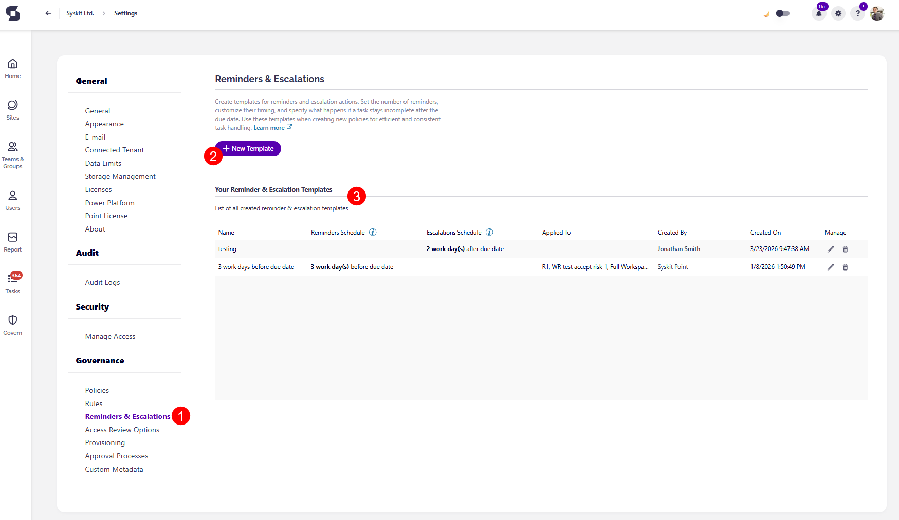
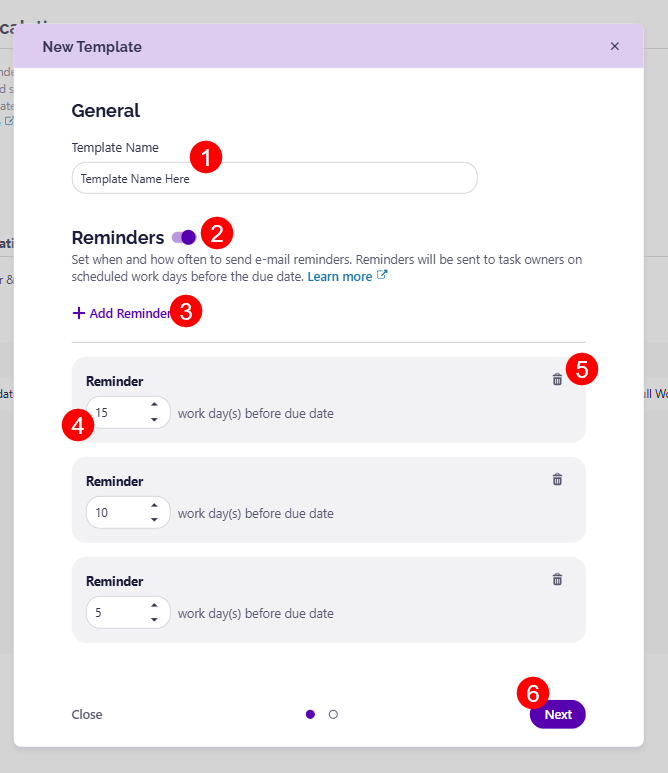

# Escalations

**Escalations** are a part of the **Workspace Review process**, and are used to **define what should happen when review tasks aren't completed on time**. 

Escalations allow for **additional actions to be taken on overdue reviews**, with the following options available:
* Add manager to CC
* Add specific people or group to CC
* E-mail to task owners
* Archive the workspace
* Restrict site access
* Restrict Copilot content discoverability

Before diving into the configuration, note that some escalations may not be supported across all workspace types. The following sections explain how to set up escalations, which workspace types they apply to, and how to apply them. 

## Escalations Templates

To create your Escalations Templates, go to **Settings > Governance > Reminders & Escalations (1)**. Here, you are able to:
* Create a **New Template (2)**
* View your **current reminder & escalation templates (3)** if there are any

Clicking New Template, opens the **New Template dialog** screen where you can:

* When you have decided on a name for your escalation template, enter the **Template Name (1)** in the designated space
  * The first step involves [reminders](../workspace-review/reminders.md), and for Escalations, you can move on to the next step
* **Turn the toggle on (2)** to enable **Escalations**
* Click the **Add Escalation (3)** button, which opens an Esclations section where you can:
  * **Enter the number of work days past the due date (4)**, after which the escalation should be triggered
  * **Select from the following available actions (5)**: 
    * **Add manager to CC** - sends e-mail to the owner and their manager, or to Point admins if the manager is excluded from governance tasks
    * **Add specific people or group to CC** - sends e-mail to the owner and selected people or groups
    * **E-mail to task owners** - sends a reminder to task owners that the due date has passed
    * **Archive the workspace** - archives the workspace and automatically closes the associated task
    * **Restrict site access** - limits access to workspace files and folders
    * **Restrict Copilot content discoverability** - restrict site's content from appearing in Microsoft 365 Copilot, SharePoint agents, and organization-wide search results
    * Click the **Save Escalation (6)** button to save your preferences
* You can set up more than one escalation for a template, by clicking the **Add Escalation** button and repeating this process again
  * This helps ensure multiple escalation measures within a policy. For example, email task owners after 5 work days, include managers after 10, and archive the workspace after 20.
* Use the **delete (7)** icon to remove a reminder if you change your mind
* Use the **edit (8)** icon to make any changes
  * An Escalation can be edited only when a Workspace Review with that escalation is not active, if a workspace review is active, the escalation cannot be edited
* Click **Save (9)** once you are done to store your template

:::warning

**Please note the following:** 
* To prevent reviews from remaining open, 30 days after the last escalation, reviews are closed, and outstanding tasks are marked as Expired.
* Only the **Archive the workspace escalation automatically closes the Workspace Review tasks**
* If **no escalations** are configured, tasks are **automatically closed and marked as expired after the due date**

:::

## Escalations & Workspace Types

Not all escalations are supported across all workspace types. The table below shows which workspaces each escalation can be applied to. 

| Escalation Name | Workspace Type | 
| :--- | :--- | 
| Add manager to CC | SharePoint Site, Microsoft 365 Group, Viva Engage Community, Microsoft Team, OneDrive | 
| Add specific people or group to CC | SharePoint Site, Microsoft 365 Group, Viva Engage Community, Microsoft Team, OneDrive | 
| E-mail to task owners | SharePoint Site, Microsoft 365 Group, Viva Engage Community, Microsoft Team, OneDrive | 
| Archive the workspace | SharePoint Site, Microsoft 365 Group, Viva Engage Community, Microsoft Team | 
| Restrict site access | SharePoint Site, Microsoft 365 Group, Viva Engage Community, Microsoft Team, OneDrive | 
| Restrict Copilot content discoverability | SharePoint Site, Microsoft 365 Group, Viva Engage Community, Microsoft Team | 

## Escalations Requirements 

For some escalation actions, you need to meet specific requirements that include certain licenses. 

### Restrict Site Access

To use the **Restrict Site Access** escalation, the following requirements must be met:

* First, your organization **must have one** of the following **base licenses**: 
  * **Office 365 E3, E5, or A5** 
  * **Microsoft 365 E1, E3, E5, or A5**

* In addition, **at least one of the following licenses** is required:
  * **Microsoft 365 Copilot license** - at least one user in your organization must be assigned a Copilot license 
    * This user doesn't need to be a SharePoint administrator
  * **Microsoft SharePoint Advanced Management license** - available as a standalone purchase

The following tenant-level setting needs to be enabled to support site-level access restrictions: 
* **Set-SPOTenant -EnableRestrictedAccessControl $true**

 
### Restrict Copilot Content Discoverability

To use the **Restrict Copilot Content Discoverability** escalation, the following requirements must be met:

* First, your organization **must have one** of the following **base licenses**: 
  * **Office 365 E3, E5, or A5** 
  * **Microsoft 365 E1, E3, E5, or A5**

* In addition, **at least one of the following licenses** is required:
  * **Microsoft 365 Copilot license** - at least one user in your organization must be assigned a Copilot license 
    * This user doesn't need to be a SharePoint administrator
  * **Microsoft SharePoint Advanced Management license** - available as a standalone purchase

## Escalations E-mails

Escalation e-mails are sent when an escalation is triggered.
* Depending on the escalation you selected, **e-mails are sent to your designated users** 
* Each recipent **receives an e-mail that includes only the workspaces assigned to them**
* E-mails are sent **when an escalation is triggered on one or more workspaces**, if no workspaces are escalated, no e-mails are sent
* If the **workspace review does not exist** at the time an escalation is triggered, **no e-mail is sent**

The content and subject of the e-mail depend on the type of escalation selected:
  * When the **Archive the workspace** escalation is selected, the recipients receive an **e-mail with the subject containing *Workspaces Archived*** and the e-mail **lists only the workspaces that were archived**
  * When other non-archive escalations are selected (e.g., restrict site access), recipients receive an **email with the subject stating tasks are overdue**, and the e-mail **lists all affected workspaces**

Each escalation e-mail includes:
* The **names** of the workspaces
* The **types** of the workspaces (e.g., Team, SharePoint site)
* A **link** to the corresponding workspace review in Syskit Point

## Apply Escalation Template

Once you've created your Escalation Template, you'll want to apply it to your policies. Currently, you can only apply escalation templates to Workspace Review policies.

To ensure a Escalation Template is included in your workspace review, **please follow [the directions in the set up Workspace Review article](setup-workspace-review.md).** You can apply your reminder template during the second step of the setup process, in the Schedule Review section.

:::warning

**Please note:** You can only apply **one template** to a workspace review policy. If you want a workspace review policy to contain both [reminders](reminders.md) and escalations, you need to create a template that has both.  

:::